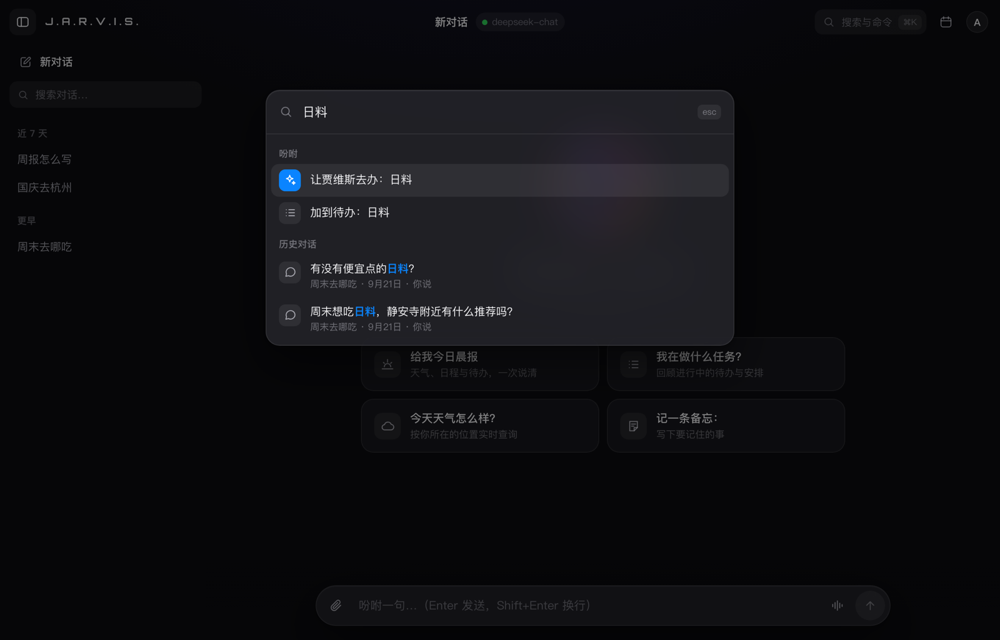
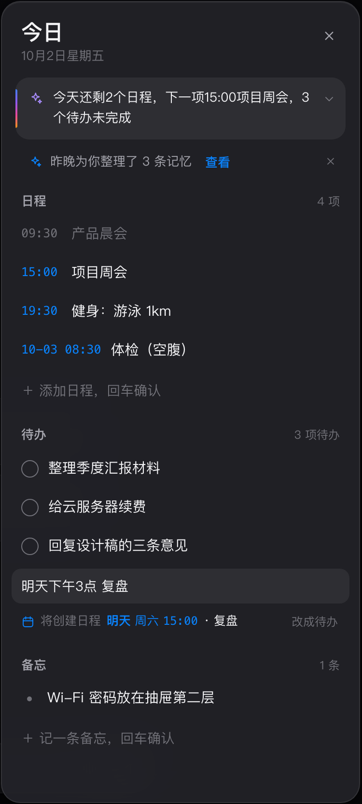

# 更新日志

[← 返回 README](README.md) · 逐轮开发与验收记录见 [`PROGRESS.md`](PROGRESS.md)，当前未解决事项见 [`BLOCKED.md`](BLOCKED.md)。

<b>第十五轮 · 2026-10-02</b>　市场做首页 · 参考 Codex 重做插件目录 · MCP 接入 · 49 个官方开源插件 · /login

- **市场就是首页**：网站根地址 `/` 是智能体市场，登录改到 `/login`，主应用在 `/app`；未登录访问 `/app` 先登录再回来，旧的 `/market`、`/?u=` 链接与二维码自动跳转，「登录后去哪」只接受站内地址。
- **参考 Codex 重做插件目录**：顶栏搜索（⌘K / `/`）、精选套装一键整套加入、分类 × 来源 × 类型筛选、像 App Store 条目页的插件详情（能做什么、试试这样问、需要什么、来源与许可证、同类推荐，可分享可后退），工具箱能排序并显示类型分布。
- **MCP 接入**：插件包放 `mcp.json` 即可接入远程 MCP（streamable-http / sse），Key 加密保存只显示末四位；安装时存档工具清单，清单一变自动停用待管理员确认；管理员可直接「添加 MCP 服务」。实测 DeepWiki 免 Key 可用，智能体能通过它回答开源仓库的问题。
- **49 个官方开源插件（MIT-0）**：新增 15 个技能、5 个计算工具（金额大写、个税社保、房贷车贷、工作日、BMI）、4 个 MCP（DeepWiki、Context7、高德地图、快递100）；仓库根目录 `.agents/plugins/marketplace.json` 是官方插件源，兼容 Codex。
- 测试基线 **pytest 1482 / vitest 504 / desktop 166**，全部通过。方案见 [`docs/proposals/2026-10-round15-market.md`](docs/proposals/2026-10-round15-market.md)。

 

<b>第十四轮 · 2026-10-02</b>　插件独立封装 · GitHub 导入 · PDF / Excel / Word · 换号与推荐修复 · 桌面端成为正式 App

- **插件独立封装**：每个插件是一个目录（`plugin.json` + 代码），单独加载、单独出错——清单坏了、依赖缺了只让它自己「暂不可用」；工具调用有超时与人话报错；导入的第三方插件跑在独立子进程（隔离环境变量、资源限额）。原有 22 个插件全部迁成插件包，接口不变。
- **从开源导入**：管理员在市场里贴 GitHub / Gitee 地址或上传 zip，先看信任预览（作者、版本、许可证、来源 commit、权限），确认后固定版本安装；兼容 Codex / ChatGPT 的 Agent Plugins 标准格式、SKILL.md 技能和 `.agents/plugins/marketplace.json` 插件源，可检查更新。开发指南见 [`docs/plugins.md`](docs/plugins.md)，插件模板以 MIT-0 授权。
- **办公插件 + 文件空间**：PDF 工具箱（合并、拆分、提取文字、旋转）、Excel 工具箱（读表、分组汇总、筛选、生成表格、CSV 互转）、Word 文档（读取、按要点生成）；对话里上传的文件会保存原件，处理结果给下载链接；流程新增「生成 Excel 表格」「生成 Word 文档」积木。
- **体验修复**：扫码带来的账号与当前登录不一致时先确认再切换，本地记录按账号区分；智能体主页的快捷问题由模型按名称、介绍和已装插件生成（「学习助手」→「提醒我明天早上背单词」）。
- **桌面端成为正式 App**：打包为 `~/Applications/贾维斯.app`，注册 `jws://`，网页一点即可拉起并接管登录；适配 Chrome 的「本地网络访问」权限，被拦时提示如何放行。
- 测试基线 **pytest 1296 / vitest 461 / desktop 166**，全部通过。方案见 [`docs/proposals/2026-10-round14-plugins.md`](docs/proposals/2026-10-round14-plugins.md)。

 

<b>第十三轮 · 2026-10-02</b>　智能体工坊：插件市场 · 专属账号即智能体 · 积木流程 · 删除 MOSS

- **智能体市场**（`/market`）：22 个插件按「效率 / 沟通 / 资料 / 资讯 / 生活 / AI 处理 / 输出」分类，点「加入」进工具箱；「帮我推荐」可选职业，或一句话说说自己（「我开奶茶店，想管订单和员工排班」），AI 只从清单里挑并说明理由，一键全加。
- **专属账号即智能体**：挑完起个名字，生成一套专属账号和口令（只显示一次，可复制、可存成图片）；在现有登录页登录，进去就是按所选插件组装的智能体——只用这些插件的工具、以自己的名字自称，主页问候、快捷问题、主题色都随之变化。管理员登录后可直接在市场里帮客户开号；游客自助开号默认关闭。
- **积木流程**（`/flows`）：「输入 → 处理 → 输出」一条链，9 种积木（文字 / 资料上传、文件拆分、AI 提炼、加到待办、发飞书、汇总到飞书文档、发微信、生成网页二维码），按职业套用模板；运行时信号沿连线流动、节点逐个亮起，结果生成手机可扫的网页。
- **删除 MOSS**：登录页只保留 J.A.R.V.I.S. 形态，人设去掉 MOSS 人格；移除 three.js 依赖，前端产物 1.68MB → 0.71MB。
- 测试基线 **pytest 1178 / vitest 417 / desktop 149**，全部通过。方案与接口契约见 [`docs/proposals/2026-10-round13-platform.md`](docs/proposals/2026-10-round13-platform.md)。

 

<b>第十二轮 · 2026-10-02</b>　手机端修抖 · 语音更像人 · 回答拟人化 · ⌘K 翻旧账 · 可操作提醒

- **手机端上滑不再抖**：根因是流式输出时「离底 80px 内就贴底」把手指拽回，以及消息行估高在 Safari 上回填跳动；改为按手势判断跟随，实测上滑 0 跳动、0 次被拽回（Chromium + WebKit）。键盘弹起不遮输入栏，点击区 ≥44px，手机端去掉大面积毛玻璃。
- **语音更像人**：开口即打断并标出「⋯ 已打断」，下一句接着你的话说；工具慢时先垫一句「好，我查一下」；时间、温度、日期按中文口语念，不念网址和 Markdown；语气随情绪调整；TTS 升级 speech-2.8-turbo。
- **回答拟人化**：人设提示词重写（先接住情绪、结论先行、不说套话、缺信息只问一个问题）；每轮注入「此刻」时间与今日概况，换算日期不再调工具；评测中工具调用 35 → 27、列表行 37 → 11。
- **⌘K 直接吩咐 + 翻旧账**：⌘K 里一句话直接交给贾维斯或加到日程 / 待办；跨会话全文检索历史，跳转并定位到那条消息；问「上次你推荐的那家店」会带出处回答。
- **可操作的提醒**：网页、桌面、微信、飞书里都能「稍后 10 分 / 完成」，一处处理其余不再催；新增「主动找你」设置（送达渠道 + 免打扰），提醒可推送到飞书。
- 测试基线 **pytest 1069 / vitest 347 / desktop 149**，全部通过。

 

<b>第十一轮 · 2026-10-02</b>　进场动画 · 一句话速记 · 记忆回执 · 今日简报 · 桌面端改版 · 安全加固

- **进场动画「唤醒」**：Apple 式边缘流光与逐字显影，光幕化作粒子汇聚成光球，无缝交给登录页；原生 WebGL，gzip 约 9KB，60fps。
- **一句话速记**：在「今日」板写「明天下午3点 复盘」，边打字边预览，自动成为日程；不带时间就是待办，可撤销，⌘K 里也能用。
- **记忆回执**：贾维斯记住或忘记什么，回答下方留一行「✓ 已记住 · 撤销」；夜间整理的记忆第二天在「今日」板提示。
- **今日简报卡**：「今日」板顶部一行 AI 简报，每人每天最多调用一次模型，失败退回规则摘要。
- **桌面悬浮窗改版**：与网页同一套设计语言，悬浮球改为光球三态，空闲 CPU 13.9% → 6.1%。
- **安全加固**：cryptography 50.0.2（依赖漏洞清零），建号 / 改口令强制强口令，过期会话定期清理，Heartbeat 夜间静默与去重。
- 测试基线 **pytest 898 / vitest 304 / desktop 137**，全部通过。

 

<b>第十轮 · 2026-10-02</b>　全功能 QA · 飞书绑定面板 · 弱口令提醒

- **网页端**：修复 12 个问题（弹窗焦点陷阱、键盘选会话、通话 Esc 挂断、亮色对比度、报错文案等）；新增「思考中」小光球与飞书绑定面板（绑定码、倒计时、一键复制、解绑）。
- **后端**：修复工具异常穿透、`calc` 超大幂运算卡死全站、同线程并发丢回答、微信长轮询静默退出、后台线程混入会话侧栏等问题；四个定时线程统一为 `PeriodicWorker`。
- **安全**：检测默认 / 弱口令并在网页顶部提醒修改；pypdf、urllib3 升级修复高危 DoS。
- 测试基线 **pytest 765 / vitest 184 / desktop 124**，全部通过。

<b>第九轮 · 2026-10-02</b>　网页端界面改版 · AI 光球 · ⌘K 命令面板 · 「今日」板

- **设计系统**：苹果式的排版、间距与圆角，暗色 / 亮色两套设计 token 重做；手机竖屏同步适配。
- **导航**：账户、记忆、设置中心、微信、悬浮窗、主题收进右上角头像菜单；⌘K 命令面板可搜会话、直达任意设置。
- **「今日」板**：日程、待办、备忘与会议纪要收在一处，宽屏常驻、窄屏浮层。
- **AI 光球 Presence**：WebGL 光球贯穿登录页、新对话空态与语音通话，随听 / 想 / 说变化。
- **登录页**：重新设计并保留 J.A.R.V.I.S. / MOSS 双形态切换（MOSS 已在第十三轮删除），登录页 JS 1282 → 352KB。
- 测试基线 **pytest 657 / vitest 133 / desktop 124**，全部通过。

<b>第八轮 · 2026-10-02</b>　后端卡顿修复 · 流式渲染优化 · 语音延迟优化 · 飞书机器人接入

- **后端**：有界历史、checkpoint 旧版本清理、模型超时与连接池重配、客户端断开即停（实测真实首 token 2889ms → 1023ms）。
- **前端 / 桌面**：流式 Markdown 增量渲染（修复 O(n²)）、token 按帧合并、three.js 懒加载修复、桌面主进程去同步。
- **语音**：通话判停 800 → 500ms、首句逗号即送 TTS、续说不抢答、回声抑制、开口预热。
- **飞书**：长连接收事件、流式卡片回复、一次性绑定码绑定账号，无需公网回调。
- 测试基线 **pytest 657 / vitest 100 / desktop 117**，全部通过。

<b>更早</b>　第三至第七轮

- **第七轮**：三人以上说话人自动编号，纪要三件套（导入待办 / 就会议追问 / 说话人改名），双路电平柱自检。
- **第六轮**：会议「⚡ 实时要点」、服务线程成本泄漏修复、15 项代码审查修复。
- **第五轮**：通话场景模式、语气情绪感知、图片 / 短视频识别、会议说话人分离。
- **第四轮**：语音唤醒「贾维斯」、会议纪要自动邮件、网页控悬浮窗。
- **第三轮**：Heartbeat 主动唤醒、夜间记忆蒸馏、技能热加载、划词工具条。

完整记录见 [`PROGRESS.md`](PROGRESS.md)，演示入口的上线状态见 [部署指南](docs/deployment.md#演示入口与上线状态)。

