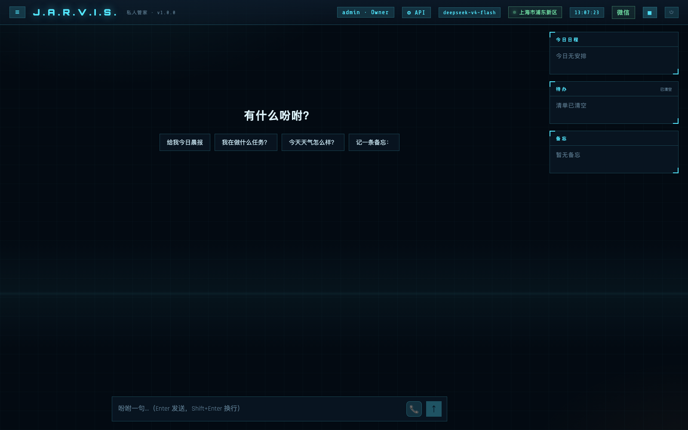
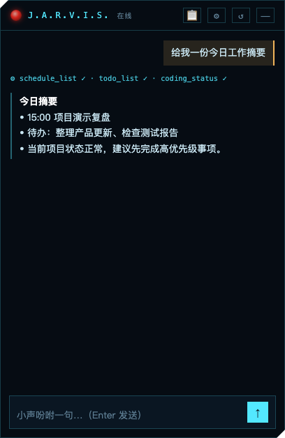
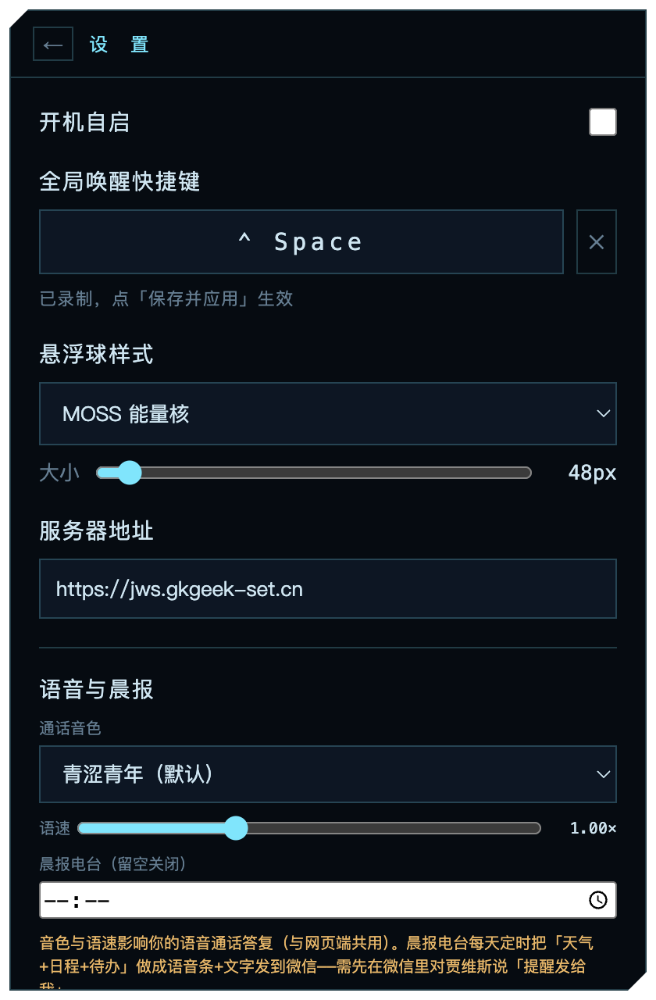
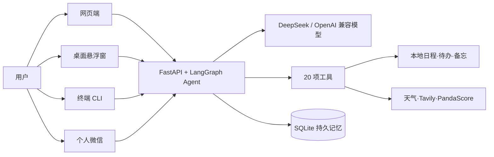

<div align="center">

# J.A.R.V.I.S. / JWS-Agent

### 一个真正记得住、随时叫得到、能够采取行动的私人 AI 管家

[](https://www.python.org/)
[](https://github.com/langchain-ai/langgraph)
[](https://fastapi.tiangolo.com/)
[](https://www.electronjs.org/)
[](https://www.apple.com/macos/)


把聊天、持久记忆、日程待办和可追溯的实时搜索放进同一个 Agent：既能在网页和终端里使用，也能常驻为 macOS 悬浮球，还可以桥接个人微信。

**私有部署 / 演示入口：[`https://jws.gkgeek-set.cn`](https://jws.gkgeek-set.cn)**

这是项目维护者的私有部署或演示入口，不是公共 SaaS，也不承诺持续在线；桌面端可在设置中改为你自己的服务器地址。

> **非商用项目：仅供学习、研究与个人非商业用途。禁止未经授权的商业部署、商业集成、付费分发或收费服务。**

</div>



<table>
  <tr>
    <td align="center"><strong>随时叫得到的桌面悬浮球</strong></td>
    <td align="center"><strong>原地展开的流式聊天窗</strong></td>
    <td align="center"><strong>快捷键、外观与微信设置</strong></td>
  </tr>
  <tr>
    <td></td>
    <td></td>
    <td></td>
  </tr>
</table>

## 为什么是 JWS-Agent

- **持久记忆**：LangGraph 的 SQLite checkpointer 把对话状态落到本地数据库，进程重启后仍可沿同一线程继续。
- **多入口，同一套能力**：网页端、macOS 桌面悬浮窗、终端 CLI 和个人微信都连接同一个 Agent 与 20 项工具。
- **不仅回答，也能行动**：可增删备忘和日程、维护待办、查询天气与系统状态，并按需调用实时搜索工具。
- **实时信息可追溯**：搜索结果保留查询时间、摘要和 HTTP(S) 来源；电影评分分平台呈现，票务只提供公开信息与深链接。
- **面向私有部署**：模型地址、模型名、数据目录和服务端口均可配置；记忆、备忘、日程、待办和微信 Token 留在你的运行环境中。

> 实时网页、新闻、电影评分、票务查询，以及未使用 PandaScore 时的电竞网页回退，都需要配置 `TAVILY_API_KEY`。仓库不会附带密钥，也不代表任何线上部署已经启用 Tavily。

## 一个 Agent，四种入口

| 能力 | 网页端 | 桌面悬浮窗 | 终端 CLI | 个人微信 |
| --- | --- | --- | --- | --- |
| 中文自然语言对话与 20 项工具 | ✅ | ✅ | ✅ | ✅（文本消息） |
| 流式展示 | ✅ SSE 逐字输出并展示工具调用 | ✅ SSE 逐字输出并展示工具调用 | — 单次完整返回 | — 消息式回复 |
| 记忆线程 | 每个会话独立 `thread_id` | 固定 `desktop` 线程 | 默认 `main`，可用 `--thread` 指定 | 每个联系人独立 `wx-<联系人>` 线程 |
| 日程、待办、备忘 | 对话操作 + 任务台展示 | 对话操作 + 任务台展示 | 对话操作 | 对话操作 |
| 实时搜索 | 配置后可用 | 配置后可用 | 配置后可用 | 配置后可用 |
| 天气定位 | 浏览器定位优先，公网 IP 兜底 | 使用服务端已有定位；也可直接说城市 | 使用服务端已有定位；也可直接说城市 | 使用服务端已有定位；也可直接说城市 |
| 会话历史管理 | 新建、回放、删除 | 最近历史、清空快捷线程 | 由线程持久化 | 由联系人线程持久化 |
| 个人微信扫码管理 | 顶栏“微信” | 设置 → 个人微信 | — | 自身即消息入口 |

## 它可以怎样帮你

下面是调用方式示例，回答中的实时内容以实际查询结果为准，不预填会过期的价格、比分或评分。

**1. 晨报**

> 你：给我今日晨报，带上天气、今天的安排和待办。
>
> J.A.R.V.I.S.：读取当前定位、三日天气、本地日程与未完成待办，整理成一份晨间摘要。

**2. 日程与待办**

> 你：明天下午 3 点提醒我做项目复盘，再加一条待办：整理会议材料。
>
> J.A.R.V.I.S.：分别写入日程和待办；之后可继续询问、勾选完成或删除。

**3. 持久记忆**

> 你：记住我周三要交电费。
>
> 你（重启程序后）：我让你记过什么？
>
> J.A.R.V.I.S.：在同一线程中读取 SQLite 检查点并接续上下文。

**4. 娱乐新闻**（需要配置 `TAVILY_API_KEY`）

> 你：查一下最近一周的娱乐新闻，列出重点、查询时间和来源。
>
> J.A.R.V.I.S.：调用 `web_search`，基于带时间戳和链接的公开搜索资料整理回答。

**5. 分平台电影评分**（需要配置 `TAVILY_API_KEY`）

> 你：查这部电影在豆瓣、IMDb、Rotten Tomatoes 和 Metacritic 的评分。
>
> J.A.R.V.I.S.：分别给出各平台量表、评价人数和来源，不把不同分制合并成“综合分”。

**6. 电竞比分 / 票务查询**（PandaScore 可选；网页回退与票务需要配置 `TAVILY_API_KEY`）

> 你：查某战队最近一场比赛的比分、赛事和来源。
>
> 你：再找一下某场演出的正规购票入口。
>
> J.A.R.V.I.S.：比分优先使用已配置的 PandaScore 结构化数据，失败或未配置时回退网页搜索；票务只列公开展示价或明确无可靠公开价，并给出平台深链接，不登录、不占座、不下单。

## 工作原理



### 20 项工具如何分层

| 层级 | 工具 | 作用与数据边界 |
| --- | --- | --- |
| 基础与上下文（6） | `now`、`calc`、`weather`、`weather_here`、`my_location`、`coding_status` | 时间与白名单计算；Open-Meteo 天气无需 key；定位和编程状态保存在本地数据目录 |
| 个人信息管理（9） | `memo_add/list/del`、`schedule_add/list/del`、`todo_add/list/done` | 备忘、日程与待办在 `JARVIS_DATA_DIR` 下持久化 |
| 系统查询（1） | `sys_query` | 只执行代码允许的白名单系统查询 |
| 实时信息（4） | `web_search`、`movie_ratings`、`esports_scores`、`ticket_search` | Tavily 负责公开网页搜索；PandaScore 可提供结构化电竞数据；都不会代替用户完成交易 |

### 流式、线程与记忆

- 网页和桌面端调用 FastAPI `/api/chat`，服务端以 `text/event-stream` 返回 `token`、`tool_start`、`tool_result`、`done` 或 `error` 事件。
- 每次 Agent 调用都带 `thread_id`。网页会话、桌面固定线程、CLI 自定义线程和微信联系人线程相互隔离，避免不同入口的上下文串线。
- `SqliteSaver` 将 LangGraph 检查点写入 `JARVIS_DATA_DIR/jarvis.db`。网页会话列表另存为 `threads.json`，备忘、日程和待办使用各自的本地数据文件。
- 服务还提供带 Bearer 鉴权的 `/v1/chat/completions` OpenAI 兼容接口，供微信备用网关等客户端接入；它不是完整的 OpenAI API 实现。

### 实时搜索的来源边界

- `TAVILY_API_KEY` **不是可选装饰项**：没有它，Tavily 驱动的联网查询会明确返回“未配置”，不会伪装成实时结果。
- Tavily 请求使用 Basic 深度、Safe Search、最多 5 条结果、12 秒超时和 5 分钟进程内缓存；输出记录查询时间、标题、摘要与有效 HTTP(S) 来源。
- 网页文本被标记为外部资料而不是 Agent 指令，但公开网页仍可能过时或有误；重要信息应打开原始链接复核。
- `PANDASCORE_TOKEN` 可选。配置后电竞比分优先走结构化接口，缺失或失败时才回退 Tavily；回退要可用仍需 `TAVILY_API_KEY`。
- 电影评分按平台和分制分开；票务价格只代表公开展示价、起价或票面价，库存、手续费和最终成交价以平台结算页为准。

## 快速开始

### 运行要求

- Python 3.10 或更高版本。
- Node.js 与 npm：仅桌面端需要。
- macOS：当前 Electron 悬浮窗使用 LaunchAgent、全局快捷键和 macOS 窗口行为，桌面端按 macOS 设计；Web 与 CLI 后端本身是 Python 应用。
- 一个 OpenAI 兼容模型的 API key；默认配置面向 DeepSeek。

### 1. 安装 Python 环境

在项目根目录执行：

```bash
python3 -m venv .venv
.venv/bin/pip install -e ".[dev]"
cp .env.example .env
```

然后至少填写 `DEEPSEEK_API_KEY`。如果要使用实时网页、新闻、电影评分或票务查询，再填写 `TAVILY_API_KEY`；请勿提交 `.env`。

### 2. 启动网页端

```bash
.venv/bin/jarvis-web
```

默认监听 `http://127.0.0.1:7789`。登录后可创建和删除会话、查看历史、停止生成、复制回复，并在任务台查看日程、待办和备忘；后端每轮对话后继续使用同一条线程记忆。

### 3. 使用终端

```bash
.venv/bin/jarvis
.venv/bin/jarvis --once "现在几点了"
.venv/bin/jarvis --thread work
```

交互模式输入 `quit` 或 `exit` 退出。`--once` 单发一句后结束；`--thread` 可将工作、生活等上下文拆为不同记忆线程。

### 4. 启动 macOS 桌面悬浮窗

先确保可访问一个正在运行的 JWS-Agent Web 服务，再执行：

```bash
cd desktop
npm install
npm start
```

首次启动后可在设置页把服务器地址改为本机 `http://127.0.0.1:7789` 或你自己的私有部署地址。悬浮球置顶并跨工作区显示，点击后向左展开快捷聊天；默认全局唤醒键为 `⌥Space`，也可修改或停用。开机自启通过 `~/Library/LaunchAgents/com.jws.jarvis.desktop.plist` 实现。

## 环境变量

| 变量 | 必需 | 默认值 | 说明 |
| --- | --- | --- | --- |
| `DEEPSEEK_API_KEY` | 是 | 无 | OpenAI 兼容模型 API key；未配置时无法构建 Agent |
| `JARVIS_BASE_URL` | 否 | `https://api.deepseek.com` | OpenAI 兼容接口基址 |
| `JARVIS_MODEL` | 否 | 代码回退为 `deepseek-chat` | 模型名；仓库 `.env.example` 当前示例为 `deepseek-v4-flash` |
| `JARVIS_DATA_DIR` | 否 | `<项目根>/data` | SQLite 记忆、本地日程/待办/备忘、会话元数据和微信 Token 的目录 |
| `JARVIS_PORT` | 否 | `7789` | Web 服务监听端口 |
| `TAVILY_API_KEY` | 使用实时搜索时是 | 无 | Tavily 网页/新闻搜索密钥；仓库与演示入口均不保证已配置 |
| `PANDASCORE_TOKEN` | 否 | 无 | PandaScore 结构化电竞数据 Token；缺失或失败时回退 Tavily |

## 个人微信桥接

推荐从你自己的 Web 部署登录后，点击顶栏 **微信**，生成二维码并用**专用微信小号**扫码确认。桌面端也可在 **设置 → 个人微信** 管理同一桥接状态。连接由服务器进程维持，关闭浏览器或桌面窗口不会主动断开；服务重启会尝试恢复。

- Token 仅保存在 `JARVIS_DATA_DIR/wechat_token`，权限为 `0600`，不会返回前端；二维码、Token、`.env` 都不得入库或公开分享。
- 每个联系人使用独立的 `wx-<联系人>` 线程；群聊和非文本消息默认忽略。
- 个人号第三方桥接存在登录态失效、协议变化和账号风险。请使用专用小号，不要使用主号，不要高频发送，**禁止群发营销**。
- 登录态失效时，在网页或桌面设置中重新生成二维码并扫码。
- 命令行备用桥位于 `wechat/ilink_gateway.py`；不要让备用桥和网页内置桥同时连接同一微信账号，否则可能重复拉取或回复消息。

备用方式的具体变量和白名单配置见 [`wechat/README.md`](wechat/README.md)。

## 验收与测试

当前仓库的确定性单元测试基线为 **109 项**。单元测试不调用真实大模型；其余三条脚本会连接真实模型或外部搜索服务，运行前应准备相应 key，并注意 `check_memory.py` 会重建默认 `data/jarvis.db` 以验证跨进程记忆。

```bash
.venv/bin/python -m pytest -q
.venv/bin/python scripts/check_smoke.py
.venv/bin/python scripts/check_memory.py
.venv/bin/python scripts/search_smoke.py
```

验收含义：

1. `pytest -q`：全量单元测试应为 0 失败、0 跳过，当前基线 109 项。
2. `check_smoke.py`：真实模型回答“现在几点了”，且必须产生实际工具调用。
3. `check_memory.py`：两个独立 CLI 进程先后对话，验证第二次能读取第一次写入的 SQLite 历史。
4. `search_smoke.py`：真实模型分别路由新闻、电影评分、电竞比分和票务四类查询，JSON 结果应为 4/4，并包含查询时间与可追溯来源；需要 `TAVILY_API_KEY`，电竞结构化路径可另配 `PANDASCORE_TOKEN`。

## 项目结构

```text
JWS-Agent/
├── jarvis/
│   ├── config.py          # 环境变量、模型与数据路径
│   ├── graph.py           # LangGraph ReAct Agent + SQLite checkpointer
│   ├── server.py          # FastAPI、登录、SSE、仪表盘与兼容接口
│   ├── cli.py             # 交互式与单发 CLI
│   ├── wechat.py          # Web 服务内置个人微信桥
│   ├── web/               # 零构建的网页端
│   └── tools/             # 20 项工具及注册表
├── desktop/               # macOS Electron 悬浮球与设置页
├── wechat/                # 命令行备用网关
├── tests/                 # 确定性单元测试
├── scripts/               # 真模型、记忆与实时搜索验收脚本
├── docs/assets/readme/    # README 产品截图
├── pyproject.toml
└── .env.example
```

## FAQ

<details>
<summary><strong>为什么搜索提示“未配置 TAVILY_API_KEY”？</strong></summary>

实时搜索默认不会偷偷使用其他服务。复制 `.env.example` 为 `.env`，填入有效的 `TAVILY_API_KEY` 后重启 Python 服务。天气使用 Open-Meteo，不依赖 Tavily；若只使用本地日程、待办、备忘和基础工具，可以不配置 Tavily。

</details>

<details>
<summary><strong>npm install 后提示缺少 Electron 二进制怎么办？</strong></summary>

某些 npm 配置会阻止 Electron 安装脚本。先在 `desktop/` 下执行：

```bash
npm rebuild electron
```

仍失败再执行：

```bash
node node_modules/electron/install.js
```

</details>

<details>
<summary><strong>询问“这里的天气”却提示没有定位怎么办？</strong></summary>

在网页端允许浏览器定位；服务端只在尚无定位时尝试公网 IP 城市级兜底，内网地址或外部定位服务失败时可能拿不到位置。也可以在问题中直接写城市名，例如“深圳未来三天天气”。

</details>

<details>
<summary><strong>个人微信失效后怎样恢复？</strong></summary>

打开网页顶栏“微信”或桌面端“设置 → 个人微信”，重新生成二维码并扫码。若使用命令行备用桥，先确认它没有与内置桥同时连接同一账号，再按 `wechat/README.md` 重新认证。

</details>

<details>
<summary><strong>可以把默认 Web 服务直接暴露到公网吗？</strong></summary>

不建议。当前 `jarvis-web` 默认只监听 `127.0.0.1`，仓库内登录口令是固定的开发配置，不足以承担公网安全边界。生产使用至少应改造账号与密钥管理、使用 HTTPS 反向代理、设置访问控制和限流、收紧网络入口、保护并备份 `JARVIS_DATA_DIR`，同时按组织要求补充日志脱敏、依赖更新与安全审计。

</details>

## 共同开发与使用声明

本项目由陈文杰、钟俊琅共同开发。

本项目仅供学习、研究与个人非商业用途。未经两位开发者书面授权，禁止任何形式的商业使用、付费分发、商业部署、商业集成或以本项目为基础提供收费服务。

项目引用的第三方依赖与服务仍分别适用其各自的许可证、服务条款与品牌规则；上述声明不改变第三方组件的授权范围，也不授予本项目除第三方组件既有权利之外的任何商业使用权。
