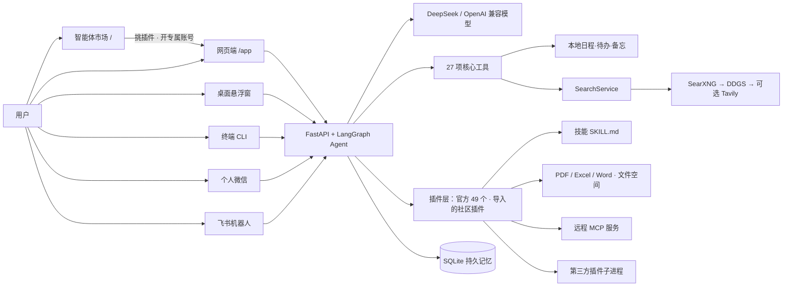

<div align="center"><a name="readme-top"></a>


# J.A.R.V.I.S.

**一个真正记得住、随时叫得到、能够采取行动的私人 AI 管家**

贾维斯（JWS-Agent）把聊天、语音通话、长期记忆、日程待办和带来源的实时搜索放进同一个 Agent<br>网页 · macOS 悬浮球 · 终端 · 个人微信 · 飞书，共用一套能力与记忆

[](https://www.python.org/) [](https://github.com/langchain-ai/langgraph) [](https://fastapi.tiangolo.com/) [](https://react.dev/) [](https://www.electronjs.org/) [](https://www.apple.com/macos/) [](#声明)

**[快速开始](#快速开始)** · [功能详解](docs/features.md) · [部署](docs/deployment.md) · [配置](docs/configuration.md) · [微信与飞书](docs/channels.md) · [架构](docs/architecture.md) · [FAQ](docs/faq.md)

<br>


<sub>一句话安排出差：调用工具写进日程和待办，再用表格列出行李清单，顺手提醒你对花生过敏（真实模型回答，演示数据）</sub>

</div>

> [!NOTE]
> **演示入口：[jws.gkgeek-set.cn](https://jws.gkgeek-set.cn)**。这是维护者的私有部署 / 演示入口，不是公共 SaaS，也不承诺持续在线；桌面端可在设置里改成你自己的服务器地址。上线状态见 [部署指南](docs/deployment.md#演示入口与上线状态)；这些状态说明不代表维护者已经替访问者执行过实时娱乐搜索或验证过任何具体结果。

> [!IMPORTANT]
> **非商用项目**：仅供学习、研究与个人非商业用途，禁止未经授权的商业部署、商业集成、付费分发或收费服务。本声明只描述 JWS-Agent 自身的使用范围；可选部署中的第三方 SearXNG 采用独立的 AGPL-3.0，二者不能互相替代，详见 [`deploy/searxng`](deploy/searxng/README.md)。插件模板 [`examples/plugin-template`](examples/plugin-template/) 是例外，单独以 MIT-0 授权，方便第三方开发者复制去写自己的插件。

## 它能做什么

一个 LangGraph Agent 驱动 27 项核心工具，外加可插拔的插件（49 个官方开源插件：PDF / Excel / Word 工具箱、15 个写作与规划技能、计算工具、DeepWiki / 高德等 MCP 服务；还能从 GitHub 导入社区插件），能聊、能记，也能动手：增删日程待办、查天气、搜实时信息、处理文档表格、开会记纪要。完整清单见 [功能详解](docs/features.md)，插件开发见 [插件指南](docs/plugins.md)。

它也是一座**智能体工坊**：不懂技术的人在插件市场里挑几个插件，就能拿到一套专属账号口令，登录进去就是按这些插件组装好的智能体；再用「输入 → 处理 → 输出」积木拼个流程，结果生成网页二维码，手机一扫就能看。

<table>
<tr>
<td width="33%" valign="top"><b>💬 流式对话</b><br>完整 Markdown（来源链接、表格、代码高亮），可重答、编辑重发、导出；上传 PDF / Word / Excel / CSV 直接处理原文件</td>
<td width="33%" valign="top"><b>🧠 长期记忆</b><br>画像可查可删，每晚把当天对话蒸馏进长期画像；称呼与语气可调</td>
<td width="33%" valign="top"><b>⏰ 主动找你</b><br>日程到点推送微信 / 飞书 / 桌面 / 网页，一键「稍后 10 分 / 完成」；渠道与免打扰自己定，该开口才开口</td>
</tr>
<tr>
<td valign="top"><b>📞 语音通话</b><br>边说边答带字幕，开口即打断、查得慢先垫一句；时间数字按口语念，语气随你的情绪变；9 种场景模式</td>
<td valign="top"><b>🎙️ 会议纪要</b><br>麦克风 + 系统回环双路转写、说话人分离，纪要自动发邮箱；飞书、腾讯会议、Zoom 都能录</td>
<td valign="top"><b>🗣️ 语音唤醒</b><br>喊一声「贾维斯」就接通；本地 VAD 圈出人声才送云端识别，静音零上传</td>
</tr>
<tr>
<td valign="top"><b>🖥️ 桌面悬浮球</b><br>⌥Space 唤出快捷聊天，⌥Q 划词翻译 / 解释 / 改写，通话时随听、想、说三态变色</td>
<td valign="top"><b>🔎 可追溯搜索</b><br>SearXNG → DDGS 免费降级，结果带时间与来源；评分分平台列出，票务只给公开入口</td>
<td valign="top"><b>🖼️ 看图识视频</b><br>发图片或短视频，qwen3-vl 转成描述后可连续追问，截图里的文字表格逐字转录</td>
</tr>
<tr>
<td valign="top"><b>📱 微信 · 飞书</b><br>扫码接入个人微信，发链接即总结；飞书机器人走长连接免公网回调，流式卡片回复</td>
<td valign="top"><b>👥 多用户隔离</b><br>Owner 邀请制开号，对话、记忆、日程与模型 Provider 各自独立，Key 加密存储、永不回显</td>
<td valign="top"><b>🧩 技能热加载</b><br>在 <code>skills/</code> 放一个 <code>SKILL.md</code> 就多一项技能，下一轮对话生效，无需重启</td>
</tr>
<tr>
<td valign="top"><b>🏭 智能体工坊</b><br>在插件市场挑插件、起个名字，拿到专属账号口令；登录即是只用这些插件、以自己名字自称的智能体</td>
<td valign="top"><b>🧱 积木流程</b><br>「输入 → 处理 → 输出」拼成一条链：上传资料、拆分、AI 提炼、生成 Excel / Word / 网页二维码</td>
<td valign="top"><b>🔌 插件市场</b><br>插件独立封装、互不影响；PDF / Excel / Word 工具箱内置，管理员可从 GitHub / Gitee / zip 导入社区插件</td>
</tr>
</table>

## 界面一览

<p align="center"><br><sub>进场动画「唤醒」：边缘流光 → 光幕化作粒子 → 凝成光球 → 无缝交给登录页（约 3.3 秒，每次打开或刷新都播，点击即可跳过）</sub></p>

<table>
<tr>
<td align="center" width="50%"><br><sub>登录页：会呼吸的 AI 光球与问候</sub></td>
<td align="center" width="50%"><br><sub>新对话：光球 + 问候 + 一键建议</sub></td>
</tr>
<tr>
<td align="center"><br><sub>⌘K 命令面板：搜会话、直达所有设置</sub></td>
<td align="center"><br><sub>「今日」板：日程 · 待办 · 备忘 · 会议纪要</sub></td>
</tr>
<tr>
<td align="center"><br><sub>语音通话：光球随听 / 想 / 说变化，9 种场景</sub></td>
<td align="center"><br><sub>亮色主题：代码高亮，一键切换</sub></td>
</tr>
<tr>
<td align="center" colspan="2"><br><sub>手机版（390×844）：新对话 · 对话 · 「今日」板</sub></td>
</tr>
<tr>
<td align="center"><br><sub>首页即智能体市场：搜索、精选套装、按职业 / 一句话推荐</sub></td>
<td align="center"><br><sub>积木流程：节点逐个亮起，跑完给出结果网页二维码</sub></td>
</tr>
<tr>
<td align="center"><br><sub>插件详情：能做什么、试试这样问、需要什么（以 DeepWiki MCP 为例）</sub></td>
<td align="center"><br><sub>导入插件：来源、权限、许可证一目了然再安装</sub></td>
</tr>
</table>

<table>
<tr>
<td align="center"><br><sub>桌面端：原地展开的快捷聊天</sub></td>
<td align="center"><br><sub>会议监控：我 / 对方双路实时字幕</sub></td>
<td align="center"><br><sub>快捷键、音色与晨报设置</sub></td>
</tr>
<tr>
<td align="center" colspan="3">
&emsp;&emsp;&emsp;<br>
<sub>悬浮球：待命 · 听（律动 + 冷蓝涟漪）· 想（亮弧流转）· 说（随音量起伏、转暖）</sub>
</td>
</tr>
</table>

<sub>网页截图为第九轮新界面，2026-10-02 在隔离演示环境实拍（桌面 1440×900、手机 390×844，均为 2 倍像素）；桌面端为第十一轮改版后实拍（JWS_SHOT 自检外壳，独立资料目录）。数据均为虚构演示数据（对话由真实模型回答演示问题生成），无真实用户对话与凭据入图。提醒、记忆、会议纪要、设置中心等全部 24 张截图与拍摄说明见 [截图画廊](docs/features.md#截图画廊)。</sub>

## 快速开始

> [!TIP]
> 需要 Python 3.10+ 和一个 OpenAI 兼容模型的 API Key（默认 DeepSeek，也可用 OpenAI、百炼、SiliconFlow 或自定义 HTTPS 中转）；桌面端另需 macOS 与 Node.js。

**① 安装**

```bash
python3 -m venv .venv
.venv/bin/pip install -e ".[dev]"
cp .env.example .env
```

**② 配置**：在 `.env` 中至少填好下面四项。后三项留空时不会创建 Owner，网页端会 fail closed 无法登录；`.env` 切勿提交。

```ini
JARVIS_API_KEY=<模型 API Key>
JARVIS_ADMIN_USERNAME=<首位 Owner 用户名>
JARVIS_ADMIN_PASSWORD=<强口令>
JARVIS_SESSION_SECRET=<openssl rand -hex 32 的输出>
```

**③ 启动**

```bash
.venv/bin/jarvis-web                       # 网页端 → http://127.0.0.1:7789（首页是智能体市场，登录 /login，主应用 /app）
.venv/bin/jarvis                           # 终端对话（可选）
cd desktop && npm install && npm start     # macOS 桌面悬浮球（可选，需已有运行中的 Web 服务）
cd desktop && npm run pack:mac && npm run install:mac   # 打包成「贾维斯.app」装进 ~/Applications，网页可一键唤起
```

用 Owner 登录后，可在右上角头像菜单「账户设置 → 用户管理」邀请成员。动态网页提取、桌面端登录与服务器地址、自建 SearXNG、备份与回滚见 [部署指南](docs/deployment.md)，全部环境变量见 [配置参考](docs/configuration.md)。

## 工作原理


```mermaid
flowchart LR
  U[用户] --> MK[智能体市场 /]
  MK -->|挑插件 · 开专属账号| W
  U --> W[网页端 /app] & D[桌面悬浮窗] & C[终端 CLI] & X[个人微信] & F[飞书机器人]
  W & D & C & X & F --> A[FastAPI + LangGraph Agent]
  A --> M[DeepSeek / OpenAI 兼容模型]
  A --> T[27 项核心工具]
  A --> PL[插件层：官方 49 个 · 导入的社区插件]
  A --> S[(SQLite 持久记忆)]
  T --> L[本地日程·待办·备忘]
  T --> Q[SearchService]
  Q --> P[SearXNG → DDGS → 可选 Tavily]
  PL --> SK[技能 SKILL.md]
  PL --> OF[PDF / Excel / Word · 文件空间]
  PL --> MC[远程 MCP 服务]
  PL --> SB[第三方插件子进程]
```

网页与桌面端经 SSE 流式输出；每个入口使用独立的 `thread_id`，LangGraph 检查点落在 SQLite，重启后仍能接着聊。市场开出的专属账号只绑定所选插件的工具，Owner 是完整的贾维斯；插件各自封装、出错互不影响，第三方插件跑在独立子进程。工具与插件分层、搜索来源边界见 [架构说明](docs/architecture.md)。

## 最新动态

<details open>
<summary><b>第十五轮 · 2026-10-02</b>　市场做首页 · 参考 Codex 重做插件目录 · MCP 接入 · 49 个官方开源插件 · /login</summary>


- **市场就是首页**：网站根地址 `/` 是智能体市场，登录改到 `/login`，主应用在 `/app`；未登录访问 `/app` 先登录再回来，旧的 `/market`、`/?u=` 链接与二维码自动跳转，「登录后去哪」只接受站内地址。
- **参考 Codex 重做插件目录**：顶栏搜索（⌘K / `/`）、精选套装一键整套加入、分类 × 来源 × 类型筛选、像 App Store 条目页的插件详情（能做什么、试试这样问、需要什么、来源与许可证、同类推荐，可分享可后退），工具箱能排序并显示类型分布。
- **MCP 接入**：插件包放 `mcp.json` 即可接入远程 MCP（streamable-http / sse），Key 加密保存只显示末四位；安装时存档工具清单，清单一变自动停用待管理员确认；管理员可直接「添加 MCP 服务」。实测 DeepWiki 免 Key 可用，智能体能通过它回答开源仓库的问题。
- **49 个官方开源插件（MIT-0）**：新增 15 个技能、5 个计算工具（金额大写、个税社保、房贷车贷、工作日、BMI）、4 个 MCP（DeepWiki、Context7、高德地图、快递100）；仓库根目录 `.agents/plugins/marketplace.json` 是官方插件源，兼容 Codex。
- 测试基线 **pytest 1482 / vitest 504 / desktop 166**，全部通过。方案见 [`docs/proposals/2026-10-round15-market.md`](docs/proposals/2026-10-round15-market.md)。

<br clear="right">
</details>

<details>
<summary><b>第十四轮 · 2026-10-02</b>　插件独立封装 · GitHub 导入 · PDF / Excel / Word · 换号与推荐修复 · 桌面端成为正式 App</summary>


- **插件独立封装**：每个插件是一个目录（`plugin.json` + 代码），单独加载、单独出错——清单坏了、依赖缺了只让它自己「暂不可用」；工具调用有超时与人话报错；导入的第三方插件跑在独立子进程（隔离环境变量、资源限额）。原有 22 个插件全部迁成插件包，接口不变。
- **从开源导入**：管理员在市场里贴 GitHub / Gitee 地址或上传 zip，先看信任预览（作者、版本、许可证、来源 commit、权限），确认后固定版本安装；兼容 Codex / ChatGPT 的 Agent Plugins 标准格式、SKILL.md 技能和 `.agents/plugins/marketplace.json` 插件源，可检查更新。开发指南见 [`docs/plugins.md`](docs/plugins.md)，插件模板以 MIT-0 授权。
- **办公插件 + 文件空间**：PDF 工具箱（合并、拆分、提取文字、旋转）、Excel 工具箱（读表、分组汇总、筛选、生成表格、CSV 互转）、Word 文档（读取、按要点生成）；对话里上传的文件会保存原件，处理结果给下载链接；流程新增「生成 Excel 表格」「生成 Word 文档」积木。
- **体验修复**：扫码带来的账号与当前登录不一致时先确认再切换，本地记录按账号区分；智能体主页的快捷问题由模型按名称、介绍和已装插件生成（「学习助手」→「提醒我明天早上背单词」）。
- **桌面端成为正式 App**：打包为 `~/Applications/贾维斯.app`，注册 `jws://`，网页一点即可拉起并接管登录；适配 Chrome 的「本地网络访问」权限，被拦时提示如何放行。
- 测试基线 **pytest 1296 / vitest 461 / desktop 166**，全部通过。方案见 [`docs/proposals/2026-10-round14-plugins.md`](docs/proposals/2026-10-round14-plugins.md)。

<br clear="right">
</details>

<details>
<summary><b>第十三轮 · 2026-10-02</b>　智能体工坊：插件市场 · 专属账号即智能体 · 积木流程 · 删除 MOSS</summary>


- **智能体市场**（`/market`）：22 个插件按「效率 / 沟通 / 资料 / 资讯 / 生活 / AI 处理 / 输出」分类，点「加入」进工具箱；「帮我推荐」可选职业，或一句话说说自己（「我开奶茶店，想管订单和员工排班」），AI 只从清单里挑并说明理由，一键全加。
- **专属账号即智能体**：挑完起个名字，生成一套专属账号和口令（只显示一次，可复制、可存成图片）；在现有登录页登录，进去就是按所选插件组装的智能体——只用这些插件的工具、以自己的名字自称，主页问候、快捷问题、主题色都随之变化。管理员登录后可直接在市场里帮客户开号；游客自助开号默认关闭。
- **积木流程**（`/flows`）：「输入 → 处理 → 输出」一条链，9 种积木（文字 / 资料上传、文件拆分、AI 提炼、加到待办、发飞书、汇总到飞书文档、发微信、生成网页二维码），按职业套用模板；运行时信号沿连线流动、节点逐个亮起，结果生成手机可扫的网页。
- **删除 MOSS**：登录页只保留 J.A.R.V.I.S. 形态，人设去掉 MOSS 人格；移除 three.js 依赖，前端产物 1.68MB → 0.71MB。
- 测试基线 **pytest 1178 / vitest 417 / desktop 149**，全部通过。方案与接口契约见 [`docs/proposals/2026-10-round13-platform.md`](docs/proposals/2026-10-round13-platform.md)。

<br clear="right">
</details>

更早的更新（第三至第十二轮：手机端修抖、语音拟人化、进场动画、界面改版、飞书接入……）见 [更新日志](CHANGELOG.md)。

## 文档

| 文档 | 你会找到 |
| --- | --- |
| 📖 [功能详解](docs/features.md) | 完整功能清单、语音 / 会议 / 唤醒用法、多入口对比、对话示例、全部截图 |
| 🚀 [部署指南](docs/deployment.md) | 安装、网页 / 终端 / 桌面端启动、运行时 secret、多用户备份与回滚、演示入口状态 |
| ⚙️ [配置参考](docs/configuration.md) | 环境变量全表、每用户 Provider 与 API 密钥、搜索与正文提取链 |
| 💬 [微信与飞书](docs/channels.md) | 个人微信桥接、飞书机器人、开发者后台清单与权限表 |
| 🧩 [插件指南](docs/plugins.md) | 写插件、导入插件、MCP 接入、官方插件源、安全须知 |
| 🧭 [架构说明](docs/architecture.md) | 工作原理、核心工具与插件层、智能体工坊与路由、流式线程与记忆、搜索来源边界 |
| 🧪 [开发与测试](docs/development.md) | 验收脚本、测试基线、项目结构 |
| ❓ [常见问题](docs/faq.md) | 登录与路由、桌面悬浮窗唤起、插件导入与 MCP、SearXNG、微信恢复、公网暴露 |
| 📝 [更新日志](CHANGELOG.md) | 第三轮以来的全部更新 |

## 声明

本项目由陈文杰、钟俊琅共同开发，仅供学习、研究与个人非商业用途。未经两位开发者书面授权，禁止任何形式的商业使用、付费分发、商业部署、商业集成或以本项目为基础提供收费服务。

项目引用的第三方依赖与服务仍分别适用其各自的许可证、服务条款与品牌规则；上述声明不改变第三方组件的授权范围，也不授予本项目除第三方组件既有权利之外的任何商业使用权。

<div align="center"><sub><a href="#readme-top">回到顶部 ↑</a></sub></div>
