<div align="center"><a name="readme-top"></a>


# J.A.R.V.I.S.

**一个真正记得住、随时叫得到、能够采取行动的私人 AI 管家**

贾维斯（JWS-Agent）把聊天、语音通话、长期记忆、日程待办和带来源的实时搜索放进同一个 Agent<br>网页 · macOS 悬浮球 · 终端 · 个人微信 · 飞书，共用一套能力与记忆

[](https://www.python.org/) [](https://github.com/langchain-ai/langgraph) [](https://fastapi.tiangolo.com/) [](https://react.dev/) [](https://www.electronjs.org/) [](https://www.apple.com/macos/) [](#声明)

**[快速开始](#快速开始)** · [功能详解](docs/features.md) · [部署](docs/deployment.md) · [配置](docs/configuration.md) · [微信与飞书](docs/channels.md) · [架构](docs/architecture.md) · [FAQ](docs/faq.md)

<br>

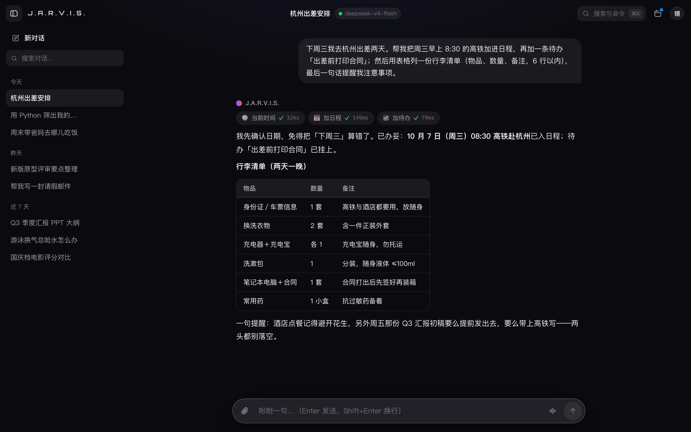

<sub>一句话安排出差：调用工具写进日程和待办，再用表格列出行李清单，顺手提醒你对花生过敏（真实模型回答，演示数据）</sub>

</div>

> [!NOTE]
> **演示入口：[jws.gkgeek-set.cn](https://jws.gkgeek-set.cn)**。这是维护者的私有部署 / 演示入口，不是公共 SaaS，也不承诺持续在线；桌面端可在设置里改成你自己的服务器地址。上线状态见 [部署指南](docs/deployment.md#演示入口与上线状态)；这些状态说明不代表维护者已经替访问者执行过实时娱乐搜索或验证过任何具体结果。

> [!IMPORTANT]
> **非商用项目**：仅供学习、研究与个人非商业用途，禁止未经授权的商业部署、商业集成、付费分发或收费服务。本声明只描述 JWS-Agent 自身的使用范围；可选部署中的第三方 SearXNG 采用独立的 AGPL-3.0，二者不能互相替代，详见 [`deploy/searxng`](deploy/searxng/README.md)。

## 它能做什么

一个 LangGraph Agent 驱动 27 项工具，能聊、能记，也能动手：增删日程待办、查天气、搜实时信息、开会记纪要。完整清单见 [功能详解](docs/features.md)。

<table>
<tr>
<td width="33%" valign="top"><b>💬 流式对话</b><br>完整 Markdown（来源链接、表格、代码高亮），可重答、编辑重发、导出；上传 PDF / Word / TXT 解析追问</td>
<td width="33%" valign="top"><b>🧠 长期记忆</b><br>画像可查可删，每晚把当天对话蒸馏进长期画像；称呼语气可调，J.A.R.V.I.S. ↔ MOSS 双人格</td>
<td width="33%" valign="top"><b>⏰ 主动找你</b><br>日程到点推送微信 / 飞书 / 桌面 / 网页，一键「稍后 10 分 / 完成」；渠道与免打扰自己定，该开口才开口</td>
</tr>
<tr>
<td valign="top"><b>📞 语音通话</b><br>边说边答带字幕，开口即打断、查得慢先垫一句；时间数字按口语念，语气随你的情绪变；9 种场景模式</td>
<td valign="top"><b>🎙️ 会议纪要</b><br>麦克风 + 系统回环双路转写、说话人分离，纪要自动发邮箱；飞书、腾讯会议、Zoom 都能录</td>
<td valign="top"><b>🗣️ 语音唤醒</b><br>喊一声「贾维斯」就接通；本地 VAD 圈出人声才送云端识别，静音零上传</td>
</tr>
<tr>
<td valign="top"><b>🖥️ 桌面悬浮球</b><br>⌥Space 唤出快捷聊天，⌥Q 划词翻译 / 解释 / 改写，通话时随听、想、说三态变色</td>
<td valign="top"><b>🔎 可追溯搜索</b><br>SearXNG → DDGS 免费降级，结果带时间与来源；评分分平台列出，票务只给公开入口</td>
<td valign="top"><b>🖼️ 看图识视频</b><br>发图片或短视频，qwen3-vl 转成描述后可连续追问，截图里的文字表格逐字转录</td>
</tr>
<tr>
<td valign="top"><b>📱 微信 · 飞书</b><br>扫码接入个人微信，发链接即总结；飞书机器人走长连接免公网回调，流式卡片回复</td>
<td valign="top"><b>👥 多用户隔离</b><br>Owner 邀请制开号，对话、记忆、日程与模型 Provider 各自独立，Key 加密存储、永不回显</td>
<td valign="top"><b>🧩 技能热加载</b><br>在 <code>skills/</code> 放一个 <code>SKILL.md</code> 就多一项技能，下一轮对话生效，无需重启</td>
</tr>
</table>

## 界面一览

<p align="center">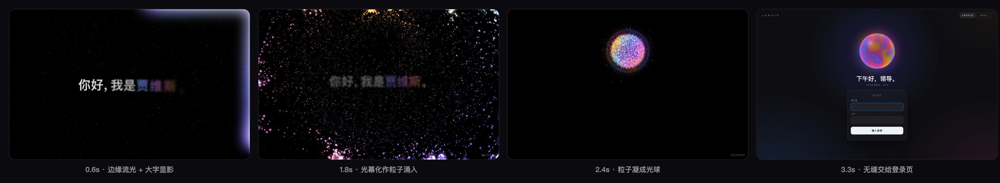<br><sub>进场动画「唤醒」：边缘流光 → 光幕化作粒子 → 凝成光球 → 无缝交给登录页（约 3.3 秒，每次打开浏览器播一次，点击即可跳过）</sub></p>

<table>
<tr>
<td align="center" width="50%">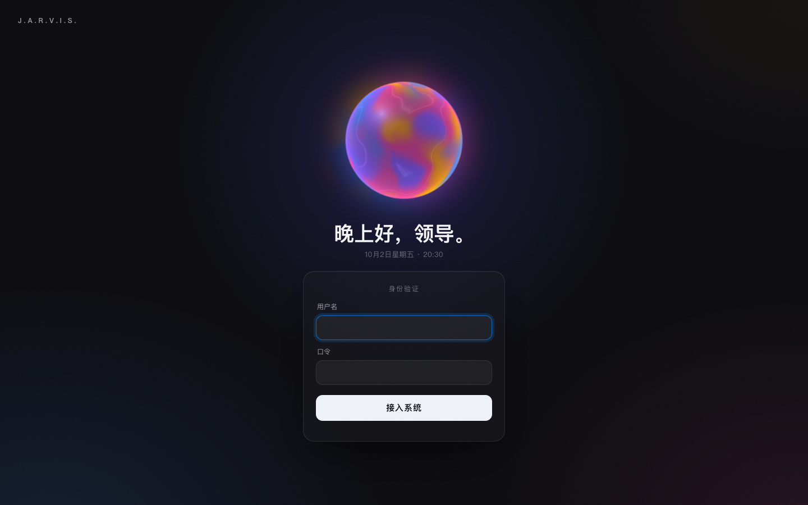<br><sub>登录页：会呼吸的 AI 光球，可切到 MOSS 形态</sub></td>
<td align="center" width="50%">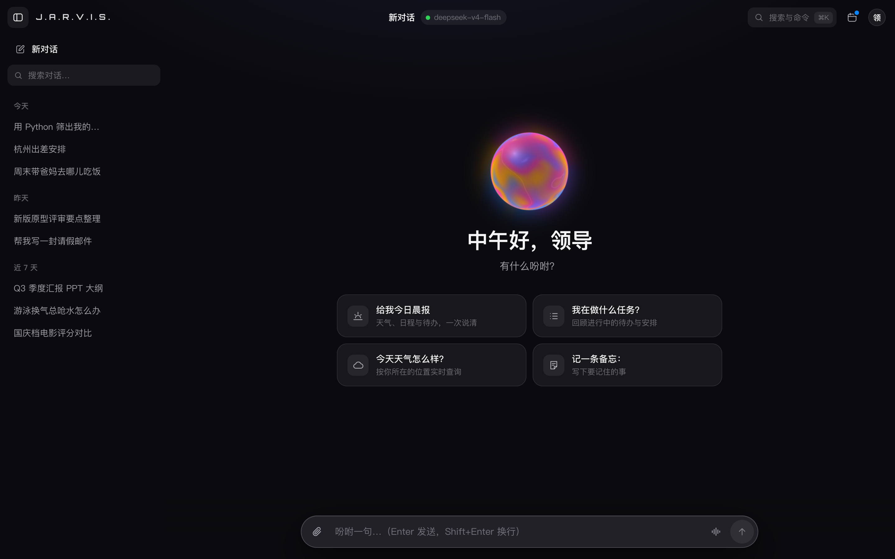<br><sub>新对话：光球 + 问候 + 一键建议</sub></td>
</tr>
<tr>
<td align="center">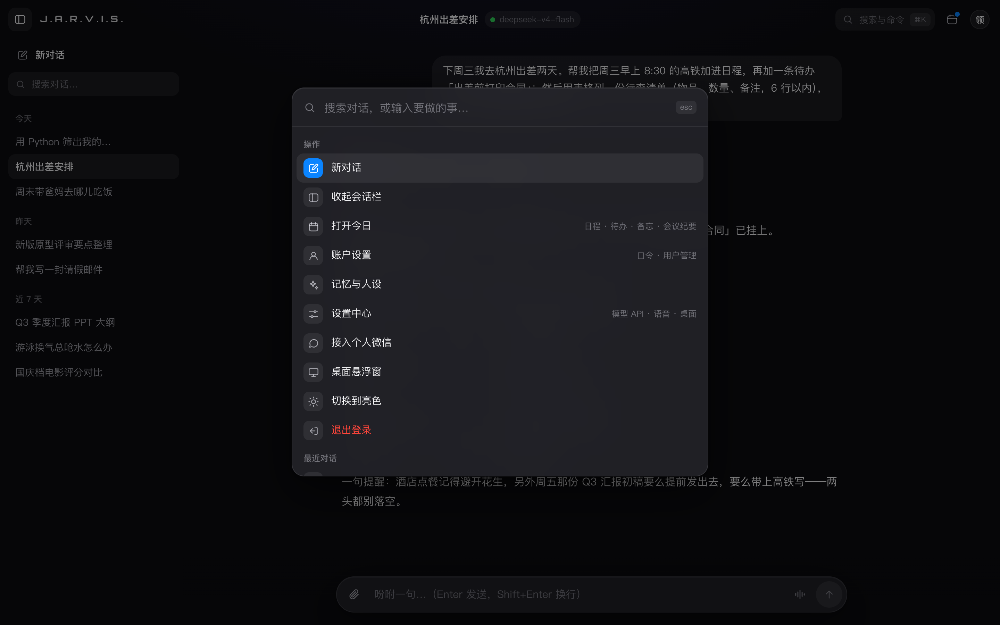<br><sub>⌘K 命令面板：搜会话、直达所有设置</sub></td>
<td align="center">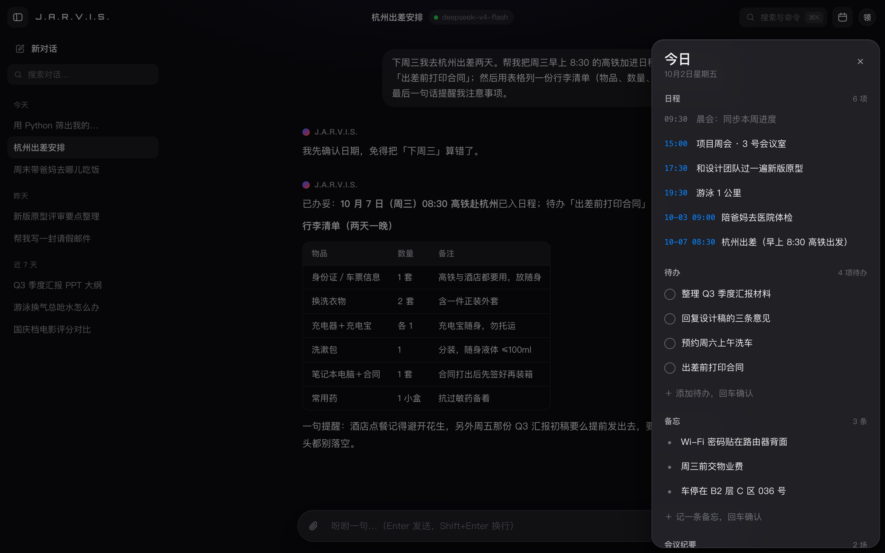<br><sub>「今日」板：日程 · 待办 · 备忘 · 会议纪要</sub></td>
</tr>
<tr>
<td align="center">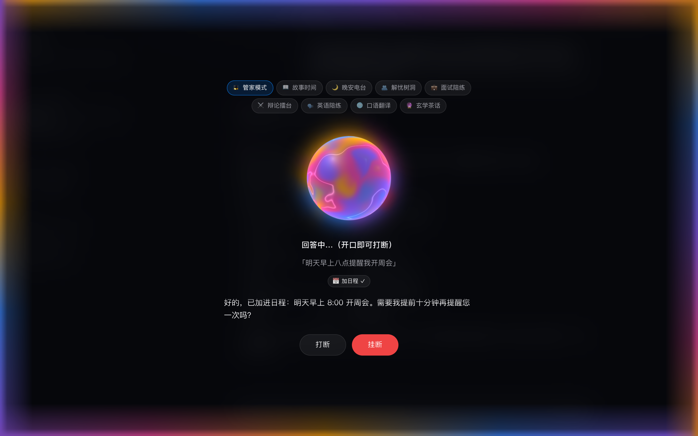<br><sub>语音通话：光球随听 / 想 / 说变化，9 种场景</sub></td>
<td align="center">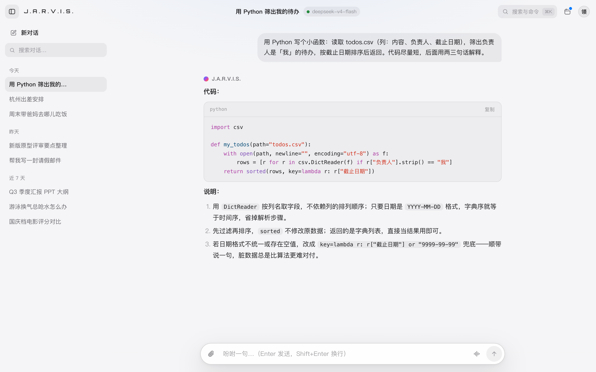<br><sub>亮色主题：代码高亮，一键切换</sub></td>
</tr>
<tr>
<td align="center" colspan="2">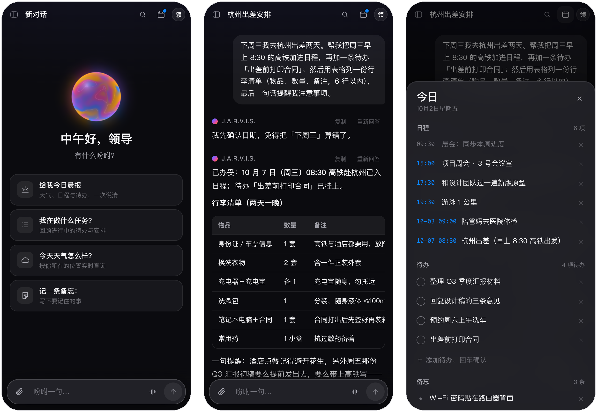<br><sub>手机版（390×844）：新对话 · 对话 · 「今日」板</sub></td>
</tr>
</table>

<table>
<tr>
<td align="center">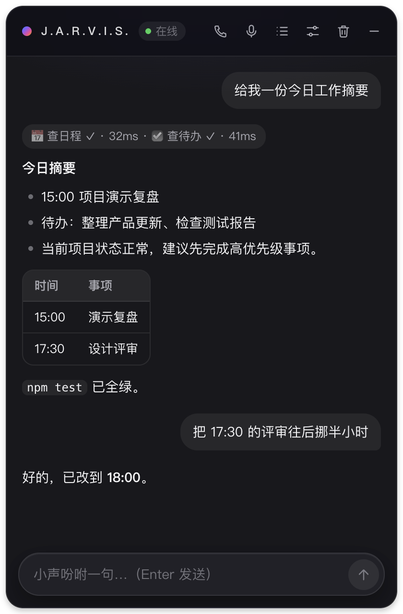<br><sub>桌面端：原地展开的快捷聊天</sub></td>
<td align="center">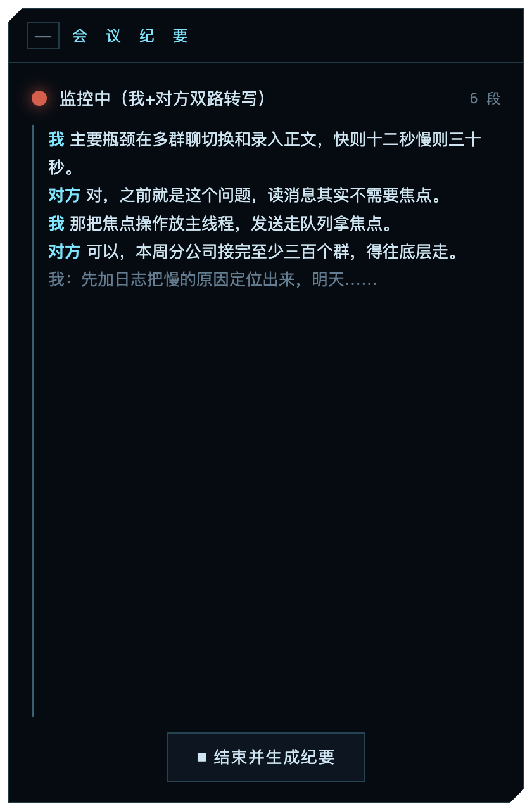<br><sub>会议监控：我 / 对方双路实时字幕</sub></td>
<td align="center">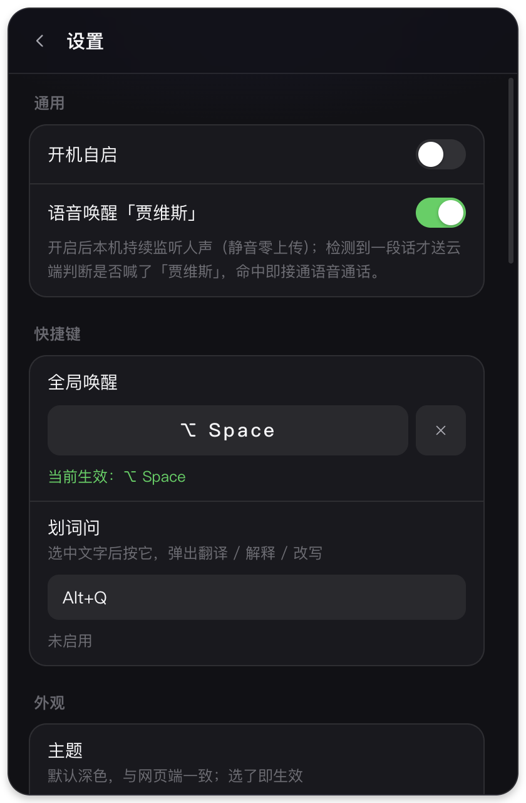<br><sub>快捷键、音色与晨报设置</sub></td>
</tr>
<tr>
<td align="center" colspan="3">
&emsp;&emsp;&emsp;<br>
<sub>悬浮球：待命 · 听（律动 + 冷蓝涟漪）· 想（亮弧流转）· 说（随音量起伏、转暖）</sub>
</td>
</tr>
</table>

<sub>网页截图为第九轮新界面，2026-10-02 在隔离演示环境实拍（桌面 1440×900、手机 390×844，均为 2 倍像素）；桌面端为第十一轮改版后实拍（JWS_SHOT 自检外壳，独立资料目录）。数据均为虚构演示数据（对话由真实模型回答演示问题生成），无真实用户对话与凭据入图。提醒、记忆、会议纪要、设置中心等全部 24 张截图与拍摄说明见 [截图画廊](docs/features.md#截图画廊)。</sub>

## 快速开始

> [!TIP]
> 需要 Python 3.10+ 和一个 OpenAI 兼容模型的 API Key（默认 DeepSeek，也可用 OpenAI、百炼、SiliconFlow 或自定义 HTTPS 中转）；桌面端另需 macOS 与 Node.js。

**① 安装**

```bash
python3 -m venv .venv
.venv/bin/pip install -e ".[dev]"
cp .env.example .env
```

**② 配置**：在 `.env` 中至少填好下面四项。后三项留空时不会创建 Owner，网页端会 fail closed 无法登录；`.env` 切勿提交。

```ini
JARVIS_API_KEY=<模型 API Key>
JARVIS_ADMIN_USERNAME=<首位 Owner 用户名>
JARVIS_ADMIN_PASSWORD=<强口令>
JARVIS_SESSION_SECRET=<openssl rand -hex 32 的输出>
```

**③ 启动**

```bash
.venv/bin/jarvis-web                       # 网页端 → http://127.0.0.1:7789
.venv/bin/jarvis                           # 终端对话（可选）
cd desktop && npm install && npm start     # macOS 桌面悬浮球（可选，需已有运行中的 Web 服务）
```

用 Owner 登录后，可在右上角头像菜单「账户设置 → 用户管理」邀请成员。动态网页提取、桌面端登录与服务器地址、自建 SearXNG、备份与回滚见 [部署指南](docs/deployment.md)，全部环境变量见 [配置参考](docs/configuration.md)。

## 工作原理

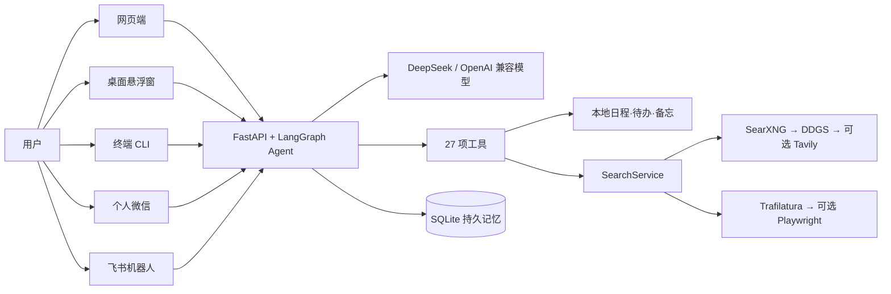
```mermaid
flowchart LR
  U[用户] --> W[网页端] & D[桌面悬浮窗] & C[终端 CLI] & X[个人微信] & F[飞书机器人]
  W & D & C & X & F --> A[FastAPI + LangGraph Agent]
  A --> M[DeepSeek / OpenAI 兼容模型]
  A --> T[27 项工具]
  A --> S[(SQLite 持久记忆)]
  T --> L[本地日程·待办·备忘]
  T --> Q[SearchService]
  Q --> P[SearXNG → DDGS → 可选 Tavily]
  Q --> R[Trafilatura → 可选 Playwright]
```

网页与桌面端经 SSE 流式输出；每个入口使用独立的 `thread_id`，LangGraph 检查点落在 SQLite，重启后仍能接着聊。工具分层与搜索来源边界见 [架构说明](docs/architecture.md)。

## 最新动态

<details open>
<summary><b>第十二轮 · 2026-10-02</b>　手机端修抖 · 语音更像人 · 回答拟人化 · ⌘K 翻旧账 · 可操作提醒</summary>


- **手机端上滑不再抖**：根因是流式输出时「离底 80px 内就贴底」把手指拽回，以及消息行估高在 Safari 上回填跳动；改为按手势判断跟随，实测上滑 0 跳动、0 次被拽回（Chromium + WebKit）。键盘弹起不遮输入栏，点击区 ≥44px，手机端去掉大面积毛玻璃。
- **语音更像人**：开口即打断并标出「⋯ 已打断」，下一句接着你的话说；工具慢时先垫一句「好，我查一下」；时间、温度、日期按中文口语念，不念网址和 Markdown；语气随情绪调整；TTS 升级 speech-2.8-turbo。
- **回答拟人化**：人设提示词重写（先接住情绪、结论先行、不说套话、缺信息只问一个问题）；每轮注入「此刻」时间与今日概况，换算日期不再调工具；评测中工具调用 35 → 27、列表行 37 → 11。
- **⌘K 直接吩咐 + 翻旧账**：⌘K 里一句话直接交给贾维斯或加到日程 / 待办；跨会话全文检索历史，跳转并定位到那条消息；问「上次你推荐的那家店」会带出处回答。
- **可操作的提醒**：网页、桌面、微信、飞书里都能「稍后 10 分 / 完成」，一处处理其余不再催；新增「主动找你」设置（送达渠道 + 免打扰），提醒可推送到飞书。
- 测试基线 **pytest 1069 / vitest 347 / desktop 149**，全部通过。

<br clear="right">
</details>

<details>
<summary><b>第十一轮 · 2026-10-02</b>　进场动画 · 一句话速记 · 记忆回执 · 今日简报 · 桌面端改版 · 安全加固</summary>


- **进场动画「唤醒」**：Apple 式边缘流光与逐字显影，光幕化作粒子汇聚成光球，无缝交给登录页；原生 WebGL，gzip 约 9KB，60fps。
- **一句话速记**：在「今日」板写「明天下午3点 复盘」，边打字边预览，自动成为日程；不带时间就是待办，可撤销，⌘K 里也能用。
- **记忆回执**：贾维斯记住或忘记什么，回答下方留一行「✓ 已记住 · 撤销」；夜间整理的记忆第二天在「今日」板提示。
- **今日简报卡**：「今日」板顶部一行 AI 简报，每人每天最多调用一次模型，失败退回规则摘要。
- **桌面悬浮窗改版**：与网页同一套设计语言，悬浮球改为光球三态，空闲 CPU 13.9% → 6.1%。
- **安全加固**：cryptography 50.0.2（依赖漏洞清零），建号 / 改口令强制强口令，过期会话定期清理，Heartbeat 夜间静默与去重。
- 测试基线 **pytest 898 / vitest 304 / desktop 137**，全部通过。

<br clear="right">
</details>

<details>
<summary><b>第十轮 · 2026-10-02</b>　全功能 QA · 飞书绑定面板 · 弱口令提醒</summary>

- **网页端**：修复 12 个问题（弹窗焦点陷阱、键盘选会话、通话 Esc 挂断、亮色对比度、报错文案等）；新增「思考中」小光球与飞书绑定面板（绑定码、倒计时、一键复制、解绑）。
- **后端**：修复工具异常穿透、`calc` 超大幂运算卡死全站、同线程并发丢回答、微信长轮询静默退出、后台线程混入会话侧栏等问题；四个定时线程统一为 `PeriodicWorker`。
- **安全**：检测默认 / 弱口令并在网页顶部提醒修改；pypdf、urllib3 升级修复高危 DoS。
- 测试基线 **pytest 765 / vitest 184 / desktop 124**，全部通过。

</details>

<details>
<summary><b>第九轮 · 2026-10-02</b>　网页端界面改版 · AI 光球 · ⌘K 命令面板 · 「今日」板</summary>

- **设计系统**：苹果式的排版、间距与圆角，暗色 / 亮色两套设计 token 重做；手机竖屏同步适配。
- **导航**：账户、记忆、设置中心、微信、悬浮窗、主题收进右上角头像菜单；⌘K 命令面板可搜会话、直达任意设置。
- **「今日」板**：日程、待办、备忘与会议纪要收在一处，宽屏常驻、窄屏浮层。
- **AI 光球 Presence**：WebGL 光球贯穿登录页、新对话空态与语音通话，随听 / 想 / 说变化。
- **登录页**：重新设计并保留 J.A.R.V.I.S. / MOSS 双形态切换，登录页 JS 1282 → 352KB。
- 测试基线 **pytest 657 / vitest 133 / desktop 124**，全部通过。

</details>

<details>
<summary><b>第八轮 · 2026-10-02</b>　后端卡顿修复 · 流式渲染优化 · 语音延迟优化 · 飞书机器人接入</summary>

- **后端**：有界历史、checkpoint 旧版本清理、模型超时与连接池重配、客户端断开即停（实测真实首 token 2889ms → 1023ms）。
- **前端 / 桌面**：流式 Markdown 增量渲染（修复 O(n²)）、token 按帧合并、three.js 懒加载修复、桌面主进程去同步。
- **语音**：通话判停 800 → 500ms、首句逗号即送 TTS、续说不抢答、回声抑制、开口预热。
- **飞书**：长连接收事件、流式卡片回复、一次性绑定码绑定账号，无需公网回调。
- 测试基线 **pytest 657 / vitest 100 / desktop 117**，全部通过。

</details>

<details>
<summary><b>更早</b>　第三至第七轮</summary>

- **第七轮**：三人以上说话人自动编号，纪要三件套（导入待办 / 就会议追问 / 说话人改名），双路电平柱自检。
- **第六轮**：会议「⚡ 实时要点」、服务线程成本泄漏修复、15 项代码审查修复。
- **第五轮**：通话场景模式、语气情绪感知、图片 / 短视频识别、会议说话人分离。
- **第四轮**：语音唤醒「贾维斯」、会议纪要自动邮件、网页控悬浮窗。
- **第三轮**：Heartbeat 主动唤醒、夜间记忆蒸馏、技能热加载、划词工具条。

完整记录见 [`PROGRESS.md`](PROGRESS.md)，演示入口的上线状态见 [部署指南](docs/deployment.md#演示入口与上线状态)。

</details>

## 文档

| 文档 | 你会找到 |
| --- | --- |
| 📖 [功能详解](docs/features.md) | 完整功能清单、语音 / 会议 / 唤醒用法、多入口对比、对话示例、全部截图 |
| 🚀 [部署指南](docs/deployment.md) | 安装、网页 / 终端 / 桌面端启动、运行时 secret、多用户备份与回滚、演示入口状态 |
| ⚙️ [配置参考](docs/configuration.md) | 环境变量全表、每用户 Provider 与 API 密钥、搜索与正文提取链 |
| 💬 [微信与飞书](docs/channels.md) | 个人微信桥接、飞书机器人、开发者后台清单与权限表 |
| 🧭 [架构说明](docs/architecture.md) | 工作原理、27 项工具分层、流式线程与记忆、搜索来源边界 |
| 🧪 [开发与测试](docs/development.md) | 验收脚本、测试基线、项目结构 |
| ❓ [常见问题](docs/faq.md) | SearXNG、Electron 二进制、天气定位、微信恢复、公网暴露 |

## 声明

本项目由陈文杰、钟俊琅共同开发，仅供学习、研究与个人非商业用途。未经两位开发者书面授权，禁止任何形式的商业使用、付费分发、商业部署、商业集成或以本项目为基础提供收费服务。

项目引用的第三方依赖与服务仍分别适用其各自的许可证、服务条款与品牌规则；上述声明不改变第三方组件的授权范围，也不授予本项目除第三方组件既有权利之外的任何商业使用权。

<div align="center"><sub><a href="#readme-top">回到顶部 ↑</a></sub></div>
