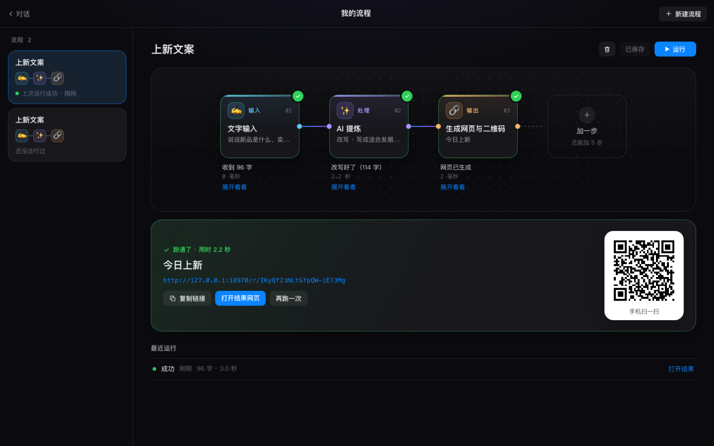
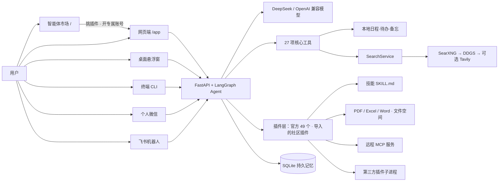
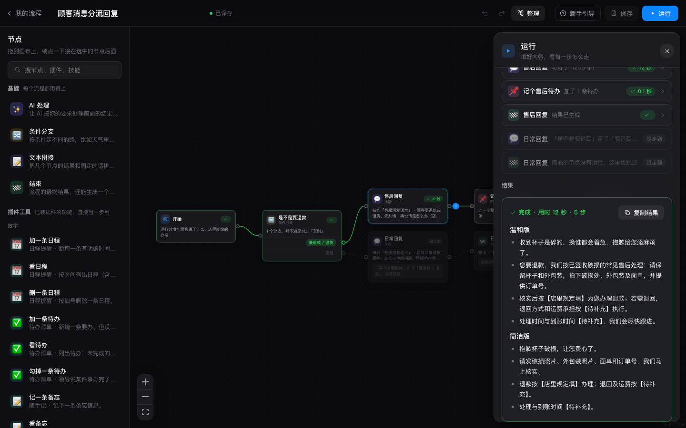
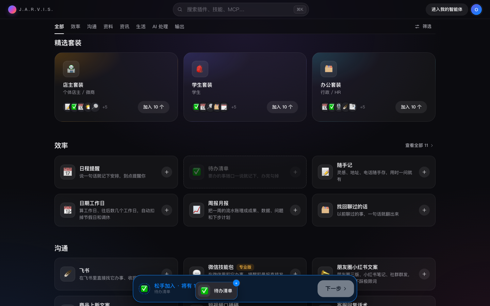

<div align="center"><a name="readme-top"></a>


# J.A.R.V.I.S.

**一个真正记得住、随时叫得到、能够采取行动的私人 AI 管家**

贾维斯（JWS-Agent）把聊天、语音通话、长期记忆、日程待办和带来源的实时搜索放进同一个 Agent<br>网页 · macOS 悬浮球 · 终端 · 个人微信 · 飞书，共用一套能力与记忆

[](https://www.python.org/) [](https://github.com/langchain-ai/langgraph) [](https://fastapi.tiangolo.com/) [](https://react.dev/) [](https://www.electronjs.org/) [](https://www.apple.com/macos/) [](#声明)

**[快速开始](#快速开始)** · [功能详解](docs/features.md) · [部署](docs/deployment.md) · [配置](docs/configuration.md) · [微信与飞书](docs/channels.md) · [架构](docs/architecture.md) · [FAQ](docs/faq.md)

<br>


<sub>一句话安排出差：调用工具写进日程和待办，再用表格列出行李清单，顺手提醒你对花生过敏（真实模型回答，演示数据）</sub>

</div>

> [!NOTE]
> **演示入口：[jws.gkgeek-set.cn](https://jws.gkgeek-set.cn)**。这是维护者的私有部署 / 演示入口，不是公共 SaaS，也不承诺持续在线；桌面端可在设置里改成你自己的服务器地址。上线状态见 [部署指南](docs/deployment.md#演示入口与上线状态)；这些状态说明不代表维护者已经替访问者执行过实时娱乐搜索或验证过任何具体结果。

> [!IMPORTANT]
> **非商用项目**：仅供学习、研究与个人非商业用途，禁止未经授权的商业部署、商业集成、付费分发或收费服务。本声明只描述 JWS-Agent 自身的使用范围；可选部署中的第三方 SearXNG 采用独立的 AGPL-3.0，二者不能互相替代，详见 [`deploy/searxng`](deploy/searxng/README.md)。插件模板 [`examples/plugin-template`](examples/plugin-template/) 是例外，单独以 MIT-0 授权，方便第三方开发者复制去写自己的插件。

## 它能做什么

一个 LangGraph Agent 驱动 27 项核心工具，外加可插拔的插件（49 个官方开源插件：PDF / Excel / Word 工具箱、15 个写作与规划技能、计算工具、DeepWiki / 高德等 MCP 服务；还能从 GitHub 导入社区插件），能聊、能记，也能动手：增删日程待办、查天气、搜实时信息、处理文档表格、开会记纪要。完整清单见 [功能详解](docs/features.md)，插件开发见 [插件指南](docs/plugins.md)。

它也是一座**智能体工坊**：不懂技术的人在插件市场里挑几个插件，就能拿到一套专属账号口令，登录进去就是按这些插件组装好的智能体；再用「输入 → 处理 → 输出」积木拼个流程，结果生成网页二维码，手机一扫就能看。

<table>
<tr>
<td width="33%" valign="top"><b>💬 流式对话</b><br>完整 Markdown（来源链接、表格、代码高亮），可重答、编辑重发、导出；上传 PDF / Word / Excel / CSV 直接处理原文件</td>
<td width="33%" valign="top"><b>🧠 长期记忆</b><br>画像可查可删，每晚把当天对话蒸馏进长期画像；称呼与语气可调</td>
<td width="33%" valign="top"><b>⏰ 主动找你</b><br>日程到点推送微信 / 飞书 / 桌面 / 网页，一键「稍后 10 分 / 完成」；渠道与免打扰自己定，该开口才开口</td>
</tr>
<tr>
<td valign="top"><b>📞 语音通话</b><br>边说边答带字幕，开口即打断、查得慢先垫一句；时间数字按口语念，语气随你的情绪变；9 种场景模式</td>
<td valign="top"><b>🎙️ 会议纪要</b><br>麦克风 + 系统回环双路转写、说话人分离，纪要自动发邮箱；飞书、腾讯会议、Zoom 都能录</td>
<td valign="top"><b>🗣️ 语音唤醒</b><br>喊一声「贾维斯」就接通；本地 VAD 圈出人声才送云端识别，静音零上传</td>
</tr>
<tr>
<td valign="top"><b>🖥️ 桌面悬浮球</b><br>⌥Space 唤出快捷聊天，⌥Q 划词翻译 / 解释 / 改写，通话时随听、想、说三态变色</td>
<td valign="top"><b>🔎 可追溯搜索</b><br>SearXNG → DDGS 免费降级，结果带时间与来源；评分分平台列出，票务只给公开入口</td>
<td valign="top"><b>🖼️ 看图识视频</b><br>发图片或短视频，qwen3-vl 转成描述后可连续追问，截图里的文字表格逐字转录</td>
</tr>
<tr>
<td valign="top"><b>📱 微信 · 飞书</b><br>扫码接入个人微信，发链接即总结；飞书机器人走长连接免公网回调，流式卡片回复</td>
<td valign="top"><b>👥 多用户隔离</b><br>Owner 邀请制开号，对话、记忆、日程与模型 Provider 各自独立，Key 加密存储、永不回显</td>
<td valign="top"><b>🧩 技能热加载</b><br>在 <code>skills/</code> 放一个 <code>SKILL.md</code> 就多一项技能，下一轮对话生效，无需重启</td>
</tr>
<tr>
<td valign="top"><b>🏭 智能体工坊</b><br>在插件市场挑插件、起个名字，拿到专属账号口令；登录即是只用这些插件、以自己名字自称的智能体</td>
<td valign="top"><b>🧱 积木流程</b><br>「输入 → 处理 → 输出」拼成一条链：上传资料、拆分、AI 提炼、生成 Excel / Word / 网页二维码</td>
<td valign="top"><b>🔌 插件市场</b><br>插件独立封装、互不影响；PDF / Excel / Word 工具箱内置，管理员可从 GitHub / Gitee / zip 导入社区插件</td>
</tr>
</table>

## 界面一览

<p align="center"><br><sub>进场动画「唤醒」：边缘流光 → 光幕化作粒子 → 凝成光球 → 无缝交给登录页（约 3.3 秒，每次打开或刷新都播，点击即可跳过）</sub></p>

<table>
<tr>
<td align="center" width="50%"><br><sub>登录页：会呼吸的 AI 光球与问候</sub></td>
<td align="center" width="50%"><br><sub>新对话：光球 + 问候 + 一键建议</sub></td>
</tr>
<tr>
<td align="center"><br><sub>⌘K 命令面板：搜会话、直达所有设置</sub></td>
<td align="center"><br><sub>「今日」板：日程 · 待办 · 备忘 · 会议纪要</sub></td>
</tr>
<tr>
<td align="center"><br><sub>语音通话：光球随听 / 想 / 说变化，9 种场景</sub></td>
<td align="center"><br><sub>亮色主题：代码高亮，一键切换</sub></td>
</tr>
<tr>
<td align="center" colspan="2"><br><sub>手机版（390×844）：新对话 · 对话 · 「今日」板</sub></td>
</tr>
<tr>
<td align="center"><br><sub>首页即智能体市场：一个搜索框（也能一句话让 AI 推荐）、精选套装、紧凑插件行，拖进底部工具箱即可加入</sub></td>
<td align="center"><br><sub>积木流程：节点逐个亮起，跑完给出结果网页二维码</sub></td>
</tr>
<tr>
<td align="center"><br><sub>插件详情：能做什么、试试这样问、需要什么（以 DeepWiki MCP 为例）</sub></td>
<td align="center"><br><sub>导入插件：来源、权限、许可证一目了然再安装</sub></td>
</tr>
</table>

<table>
<tr>
<td align="center"><br><sub>桌面端：原地展开的快捷聊天</sub></td>
<td align="center"><br><sub>会议监控：我 / 对方双路实时字幕</sub></td>
<td align="center"><br><sub>快捷键、音色与晨报设置</sub></td>
</tr>
<tr>
<td align="center" colspan="3">
&emsp;&emsp;&emsp;<br>
<sub>悬浮球：待命 · 听（律动 + 冷蓝涟漪）· 想（亮弧流转）· 说（随音量起伏、转暖）</sub>
</td>
</tr>
</table>

<sub>网页截图为第九轮新界面，2026-10-02 在隔离演示环境实拍（桌面 1440×900、手机 390×844，均为 2 倍像素）；桌面端为第十一轮改版后实拍（JWS_SHOT 自检外壳，独立资料目录）。数据均为虚构演示数据（对话由真实模型回答演示问题生成），无真实用户对话与凭据入图。提醒、记忆、会议纪要、设置中心等全部 24 张截图与拍摄说明见 [截图画廊](docs/features.md#截图画廊)。</sub>

## 快速开始

> [!TIP]
> 需要 Python 3.10+ 和一个 OpenAI 兼容模型的 API Key（默认 DeepSeek，也可用 OpenAI、百炼、SiliconFlow 或自定义 HTTPS 中转）；桌面端另需 macOS 与 Node.js。

**① 安装**

```bash
python3 -m venv .venv
.venv/bin/pip install -e ".[dev]"
cp .env.example .env
```

**② 配置**：在 `.env` 中至少填好下面四项。后三项留空时不会创建 Owner，网页端会 fail closed 无法登录；`.env` 切勿提交。

```ini
JARVIS_API_KEY=<模型 API Key>
JARVIS_ADMIN_USERNAME=<首位 Owner 用户名>
JARVIS_ADMIN_PASSWORD=<强口令>
JARVIS_SESSION_SECRET=<openssl rand -hex 32 的输出>
```

**③ 启动**

```bash
.venv/bin/jarvis-web                       # 网页端 → http://127.0.0.1:7789（首页是智能体市场，登录 /login，主应用 /app）
.venv/bin/jarvis                           # 终端对话（可选）
cd desktop && npm install && npm start     # macOS 桌面悬浮球（可选，需已有运行中的 Web 服务）
cd desktop && npm run pack:mac && npm run install:mac   # 打包成「贾维斯.app」装进 ~/Applications，网页可一键唤起
```

用 Owner 登录后，可在右上角头像菜单「账户设置 → 用户管理」邀请成员。动态网页提取、桌面端登录与服务器地址、自建 SearXNG、备份与回滚见 [部署指南](docs/deployment.md)，全部环境变量见 [配置参考](docs/configuration.md)。

## 工作原理


```mermaid
flowchart LR
  U[用户] --> MK[智能体市场 /]
  MK -->|挑插件 · 开专属账号| W
  U --> W[网页端 /app] & D[桌面悬浮窗] & C[终端 CLI] & X[个人微信] & F[飞书机器人]
  W & D & C & X & F --> A[FastAPI + LangGraph Agent]
  A --> M[DeepSeek / OpenAI 兼容模型]
  A --> T[27 项核心工具]
  A --> PL[插件层：官方 49 个 · 导入的社区插件]
  A --> S[(SQLite 持久记忆)]
  T --> L[本地日程·待办·备忘]
  T --> Q[SearchService]
  Q --> P[SearXNG → DDGS → 可选 Tavily]
  PL --> SK[技能 SKILL.md]
  PL --> OF[PDF / Excel / Word · 文件空间]
  PL --> MC[远程 MCP 服务]
  PL --> SB[第三方插件子进程]
```

网页与桌面端经 SSE 流式输出；每个入口使用独立的 `thread_id`，LangGraph 检查点落在 SQLite，重启后仍能接着聊。市场开出的专属账号只绑定所选插件的工具，Owner 是完整的贾维斯；插件各自封装、出错互不影响，第三方插件跑在独立子进程。工具与插件分层、搜索来源边界见 [架构说明](docs/architecture.md)。

## 最新动态

<details open>
<summary><b>第十九轮 · 2026-10-03</b>　流程里文件直通 Excel / PDF / Word · 工具失败就停下 · 联网按账号设置</summary>

- **上传的文件直接交给文件工具**：流程开始节点上传的文件会存进账号的文件空间，变量里多出「开始 · 上传资料（原文件）」，Excel / PDF / Word 工具直接用它——「Excel 报表分析成 Word」模板改为由 Excel 工具精确分组汇总（不再只看前 60 行），实测 120 行随机数据逐区数字与独立计算一致，Word 里的表格也一致；新增「几份 PDF 合成一份」「Word 文档润色后另存」两个模板，一句话生成也会用文件工具。运行面板与运行记录能看到上传的原件。
- **工具没办成就停下**：天气、按定位查天气、翻旧账、联网搜索、网页读取、文娱搜索以及 Excel / PDF / Word 插件这次没办成时，流程停在那一步并说清原因（如「「按定位查天气」：还没拿到定位，没法按位置查天气；流程里请改用『查城市天气』」），不再把失败说明当结果传给下一步；对话里的表现不变。
- **联网工具按账号设置**：流程里的联网搜索、网页读取、文娱搜索用账号自己的搜索服务设置，和对话里一致。
- 顺带修：运行面板里没动过的输入框显示字段默认值。测试基线 **pytest 1756 / vitest 718 / desktop 166**，全部通过。
</details>

<details>
<summary><b>第十八轮 · 2026-10-03</b>　流程画布（参考 Dify / Langflow）· 插件即节点 · 一句话生成 · 模板 · 定时运行 · 新手引导</summary>


- **流程画布**：「我的流程」从线性积木升级为可视化节点画布——开始、AI 处理、插件工具、技能、条件分支、文本拼接、积木、结束；**任何已装插件的工具都能直接拖上画布**，智能体没装的插件也列出来并提示去加。后面的节点用「插入变量」引用前面的结果（显示成「查天气 · 文字」这样的人话）。运行时逐节点亮起，走过的分支高亮、没走到的变暗，每一步的结果可展开；改过配置的节点标「结果已过期」。保存过的流程改动后 2 秒自动保存，可撤销 / 重做、一键整理，手机上是列表式编辑。旧流程自动换算成画布，不丢。
- **起步更省事**：一句话生成流程（「每天早上把天气和日程发到飞书」→ 几秒出草稿，预览后打开编辑）；24 个模板覆盖办公 / 学习 / 内容创作 / 店铺 / 生活资讯，模板会写明「需要准备」什么（比如先绑定飞书）。
- **定时运行**：每天 / 工作日 / 每周几 + 时间，「工作日」跳过法定节假日、调休照常；到点后台自己跑，结果推到飞书或桌面；连续失败 5 次自动暂停并通知。
- **新手引导**：流程首页、画布、智能体市场、主应用各一套，聚光灯 + 步骤卡；每个账号只自动出现一次（换设备也一样），可跳过，随时点「新手引导」、头像菜单或 ⌘K 重看，设置里可一键重置。
- 测试基线 **pytest 1722 / vitest 707 / desktop 166**，全部通过；真后端联调 15 项全过。调研与方案见 [`docs/design/2026-10-flows-references.md`](docs/design/2026-10-flows-references.md)、[`docs/proposals/2026-10-round18-flows.md`](docs/proposals/2026-10-round18-flows.md)。

<br clear="right">
</details>

<details>
<summary><b>第十七轮 · 2026-10-03</b>　插件市场去冗余改版 · 拖拽加入 · 进场动画每次刷新都播</summary>


- **市场去冗余**：参考苹果 App Store、华为应用市场、Anthropic 插件目录与 ChatGPT 的版面，首屏只留一句主张、一个大搜索框和分类页签（首屏信息块 11 → 6，整页高度少四分之一）；同屏只有一个实心主按钮（工具箱的「下一步」）。插件卡改成紧凑行：图标、名称、一句话、圆形「+」，徽标最多一个；精选套装一行三张；手机首屏就能看到插件。「一句话帮我推荐」并进搜索框，来源与类型收进「筛选」，管理员的「插件管理」挪进头像菜单。
- **拖拽加入**：把插件卡或整套套装拖进底部工具箱，工具箱高亮并提示「松手加入 · 将有 N 个」；已经加过或需要配置的插件拖过去会显示原因、不会加入；点「+」时图标飞进工具箱。工具箱里按住一行拖动排序（生成时按这个顺序装），往外拖或把工具箱上的小图标往上拖出就是移除，5 秒内可撤销；手机长按卡片即可拖动，正常上下滑不受影响。全程键盘可用、读屏有播报，零新依赖。
- **详情与结果页重做**：插件详情、起名配色、生成账号结果页统一成同一套间距、圆角和按钮层级。
- **进场动画每次打开或刷新都播**：市场、登录页、主应用、流程页都播（站内切页不重播，品牌智能体入口不播）；系统开了「减弱动态效果」时改为不到 1 秒的静态淡入。
- 测试基线 **pytest 1482 / vitest 558 / desktop 166**，全部通过；真后端联调 22 项全过。调研与方案见 [`docs/design/2026-10-market-references.md`](docs/design/2026-10-market-references.md)、[`docs/proposals/2026-10-round17-market.md`](docs/proposals/2026-10-round17-market.md)。

<br clear="right">
</details>

更早的更新（第三至第十五轮：市场做首页与 MCP、插件独立封装、智能体工坊、手机端修抖、语音拟人化、进场动画、飞书接入……）与第十六轮的小修复见 [更新日志](CHANGELOG.md)。

## 文档

| 文档 | 你会找到 |
| --- | --- |
| 📖 [功能详解](docs/features.md) | 完整功能清单、语音 / 会议 / 唤醒用法、多入口对比、对话示例、全部截图 |
| 🚀 [部署指南](docs/deployment.md) | 安装、网页 / 终端 / 桌面端启动、运行时 secret、多用户备份与回滚、演示入口状态 |
| ⚙️ [配置参考](docs/configuration.md) | 环境变量全表、每用户 Provider 与 API 密钥、搜索与正文提取链 |
| 💬 [微信与飞书](docs/channels.md) | 个人微信桥接、飞书机器人、开发者后台清单与权限表 |
| 🧩 [插件指南](docs/plugins.md) | 写插件、导入插件、MCP 接入、官方插件源、安全须知 |
| 🧭 [架构说明](docs/architecture.md) | 工作原理、核心工具与插件层、智能体工坊与路由、流式线程与记忆、搜索来源边界 |
| 🧪 [开发与测试](docs/development.md) | 验收脚本、测试基线、项目结构 |
| ❓ [常见问题](docs/faq.md) | 登录与路由、桌面悬浮窗唤起、插件导入与 MCP、SearXNG、微信恢复、公网暴露 |
| 📝 [更新日志](CHANGELOG.md) | 第三轮以来的全部更新 |

## 声明

本项目由陈文杰、钟俊琅共同开发，仅供学习、研究与个人非商业用途。未经两位开发者书面授权，禁止任何形式的商业使用、付费分发、商业部署、商业集成或以本项目为基础提供收费服务。

项目引用的第三方依赖与服务仍分别适用其各自的许可证、服务条款与品牌规则；上述声明不改变第三方组件的授权范围，也不授予本项目除第三方组件既有权利之外的任何商业使用权。

<div align="center"><sub><a href="#readme-top">回到顶部 ↑</a></sub></div>
