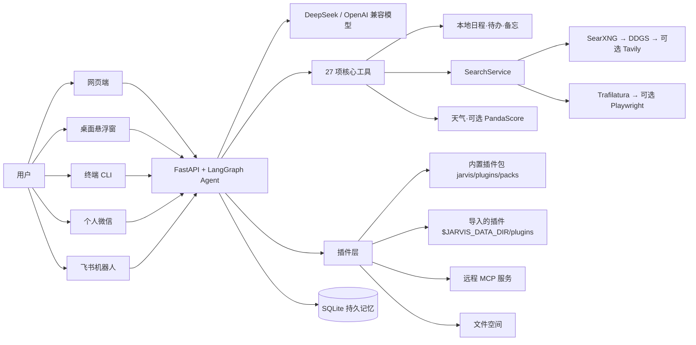

# 架构说明

[← 返回 README](../README.md) · [功能](features.md) · [部署](deployment.md) · [配置](configuration.md) · [微信与飞书](channels.md) · [开发与测试](development.md) · [FAQ](faq.md)

**目录**：[工作原理](#工作原理) · [27 项工具如何分层](#27-项工具如何分层) · [插件层](#插件层) · [智能体工坊与路由](#智能体工坊与路由) · [流式、线程与记忆](#流式线程与记忆) · [实时搜索与正文提取的来源边界](#实时搜索与正文提取的来源边界)

## 工作原理

## 27 项工具如何分层

| 层级 | 工具 | 作用与数据边界 |
| --- | --- | --- |
| 基础与上下文（6） | `now`、`calc`、`weather`、`weather_here`、`my_location`、`coding_status` | 时间与白名单计算；Open-Meteo 天气无需 key；定位和编程状态保存在本地数据目录 |
| 个人信息管理（12） | `memo_add/list/del`、`schedule_add/list/del`、`todo_add/list/done`、`profile_remember/list/forget` | 备忘、日程、待办与长期记忆画像在 `JARVIS_DATA_DIR` 下持久化；画像条目注入每轮系统提示词，网页「记忆」面板可查可删 |
| 系统查询（1） | `sys_query` | 只执行代码允许的白名单系统查询 |
| 翻旧账（1） | `recall_history` | 跨会话全文检索本账号的历史消息（SQLite FTS5 trigram，短词退回 LIKE），回答注明出处；索引是 checkpoint 的镜像，删会话同步删除 |
| 会议纪要（2） | `meeting_start`、`meeting_stop` | 对话里说「监控会议」即可远程开始/结束；音频由 macOS 桌面端采集，纪要生成与邮件发送在服务端完成 |
| 实时信息（5） | `web_search`、`web_extract`、`movie_ratings`、`esports_scores`、`ticket_search` | SearchService 统一调度免费优先搜索与有界正文提取；Tavily、PandaScore 和 Playwright 都是可选增强；工具不会代替用户完成交易 |

工具注册见 `jarvis/tools/__init__.py`（22 项本地工具 + 5 项共享同一 SearchService 的联网工具）。

## 插件层

- **插件包**：一个目录 = 一个插件（`plugin.json` + 可选 `tools.py` / `SKILL.md` / `mcp.json`）。内置的 49 个官方插件在 `jarvis/plugins/packs/`（MIT-0），导入的在 `$JARVIS_DATA_DIR/plugins/`；加载器 `jarvis/plugins/loader.py` 逐个校验、逐个加载，汇总成市场目录（`GET /api/market/catalog`）。启用 / 停用、导入记录、插件源、MCP 工具存档都在 `plugins/_state.json`，MCP 配置在 `plugins/_config.json`（0600，密钥 AES-GCM，主密钥 `JARVIS_SECRETS_KEY`）——不加数据库表。
- **四类插件**：`tool`（对话工具；「已有能力」类插件把核心工具打包成插件）、`skill`（SKILL.md 提示词技能，按外部资料包一层注入）、`step`（积木流程里的积木）、MCP（`mcp.json` 声明远程 streamable-http / sse 服务，工具在安装时发现并存档，名为 `<插件id>__<工具名>`）。`channel`（微信、飞书）是需要绑定的通道。
- **隔离**：清单坏了 / 导入出错 / 依赖缺失只让这一个插件「暂不可用」；工具调用有超时，异常一律转人话；工具名冲突拒绝后来者；插件设置在 `tenant_prefs` 的 `plugin:<id>:<key>` 命名空间；导入的第三方插件在子进程里执行（`python -I -B`、最小环境变量、临时工作目录、资源限额、超时杀进程组），v1 只能提供文本工具。MCP 工具清单一变就停用待管理员确认，返回内容按外部资料包裹。子进程不是沙箱：与服务同一系统用户，只给管理员导入。
- **导入与插件源**（`jarvis/plugins/importer.py`、`routes.py`，仅 Owner）：GitHub / Gitee（分支解析成 commit 固定）或 zip → 信任预览 → 确认安装；兼容 Agent Plugins 标准 `plugin.json`、`skills/*/SKILL.md` 与 `.agents/plugins/marketplace.json` 插件源。仓库根目录的 `.agents/plugins/marketplace.json` 就是官方插件源。
- **文件空间**（`jarvis/files.py`）：对话附件与工具生成的文件存在 `data_dir()/files/<owner_id>/`，每账号 200MB、单文件 20MB、30 天；PDF / Excel / Word 插件按 `file_id` 读写，结果以 `/api/files/<id>` 下载链接返回。

## 智能体工坊与路由

- **路由**（`web-src/src/routes.js`）：`/` 智能体市场（公开）、`/login` 登录、`/app` 主应用、`/flows` 积木流程、`/p/<slug>` 智能体品牌入口；服务端对这些路径回 index.html，`/market` 与旧的 `/?u=` 302 到新地址。登录后的 `next` 只接受站内路径。
- **专属账号即智能体**（`jarvis/platforms.py`）：市场开号时建一个 Member 账号 + `tenant_platforms` 记录（所选插件、名称、主题色）。该账号的 Agent 只绑定这些插件的工具（外加 now / calc），系统提示词加「智能体身份」段；插件或名称变了就按 `plugins_gen` / `platform_rev` 重建这个账号的 Agent。Owner 与没有智能体的账号不受影响。
- **主页问候与快捷问题**（`jarvis/platform_home.py`）：按名称、介绍、职业和已装插件由模型生成，存 `tenant_prefs`，模型不可用时按规则兜底。
- **积木流程**（`jarvis/flows/`）：`tenant_flows` / `tenant_flow_runs`（租户 schema v6），9 个核心积木 + 插件包提供的积木（如 `excel_out`、`word_out`），运行进度经 SSE 推送，结果页 `/r/<token>` 服务端渲染、全转义、CSP 禁脚本。

## 流式、线程与记忆

- 网页和桌面端调用 FastAPI `/api/chat`，服务端以 `text/event-stream` 返回 `token`、`tool_start`、`tool_result`、`done` 或 `error` 事件。`profile_remember` / `profile_forget` 真正写入或删除时，`tool_result` 额外带 `memory: {action, id, content}`（来自 ToolMessage.artifact，不进模型上下文），网页据此在回答下方显示可撤销的记忆回执。
- 「今日」板的两个附加行都不加表、只用 `tenant_prefs`：今日简报卡（`jarvis/briefing.py`，`GET/POST /api/brief`，每账号每天最多 1 次模型调用，失败退回规则摘要）；夜间蒸馏批次提示与回执开关（`jarvis/memory_receipts.py`，`GET /api/memory`、`PUT /api/memory/prefs`、`POST /api/memory/fresh/dismiss`）。
- 每次 Agent 调用都带 `thread_id`。网页会话、桌面固定线程、CLI 自定义线程和微信联系人线程相互隔离，避免不同入口的上下文串线。
- `JARVIS_DATA_DIR/jarvis.db` 保存 LangGraph 检查点；`accounts.sqlite3` 保存账号、会话、审计以及按 Owner 隔离的线程/备忘/待办/日程/位置元数据。两个 SQLite 文件都是完整备份的一部分。
- 服务还提供带 Bearer 鉴权的 `/v1/chat/completions` OpenAI 兼容接口，供微信备用网关等客户端接入；它不是完整的 OpenAI API 实现。

## 实时搜索与正文提取的来源边界

- `SearchService` 默认依次尝试本地 SearXNG、DDGS 和显式配置的可选 Tavily。仓库提供的 SearXNG Compose 只监听 `127.0.0.1:18888`；生产审计发现 8888 已被 BT-Panel 占用，因此改用确认空闲的 18888。未启动或未配置时会自动继续 DDGS。
- 私有演示部署的线上验收范围（截至 2026-08-13）见 [部署指南 · 演示入口与上线状态](deployment.md#演示入口与上线状态)。
- 静态正文优先由 Trafilatura 有界提取；只有安装 browser extra 和 Chromium 后，动态页面才可回退 Playwright。提取器限制响应体与输出长度，并拒绝 loopback、私网和其他不安全目标。
- 每次搜索输出记录查询时间、provider、标题、摘要与有效 HTTP(S) 来源。网页文本被标记为外部资料而不是 Agent 指令，但公开网页仍可能过时或有误；重要信息应打开原始链接复核。
- `TAVILY_API_KEY` 与 `PANDASCORE_TOKEN` 都可选。PandaScore 配置后可优先提供结构化电竞数据，缺失或失败时回退默认网页搜索链。
- 电影评分按平台和分制分开；票务价格只代表公开展示价、起价或票面价，库存、手续费和最终成交价以平台结算页为准。
