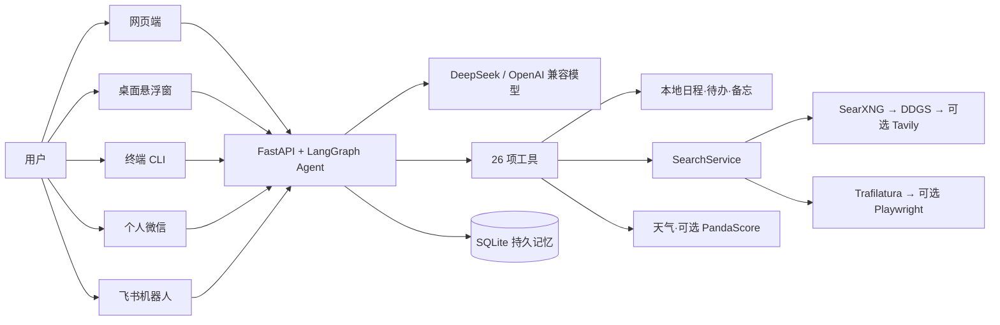

# 架构说明

[← 返回 README](../README.md) · [功能](features.md) · [部署](deployment.md) · [配置](configuration.md) · [微信与飞书](channels.md) · [开发与测试](development.md) · [FAQ](faq.md)

**目录**：[工作原理](#工作原理) · [26 项工具如何分层](#26-项工具如何分层) · [流式、线程与记忆](#流式线程与记忆) · [实时搜索与正文提取的来源边界](#实时搜索与正文提取的来源边界)

## 工作原理

## 26 项工具如何分层

| 层级 | 工具 | 作用与数据边界 |
| --- | --- | --- |
| 基础与上下文（6） | `now`、`calc`、`weather`、`weather_here`、`my_location`、`coding_status` | 时间与白名单计算；Open-Meteo 天气无需 key；定位和编程状态保存在本地数据目录 |
| 个人信息管理（12） | `memo_add/list/del`、`schedule_add/list/del`、`todo_add/list/done`、`profile_remember/list/forget` | 备忘、日程、待办与长期记忆画像在 `JARVIS_DATA_DIR` 下持久化；画像条目注入每轮系统提示词，网页「记忆」面板可查可删 |
| 系统查询（1） | `sys_query` | 只执行代码允许的白名单系统查询 |
| 会议纪要（2） | `meeting_start`、`meeting_stop` | 对话里说「监控会议」即可远程开始/结束；音频由 macOS 桌面端采集，纪要生成与邮件发送在服务端完成 |
| 实时信息（5） | `web_search`、`web_extract`、`movie_ratings`、`esports_scores`、`ticket_search` | SearchService 统一调度免费优先搜索与有界正文提取；Tavily、PandaScore 和 Playwright 都是可选增强；工具不会代替用户完成交易 |

工具注册见 `jarvis/tools/__init__.py`（21 项本地工具 + 5 项共享同一 SearchService 的联网工具）。

## 流式、线程与记忆

- 网页和桌面端调用 FastAPI `/api/chat`，服务端以 `text/event-stream` 返回 `token`、`tool_start`、`tool_result`、`done` 或 `error` 事件。
- 每次 Agent 调用都带 `thread_id`。网页会话、桌面固定线程、CLI 自定义线程和微信联系人线程相互隔离，避免不同入口的上下文串线。
- `JARVIS_DATA_DIR/jarvis.db` 保存 LangGraph 检查点；`accounts.sqlite3` 保存账号、会话、审计以及按 Owner 隔离的线程/备忘/待办/日程/位置元数据。两个 SQLite 文件都是完整备份的一部分。
- 服务还提供带 Bearer 鉴权的 `/v1/chat/completions` OpenAI 兼容接口，供微信备用网关等客户端接入；它不是完整的 OpenAI API 实现。

## 实时搜索与正文提取的来源边界

- `SearchService` 默认依次尝试本地 SearXNG、DDGS 和显式配置的可选 Tavily。仓库提供的 SearXNG Compose 只监听 `127.0.0.1:18888`；生产审计发现 8888 已被 BT-Panel 占用，因此改用确认空闲的 18888。未启动或未配置时会自动继续 DDGS。
- 私有演示部署的线上验收范围（截至 2026-08-13）见 [部署指南 · 演示入口与上线状态](deployment.md#演示入口与上线状态)。
- 静态正文优先由 Trafilatura 有界提取；只有安装 browser extra 和 Chromium 后，动态页面才可回退 Playwright。提取器限制响应体与输出长度，并拒绝 loopback、私网和其他不安全目标。
- 每次搜索输出记录查询时间、provider、标题、摘要与有效 HTTP(S) 来源。网页文本被标记为外部资料而不是 Agent 指令，但公开网页仍可能过时或有误；重要信息应打开原始链接复核。
- `TAVILY_API_KEY` 与 `PANDASCORE_TOKEN` 都可选。PandaScore 配置后可优先提供结构化电竞数据，缺失或失败时回退默认网页搜索链。
- 电影评分按平台和分制分开；票务价格只代表公开展示价、起价或票面价，库存、手续费和最终成交价以平台结算页为准。
