# 智能体市场设计参考（第十七轮调研）

2026-10-02 · 调研代理 · 配合 [第十七轮方案](../proposals/2026-10-round17-market.md)

截图都在 `docs/design/refs/`，是 2026-10-02 用 Playwright 实拍的（1440×900 / 390×844，JPEG，每张 ≤120KB）。打不开的页面在文中注明，并用替代来源。现状截图来自线上 https://jws.gkgeek-set.cn/（暗色主题，游客身份）。

---

## TL;DR

1. 四家的共同点是**每屏只有一个焦点**：一句标题，加一个搜索框或一个主按钮。我们首屏现在有 11 个信息块、4 个实心主按钮、3 个「找插件」入口。
2. 首屏只留三样：一句主张、大搜索框（兼做「一句话推荐」）、一排分类页签。光球环、「开始挑插件」按钮和右侧「帮我推荐」栏都去掉，并入搜索。
3. 目录参考 ChatGPT Plugins 和 Claude 连接器目录：**紧凑行卡**，由图标、名称、一句话和右侧一个「+」组成，宽屏 3 列，手机改成无边框列表。
4. 徽标每张卡最多 1 个。「官方」不再显示，因为线上 51/51 都是官方，这个徽标是纯噪音。「需要配置」优先级最高。
5. 筛选只留一排：分类页签。来源 / 类型收进「筛选」弹层，这是 GPTs 页签和 Claude 左侧筛选的做法。
6. 详情参考 App Store 条目页 / ChatGPT 插件详情：头部是图标、名称、一句话，旁边放**唯一的主按钮**。基本信息最多 4 项，版本、许可证等放到底部「信息」区。
7. 设计令牌收敛：字号 6 级（现在 28 种）、圆角 5 种（现在约 25 种）、阴影 3 级（现在 28 种）、动效 4 档时长。
8. 拖拽：鼠标移动 5px 起拖，触屏长按 350ms 起拖。拖起时原卡留半透明占位，跟手的是一枚紧凑「药丸」，放大 1.04、倾斜 2°。Dock 在拖动期间进入接收态，越过时高亮并打开空位；不能加入的显示 ⦸ 和原因。
9. 放下时 240ms 落进 Dock 空位，Dock 计数跳一下；取消时 250ms 回到原位（dnd-kit 的默认值）。点「+」时 420ms 弧线飞入。减少动效模式下只保留淡入淡出。
10. 结果页 h1 被程序聚焦后露出蓝色焦点框，这是 bug（`:focus` 而非 `:focus-visible`），顺手修。

---

## 一、落地清单（直接照做）

> 标注格式：【来源】。来源缩写：App Store＝apps.apple.com；Apple＝apple.com 产品页；HIG＝Apple Human Interface Guidelines；华为＝appgallery.huawei.com；鸿蒙＝HarmonyOS / OpenHarmony 设计与开发文档；Anthropic＝anthropic.com；Claude 目录＝claude.com/marketplace/connectors-plugins；ChatGPT＝chatgpt.com/plugins 与 /gpts；dnd-kit＝dnd-kit 源码默认值。

### 0. 通用令牌（三位代理共用，先对齐再动手）

1. **字号只用 6 级**（px / 行高 / 字重）：展示 44/52/700（手机 28/36）· 标题 28/36/700（手机 24/32）· 分区 20/28/600（手机 18/26）· 卡片名 15/22/600 · 正文与摘要 13/20/400（详情正文 15/24）· 辅助 12/16/500（徽标、计数、元信息）。禁止 13.5、12.5、15.5、16.5 这类半像素字号。【HIG 字体层级；ChatGPT 名称 14 / 描述 13；Claude 目录名称 16 / 描述 13】
2. **间距用 4 的倍数**，只取 4 / 8 / 12 / 16 / 24 / 32 / 48 / 64。区块之间桌面 48、手机 32；卡片内边距 16（手机 12）；网格间距 16（手机 12）。页面左右留白按断点取：<520 用 16，520–840 用 24，≥840 用 32。内容最大宽度 1120。【鸿蒙栅格断点 sm[320,520) / md[520,840) / lg[840,∞)；Apple 留白】
3. **圆角只用 5 种**：8（徽标、小控件）· 12（44–48px 图标瓦片）· 16（卡片、输入框）· 24（Dock、抽屉、精选大卡、弹层）· 999（页签、药丸按钮、搜索框）。详情页 96px 大图标用 22（约 23%，接近 Apple 图标超椭圆比例）。【App Store 卡片 / 图标；Claude 目录卡片约 16】
4. **层级（阴影）只用 3 级**：e0 静止 = 无阴影 + 1px 发丝边（暗色 `rgba(255,255,255,.08)`，亮色 `rgba(0,0,0,.08)`）；e1 悬停 / 浮层 = `0 4px 16px rgba(0,0,0,.24)`；e2 拖起 / 弹层 = `0 12px 32px rgba(0,0,0,.36), 0 2px 6px rgba(0,0,0,.2)`。暗色下层级主要靠表面变亮（+4%）来表达，不要靠加阴影。【Claude 目录与 ChatGPT 都是「浅底 + 发丝边，不加阴影」】
5. **按钮只用 3 种样式加 1 种图标按钮**：主按钮（实心；暗色主题用白底黑字，起名后用用户选的主题色）、次按钮（8% 色调底）、文字按钮（无底，带 ›）、图标按钮（32 或 36 的圆形）。**同一屏最多 1 个主按钮。** 按钮高度：大 48 / 默认 36 / 图标 32，点击热区一律 ≥44×44（不够的用伪元素扩）。【Apple 产品卡只有一个实心「Learn more」加一个文字链「Buy ›」；HIG 点击目标 44pt】
6. **动效只用 4 档时长**：按压 100ms（scale .97）· 状态切换 160ms（悬停、勾选）· 进出场 240ms（抽屉 320ms）· 飞入 420ms。缓动统一用现有的 `--m-ease: cubic-bezier(.2,.8,.2,1)`。退出用 `cubic-bezier(.4,0,1,1)`。只有「落进 Dock」时的计数跳动用回弹 `cubic-bezier(.34,1.4,.64,1)`。`prefers-reduced-motion` 时去掉所有位移和缩放，只留 ≤120ms 的淡入淡出。【HIG 动效：简短、精确、可打断，不为动而动；鸿蒙动效：自然、流畅、有意义】

### 1. 首页

1. **首屏只留 3 个信息块**：一句主张、大搜索框、分类页签。删掉光球加 9 图标环、「开始挑插件」按钮和 eyebrow「智能体市场 · 51 个插件」。主张改为一行，≤16 字，44/52，居中，例如「挑几个插件，拼出你的 AI 智能体」。副标题一行，15/24，二级文字色，≤28 字。【ChatGPT GPTs：标题 + 一行副标题 + 页签，居中，内容宽 736；Claude 目录：插画 + 大标题 + 一行副标题】
2. **大搜索框兼做「一句话推荐」**：高 56（手机 48），最大宽 640，圆角 999，左侧 20px 放大镜，占位符「搜插件，或说说你想让它帮你做什么」。输入超过 6 个字或像一句话时，下拉第一行固定显示「✨ 让 AI 按这句推荐一套」，回车即触发推荐。右侧「帮我推荐」栏整个去掉，主区回到单列 1120，这样网格能排 3 列。【ChatGPT / Claude 都是搜索优先；App Store 左上就是搜索】
3. **职业快选降级成搜索下面的一行文字建议**：「试试：个体店主 · 老师 · 学生 · 内容创作者 …」，13px，横向滚动，不加边框，点一下等于选职业并推荐。推荐结果在搜索下方就地展开（240ms 高度过渡），不再单独占一栏。【ChatGPT 首页的建议提示词；App Store 顶部的分类药丸行】
4. **区块顺序固定**：搜索区 → 精选套装（一行横滑）→ 全部插件（吸顶分类页签 + 网格）。每个区块头只放「标题 20/600 + 右侧文字按钮『查看全部 ›』」，**删掉区块副标题**（例如「按行当配好的一整套……」「点卡片看详情……」）。【华为「精品应用 / 查看更多 ›」；App Store「30 款大家都在用 ›」；ChatGPT「Popular」小标题】
5. **全站只出现一个搜索框**：首屏的大搜索框滚出视口后（用 IntersectionObserver 判断），顶栏中间才在 160ms 内淡入紧凑搜索框（高 40）。首屏时顶栏只有左边的标志和右边的头像 / 登录。去掉标志旁的「智能体市场」胶囊。「导入插件」等管理员入口挪进头像菜单。【Apple 局部导航吸顶；ChatGPT 侧栏顶部的搜索图标】
6. **垂直节奏**：桌面顶栏 56；搜索区上 64 / 下 40；精选与目录之间 48。手机搜索区上 24 / 下 24，保证 390×844 首屏能看到搜索、页签和至少 1.2 张精选卡。现状是首屏被 290px 的标题和按钮占掉。【Apple / Anthropic 大留白，手机上收紧】
7. **精选套装做成一行货架**：桌面一行 3 张（每张约 357×200），多出的横滑，翻页箭头只在悬停时出现，放在区块右上角。手机一行露出 1.15 张（露出下一张 15% 暗示可滑），开启 scroll-snap。卡片保留的内容：图标、标题、一行「适合谁」、叠放的 5 个小图标（28px，互相压 8px）。底部只放一个**次按钮**「加入 10 个」，把元信息并进按钮文案，主按钮留给 Dock。【ChatGPT「See Supabase, Flaim Fantasy, and more」的叠放图标；App Store Today 横滑大卡】
8. **配色克制**：精选卡的色调只做左上角 30% 的柔光渐变，边框不着色。页面只有一个强调色（选中、主操作），其余全部是中性灰阶。【Anthropic 首页：米白底 + 黑字 + 单一暗色块；Claude 目录全中性色】

### 2. 卡片（插件卡）

1. **结构收成 3 列**：图标 44（圆角 12）｜名称 15/22/600 加一句话 13/20（最多 2 行，超出省略）｜右侧 32px 圆形「+」。卡片内边距 16，最小高 88，不再出现第四行「需要……」的说明。【ChatGPT Plugins 行：40 图标 + 名称 + 一行描述 + 「+」；Claude 目录卡：56 图标瓦片 + 名称 + 两行描述 + 「+」】
2. **徽标 ≤1 个**，按优先级取第一个：需要配置 > 暂不可用 > 专业版 > MCP > 社区。**「官方」不再显示**（线上 51/51 都是官方），「技能 / 通道 / 积木」这类类型标签不进卡片，只在详情里出现。徽标 12/16/500，高 20，圆角 8，放在名称右侧同一行。【Claude 目录只在名称旁放一个「已验证」小勾；ChatGPT 卡片零徽标】
3. **「加入」改成纯图标的「+」**：32×32 圆形，伪元素把热区扩到 44×44，保留 `aria-label="加入工具箱：xx"`。加入后变成实心强调色加「✓」，图标做 160ms 交叉淡化。去掉「加入 / 已加入」文字，反馈交给 Dock 计数加播报。被阻止的插件「+」置灰，悬停提示显示原因。【ChatGPT / Claude 都只用「+」】
4. **表面**：静止时用 e0（发丝边，不加阴影）。悬停时表面亮度 +4%、边框亮度 +4%，不位移、不加阴影，桌面上指针为 `grab`。已加入的卡：边框换成 40% 强调色，图标瓦片右下角挂一个 14px 的 ✓ 角标，不再给整卡铺色。【HIG：高频交互不要加多余动画；华为悬停时只放大图标、显露按钮】
5. **网格**：≥1024 排 3 列，640–1023 排 2 列，<640 排 1 列。手机上改成**无边框列表行**（行高 72，行间 1px 分隔线，左右内边距 16），减少框套框。【ChatGPT 手机端是纯列表；鸿蒙 sm / md / lg 分栏】
6. **分组预览**：总览里每个分类露 6 张（桌面正好 2 行 × 3 列），组头右侧放「查看全部 11 ›」文字按钮。数量写进按钮，标题旁不再单独放数字。【App Store「30 款大家都在用 ›」；Claude「Show all 887」】
7. **整卡可拖**：桌面按住拖动，手机长按拖动；单击打开详情；点「+」加入。三种操作的热区互不冲突：「+」上 `pointerdown` 时 `stopPropagation`，不触发拖动。【HIG：能拖的地方用户都会试着拖，同时要给出替代方式】
8. **第一次使用时的提示**：首次悬停卡片时，在 Dock 上方给一条 2.6s 的提示「把卡片拖到这里，或点 +」，之后不再出现，状态存进 localStorage（读写都包 try/catch）。【HIG：给拖拽提供可发现的替代方式】

### 3. 筛选与搜索

1. **筛选只留一排**：分类页签采用下划线样式（14/20，选中项 600 加 2px 下划线，未选是二级文字色），横向滚动，两端做 24px 渐隐遮罩。页签不带计数，数字只在搜索结果标题里出现。【ChatGPT GPTs 页签：Top Picks / Images / Writing…；App Store 分类药丸】
2. **来源 / 类型收进「筛选」按钮**：放在页签行最右，图标加「筛选」两字；有生效的条件时，右上角显示 6px 的强调色圆点。点开后桌面是 320 宽的弹出层，手机是底部抽屉，里面分「来源：官方 / 社区 / 插件源（仅 Owner）」和「类型：工具 / 技能 / MCP / 积木」两组单选，底部放「重置」文字按钮。【Claude 目录：左侧 Filter 折叠组 + 右上 Sort】
3. **页签吸顶**：吸在顶栏下方（top 56），高 44，吸住后才铺毛玻璃底（现有 `useStuck` 逻辑保留）。【App Store / Apple 局部导航吸顶】
4. **即时搜索**：防抖 150ms，结果直接替换精选和总览。标题写「“周报” 的结果 · 8 个」。无结果时只放一个主按钮「让 AI 按这句推荐」加一个文字按钮「清空搜索」。【ChatGPT / Claude 搜索即过滤】
5. **快捷键**：`⌘K` 或 `/` 聚焦搜索；`Esc` 先清空、再失焦；建议列表用 `↑↓` 移动、`Enter` 选中。顶栏搜索框里那个 `⌘K` 提示只在桌面显示。【Linear 的键盘优先 / ⌘K 命令面板】
6. **搜索框获焦且为空时**，下拉显示「按行当」8 个职业（图标加名称，2 列）和「最近搜索」（最多 5 条，localStorage）。这一块替代原来右侧的「帮我推荐」栏。【ChatGPT 搜索建议；Spotlight 获焦建议】
7. **搜索框规格**：首屏 56 / 顶栏 40，表面二级底色，获焦时加 2px、40% 强调色的外环，过渡 160ms。占位符 15px 三级文字色。右侧有内容时出现清空 ×（图标按钮 32）。【Claude 目录搜索框：白底发丝边 48 高】

### 4. 详情

1. **头部照 App Store / ChatGPT 的做法**：图标 96（圆角 22）+ 名称 28/36/700 + 一句话 15/24（最多 2 行）+ 作者行 12px。**主按钮「加入工具箱」放在名称右侧**（桌面），手机放在底部吸底条。全页只有这一个主按钮。【ChatGPT 插件详情：标题右侧「Install plugin」；App Store 条目页标题区】
2. **事实条最多 4 项**：类型 · 能力（如「3 个工具」）· 来源 · 价格。版本、许可证、分类、作者、源码链接挪到页面最底部的「信息」区（2 列 dl，13/20）。【App Store：评分 / 年龄 / 排行 / 开发者 / 语言 / 大小 6 项横排，「信息」放在页底；我们信息少，取 4 项】
3. **区块顺序**：它能做什么 → 试试这样问 → 需要什么（为空就整块隐藏，不写「开箱即用」）→ 同类推荐 → 信息。区块标题 17/24/600，区块间距 32，正文 15/24。【App Store 条目页顺序：截图 → 描述 → 新功能 → 评分 → 信息】
4. **「它能做什么」改成无框列表**：每条是 20px 图标加 15px 文字，行间距 12，不再每条一个带边框的块。【ChatGPT 详情的 App / Skills 分区都是纯文本】
5. **「试试这样问」做成一块浅色面板**：整块 8% 强调色底，圆角 24，内边距 24；每条示例是白（暗色下为浅灰）药丸，点击复制；行尾 28px「→」图标按钮表示「带去推荐」。去掉现在每行一个独立的 ✨ 方块（3 条示例 = 6 个按钮）。【ChatGPT 详情：渐变面板 + 3 条示例药丸 + 行尾 →】
6. **需要配置的插件**：头部下方放一条中性警示（左侧 4px 警示色竖条加 14px 文字），不用粗边框的整框。主按钮换成次按钮样式，文案改为「需要管理员配置」并禁用，不再出现一个灰掉的「+ 加入工具箱」。【HIG：不可用的目标要说清楚原因】
7. **容器**：桌面保留右侧抽屉，宽 520，内边距 24，圆角 24，进场 320ms 从右滑入。手机是全高底部抽屉（顶部留 12px，带抓手），向下滑超过 120px 或速度 >0.5px/ms 时关闭。同类推荐用横排 3 个紧凑行卡（复用目录卡样式）。【App Store / 华为手机端的条目页都是整页上推】

### 5. 起名与结果

1. **起名页**：去掉 eyebrow「第 2 步」（顶栏已经有步骤条），标题 28/36。左侧表单最大宽 480，右侧手机预览 sticky（top 96），预览整体缩到 0.9，并减少底部空白。生成按钮**只**留在 Dock 里，作为全页唯一的主按钮，并实时使用用户选的主题色。【Apple 每屏只有一个主操作】
2. **表单**：名字输入框高 48，字号 17，进页自动聚焦；「一句话介绍」标签后加「（可选）」。字数计数只在达到上限 80% 后才出现，例如 16/20 时开始显示。【减法原则（本次调研的共同结论：参考站点都不常显辅助信息）】
3. **图标与颜色**：图标 8×2 网格，瓦片 44，间距 8，选中时 2px 强调色外环。主题色色块 28px，选中时 3px 外环；色名不常显，只放在 `title` 和 `aria-label` 里。【鸿蒙 / iOS 设置里的色板】
4. **结果页单一焦点**：单列，最大宽 560。图标 80（圆角 20）320ms 缩放入场（.8→1）；标题「奶茶店小管家 已就绪」28/36。下面是一张账号卡：账号 / 口令两行，等宽 17px，每行一个复制图标按钮；卡内一行 13px 警示文字「口令只显示这一次」。卡底主按钮「去登录」（全宽 48）。【Apple 产品页每屏一个主操作；ChatGPT 详情只有一个主按钮】
5. **次要操作合成一行文字按钮**：「复制账号和口令 · 存成图片 · 再做一个」。「在手机上打开」改成可展开的折叠区（默认收起，展开后显示 120 的二维码）。去掉现在的虚线框卡片。【ChatGPT / Apple 次要操作都用文字链】
6. **已装插件**改成一行叠放图标（最多 8 个，再多显示「+n」），配一个「查看 6 个插件 ›」折叠区，不再铺满彩色药丸。【ChatGPT「See … and more」叠放图标】
7. **修复焦点框 bug**：结果页 h1 是程序聚焦的（tabIndex=-1），截图里露出了蓝色矩形框。加 `[tabindex="-1"]:focus:not(:focus-visible){outline:none}`。起名页和市场标题同样处理。口令已经不显示的那个状态（`is-gone`）缩成一行说明，不再占一张空卡。【现状截图 `jws-result-1440.jpg`】

### 6. 拖拽

1. **起拖阈值**：鼠标或触控笔按下后移动 ≥5px 才算拖动，之前都算点击。触屏长按 350ms 且移动不超过 8px 才拖起；350ms 内移动超过 8px 判定为滚动，交还浏览器。卡片加 `touch-action: pan-y`，拖动中给 body 加 `user-select:none`。【HIG：拖动约 3pt 后显示拖动图像；OpenHarmony 长按 500ms 触发拖拽；dnd-kit 示例：delay 250ms、tolerance 5px。取 350ms 是在误触和迟钝之间折中】
2. **拖起的视觉**：原卡留在原位，透明度降到 .35，加 1.5px 虚线边作为占位。跟手的不是整张卡，而是一枚紧凑**药丸**：图标 40 + 名称 15/600，最大宽 280，高 56，圆角 16，阴影 e2，放大 1.04，倾斜 2°，按住点的相对位置不变。用 portal 挂到 body 上，`position:fixed`，`pointer-events:none`。【HIG：半透明拖动图像，让人能看到下面的目标；Trello 拖起时轻微倾斜；dnd-kit 的 DragOverlay】
3. **Dock 的接收态**：任意一次拖动开始时，Dock 在 200ms 内高 64→76，换成 1.5px、40% 强调色的虚线边，文案「拖到这里加入」。**拖动期间视口底部 120px 整条都算 Dock 的放置区**（目标越大越好点中）。【HIG：目标只在能接收时高亮；macOS Dock 是一整条贴边的目标】
4. **越过 Dock**：能加入时，Dock 底色换成 14% 强调色，边框变实线，放大 1.03（160ms）。图标行末尾在 200ms 内**撑开一个 32px 的空位**，文案「松手加入 · 将有 7 个」，药丸右上角出现「+」角标。不能加入时（`canAdd` 返回原因）不加强调色，显示 ⦸ 加原因（警示色，例如「需要管理员配置后才能加入」），药丸角标变 ⦸，不撑空位。【HIG：用 `circle.slash` 表示不允许，改动拖动图像来预示结果；macOS Dock 拖入时图标让位】
5. **放下与取消**：放下成功时，药丸用 240ms（`--m-ease`）位移并缩成 32px，落进空位；Dock 计数跳一下（1→1.12→1，220ms，回弹缓动）；原卡的「+」切成「✓」。取消（Esc、在 Dock 外松手、`pointercancel`）时，药丸用 250ms ease 回到原卡位置，然后原卡恢复不透明。如果原卡已经滚出视口，就改为原地放大 1.1 并淡出 200ms（「蒸发」）。【dnd-kit 默认放下动画 250ms ease；HIG：失败时回到原处或放大淡出】
6. **点「+」飞入**（`flyToDock`）：克隆图标，沿弧线飞到 Dock，用时 420ms。弧线靠拆分 X / Y 两条缓动实现：外层 translateX 用 `cubic-bezier(.2,.8,.2,1)`，内层 translateY 用 `cubic-bezier(.6,0,.9,.5)`。飞行中缩放 1→.45，到达时 Dock 计数跳一下。减少动效模式下不飞，只更新计数，读屏照常播报。【macOS Safari 下载时图标沿弧线飞向下载按钮；电商「加入购物车」飞入；HIG：动效简短、可打断】
7. **套装与多选**：拖套装时药丸显示前 3 个图标扇形叠放（±6°），右上角数字角标显示**实际会新加的个数**；其中有不能加的，越过 Dock 时角标更新为能加的数。【HIG：多项拖动用「成群」加数字角标，目标只接收一部分时更新角标】
8. **Dock 内排序与拖出移除，以及键盘和读屏**：Dock 图标横向拖动排序，邻居让位 200ms ease（dnd-kit sortable 默认值）。向上拖出 Dock 超过 56px 时，图标上方显示「松手移除」，图标透明度降到 .5；松手后缩到 .6 并在 160ms 内淡出，同时给 5s 的「已移除『xx』· 撤销」提示。键盘用户的替代路径：「+」可 Tab 到达；抽屉里保留 ↑↓ 和 × 按钮。读屏用 aria-live 播报 4 句：拿起、越过、放下、取消（文案见第四节）。【macOS Dock 拖出显示「移除」；HIG：拖放要能撤销，并提供菜单 / 键盘替代】

---

## 二、各家拆解（附截图）

### 2.1 Apple

**App Store 网页版**（apps.apple.com，2025 年起有完整的网页商店，`/us/` 会被重定向到 `/cn/`，截到的是中国区）

| 截图 | 看什么 |
| --- | --- |
|  | Today：两张大编辑卡，下面「瞩目 App 与游戏」。每张卡底部的 App 行只有一个次按钮「查看」（浅蓝色调底，不是实心）。 |
|  | App 频道：顶部一排分类药丸（图标 + 两个字），一个大轮播，然后「30 款大家都在用 ›」紧凑列表（60 图标 + 名称 + 一行副标题 + 「查看」），3 列。 |
| 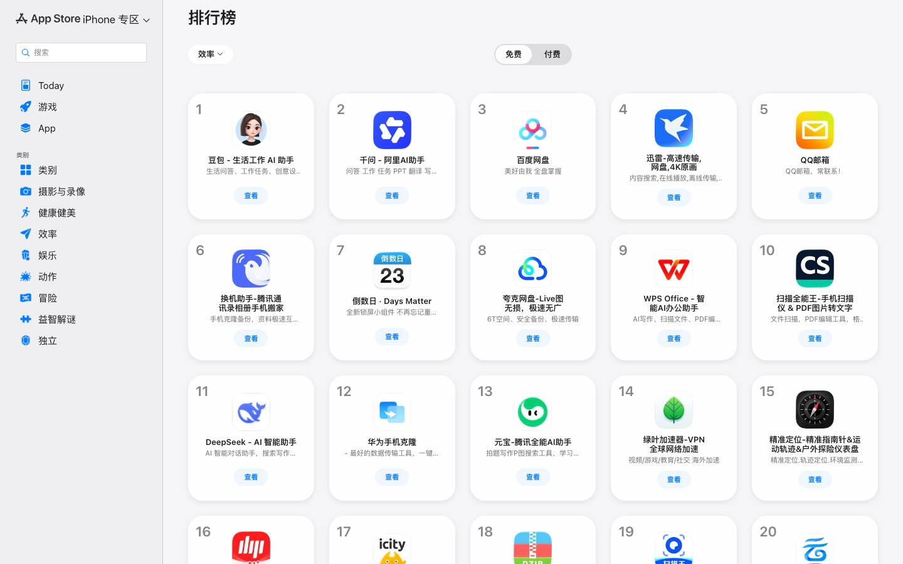 | 排行（效率）：5 列方卡，序号、图标、名称、一行描述、「查看」，全部居中。左上一个下拉、右上一个「免费 / 付费」分段控件，**筛选只有一行**。 |
|  | 条目页：约 190 的大图标 + 名称（约 34px）+ 副标题 + 价格。下面是**一排 6 项事实**（评分 / 年龄 / 排行 / 开发者 / 语言 / 大小），每项都是「小标签 + 大数字 + 小注」三层，然后是截图。 |
|  | 手机宽度：侧栏收起，内容单列。 |

要点：

- 左侧栏导航加单列内容流。每个区块头是「标题 + ›」，没有副标题。
- 操作按钮全站只有一种「查看」药丸（色调底），没有实心主按钮抢视线。实心主按钮只出现在条目页的「获取」。
- 事实条用「标签 / 数值 / 注」三层排版，比我们现在 7 个等权小格更好扫。

**apple.com 产品页**

| 截图 | 看什么 |
| --- | --- |
| 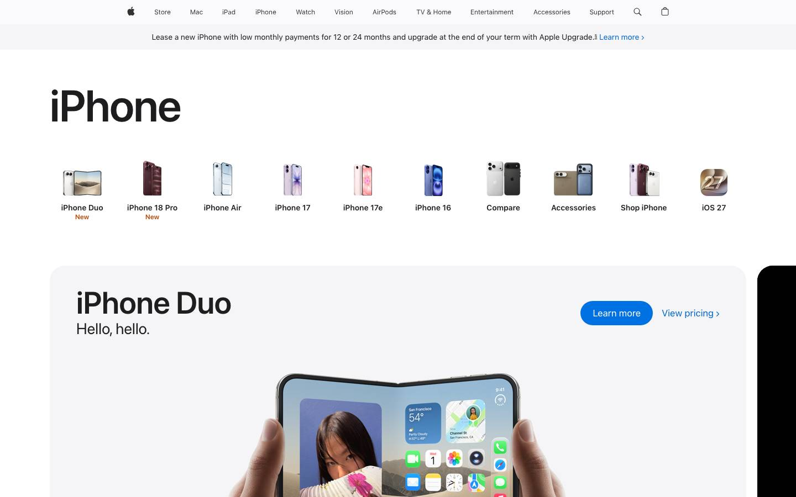 | iPhone 首页首屏：一张图、一句话、两个操作。 |
| 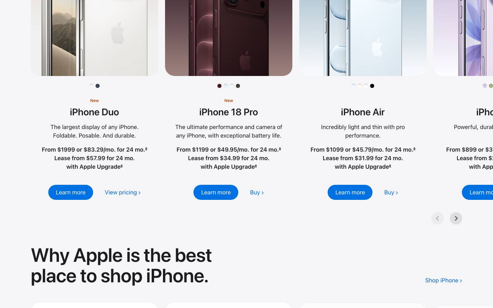 | 产品卡横滑：每张卡只有一个实心「Learn more」加一个文字链「Buy ›」。翻页箭头在区块右下，灰色圆形。大标题「Why Apple is the best place to shop iPhone.」约 56px，左对齐，对面放一个文字链。 |

要点：**每张卡 1 个实心主按钮 + 1 个文字链**；标题和正文的字号比约为 3:1，层级靠字号拉开，不靠颜色和边框。

**Apple HIG**（截图 `refs/apple-hig-drag-and-drop.jpg`。网页直连会被重置，经代理才打开；条文来自官方 JSON 数据）

- 拖放：拖动约 3pt 后显示拖动图像；拖动图像半透明，好让人看到下面的目标；目标**只在能接收时**高亮，不能接收时不给反馈，或者显式显示 `circle.slash`；离开目标时撤掉高亮；失败时回到原处，或「放大淡出」。多项拖动用「成群」加数字角标，目标只接收一部分时更新数字。尽量支持撤销。提供菜单 / 键盘 / 辅助功能的替代方式。拖到可滚动容器边缘时自动滚动。
- 动效：有目的才加动效，不为动而动；反馈动画要简短精确；高频交互不额外加动画；动画可打断，别让人等动画播完；不要把动效当作唯一的信息通道（要兼容「减少动态效果」）。

### 2.2 华为

| 截图 | 看什么 |
| --- | --- |
|  | 应用市场网页首页：顶栏是标志、4 个一级页签（推荐 / 应用 / 游戏 / 排行）、搜索框、下载客户端、头像。下面两张横幅，然后「精品应用 / 查看更多 ›」一行 8 个图标（72 图标 + 两行名称），**没有任何按钮**。 |
|  | 悬停在「小红书」上：图标放大约 10%，下方才出现「安装」药丸。**按钮渐进显露**，静止时页面零按钮。（条目页需要登录或跳转，没截到，用悬停态替代。） |
|  | 手机宽度。 |
|  | HarmonyOS Design 首页（developer.huawei.com/consumer/cn/design/）。 |

HarmonyOS / OpenHarmony 规范里可以直接用的数：

- 栅格断点 sm [320,520)、md [520,840)、lg [840,∞)（单位 vp），12 列栅格。各断点的间距示例：xs 8 / sm 16 / md、lg 20。我们取「<520 一列、520–840 两列、≥840 三列」。
- 拖拽：长按 ≥500ms 触发拖拽，800ms 时预览图开始「浮起」动效；鼠标按住移动 1vp 就起拖。我们把触屏取 350ms，因为卡片同时还要承担滚动。
- 动效原则是「自然、流畅、有意义」，大量使用弹簧曲线；性能基线 ≥60fps，首帧 ≤100ms。

### 2.3 Anthropic / Claude

| 截图 | 看什么 |
| --- | --- |
| 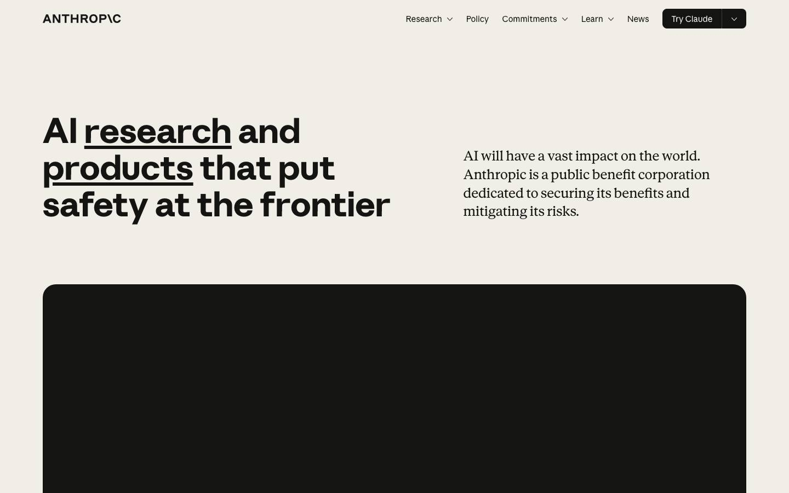 | anthropic.com 首屏：米白底、黑字、一句约 72px 的粗体标题，右侧一段衬线正文，然后一整块圆角 24 的深色媒体区。**首屏只有 2 个元素**，主按钮只有顶栏的「Try Claude」。 |
| 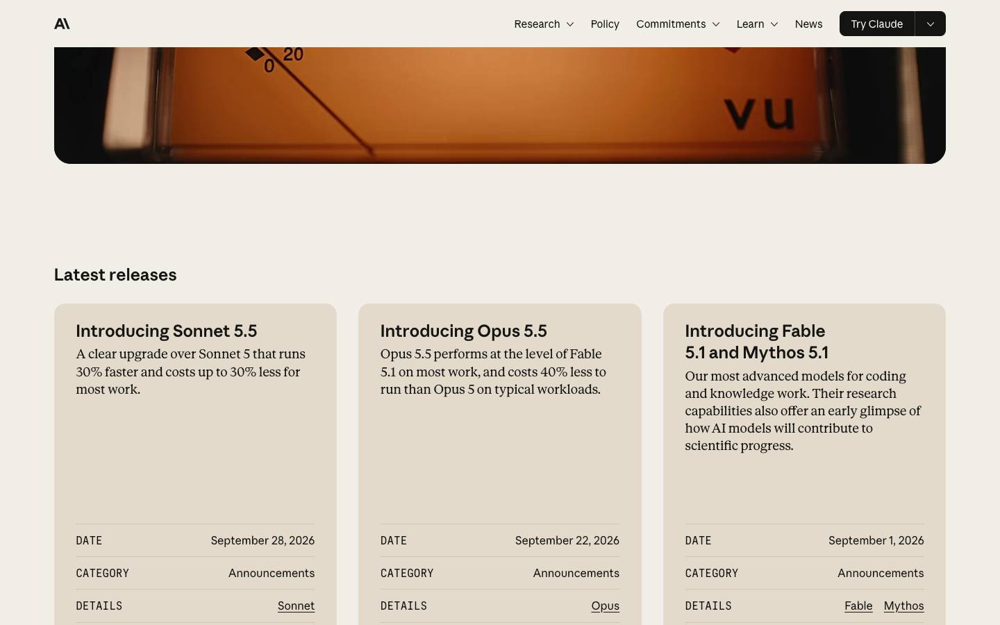 | 「Latest releases」：3 张同尺寸卡，标题加两三行正文，底部用发丝线分隔的 DATE / CATEGORY / DETAILS 元信息表。卡片没有阴影，只用比底色深一档的米色区分。 |
| 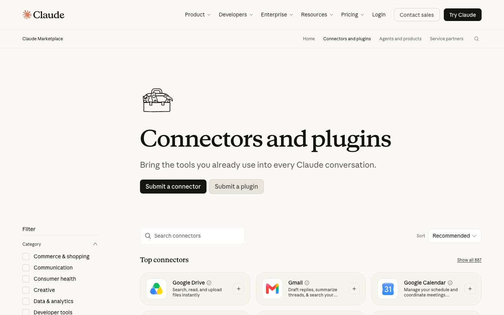 | Claude 连接器与插件目录（claude.com/connectors 会跳到 claude.com/marketplace/connectors-plugins）：手绘工具箱插画、超大衬线标题「Connectors and plugins」、一行副标题、一实一浅两个按钮。往下是左侧 Filter（Category 复选、Type 折叠），右侧搜索框和 Sort 下拉。 |
| 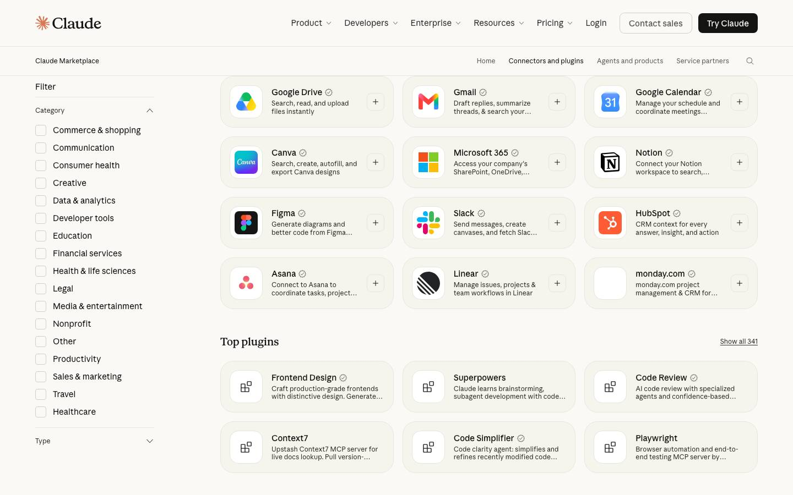 | 连接器网格：3 列卡，约 56–60 的白底图标瓦片（发丝边），名称约 16 加「已验证」小勾，两行 13px 描述，右侧 32 方形「+」。卡片是浅米色底、圆角约 16，没有阴影。区块头是「Top connectors / Show all 887」。 |
|  | 手机宽度。 |

要点：

- **克制**：只有中性色加一个品牌橙（只用在 logo 上），没有渐变光晕；层级靠字号和留白。
- 目录卡：图标、名称、描述、「+」4 个元素，**每张卡 0–1 个徽标**（只有「已验证」勾）。
- `claude.ai/directory` 被 Cloudflare 人机校验拦住（标题「Just a moment...」），没能截图，用上面的公开 Marketplace 页面替代。

### 2.4 ChatGPT

| 截图 | 看什么 |
| --- | --- |
| 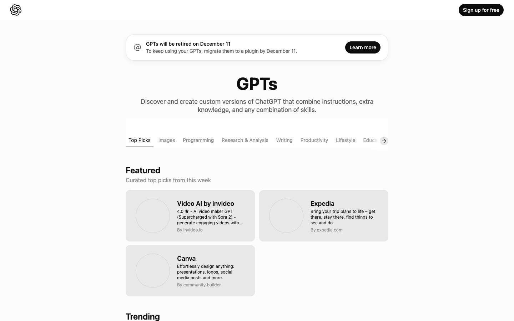 | GPTs 商店：顶部横幅写着「GPTs will be retired on December 11 … migrate them to a plugin」，**OpenAI 正在把 GPTs 并入插件**。下面居中的标题「GPTs」加一行副标题，一排下划线页签（Top Picks / Images / Programming / …），然后是「Featured / Curated top picks from this week」两列大卡。 |
| 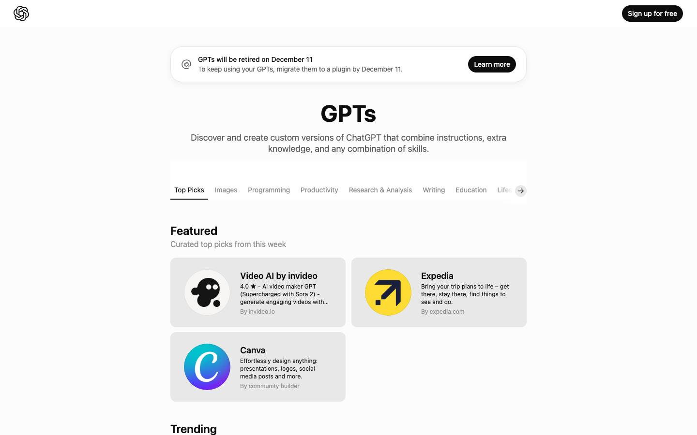 | 继续往下：Trending 等编号列表。 |
| 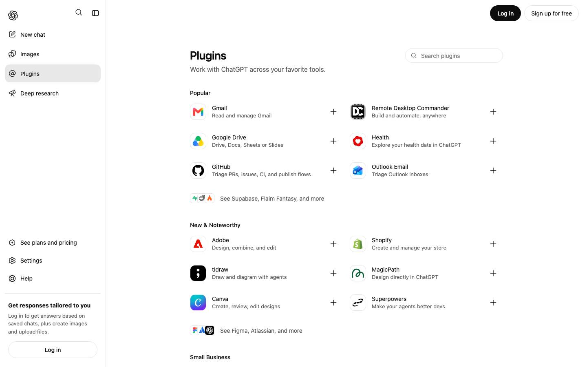 | **Plugins 目录**（chatgpt.com/apps 会跳到 /plugins）：标题「Plugins」加一行副标题，搜索框放在右上，然后是分组小标题（Popular / New & Noteworthy / Small Business / Productivity …）。每组 2 列 × 3 行**紧凑行**：40 图标、名称 14、描述 13、最右一个裸「+」。组末一行「See Supabase, Flaim Fantasy, and more」配叠放小图标。**全页没有一个边框卡片、没有一个徽标。** |
|  | 手机宽度：同样的行变成单列，搜索框全宽。 |
| 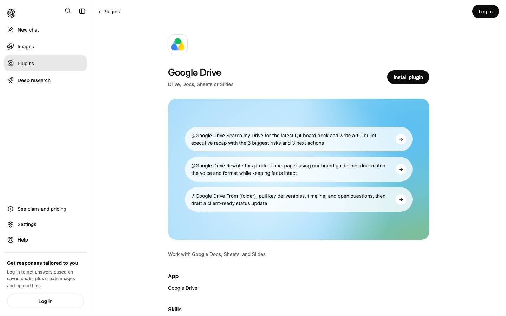 | 插件详情：返回「‹ Plugins」，56 图标、名称 28、一行描述，**右侧唯一的黑色主按钮「Install plugin」**。下面一块蓝绿渐变面板放 3 条示例提示词（白色药丸 + 行尾 →），再往下是 App / Skills 纯文本分区。 |

要点：

- **搜索优先、分组小标题、紧凑行、裸「+」**，是我们目录最直接的范本。
- 「See X, Y and more」加叠放图标，用一行解决「分组里还有更多」，比「全部 11 个 ›」更有信息量。
- 详情页的「示例面板」一块解决了「试试这样问」，比我们现在 3 条蓝底长条加 3 个 ✨ 方块干净得多。

### 2.5 拖拽手感参考

| 参考 | 可借鉴的点 | 截图 |
| --- | --- | --- |
| macOS Dock | 拖进 Dock 时已有图标**左右让位**，撑开一个空位；拖出 Dock 一段距离后，图标上方出现「移除」，松手化为一缕烟消失；Dock 是贴边的一整条大目标。 | 无（系统界面，按实际行为描述） |
| iOS 主屏编辑 | 长按约 0.5s 进入编辑；拖起的图标稍放大并浮在最上层；其余图标用弹簧动画重排；松手时弹簧落位。 | 无（同上） |
| Trello | 拖起的卡片**轻微倾斜**并加深阴影，原位置留一个灰色占位；跨列表时目标列表出现插入空位。 | 无（需登录） |
| Linear | 键盘优先（⌘K）；拖动排序时目标位置显示一条细插入线，动画都在 150–200ms，不拖泥带水。 | 无（需登录） |
| dnd-kit（官方示例） | 拖起的格子带阴影浮起，其余格子即时让位，原位留空。源码默认值：放下动画 `250ms ease`，sortable 让位 `200ms ease`，拖动中原元素 `opacity:0`（我们改成 .35 占位，更好理解）。 | 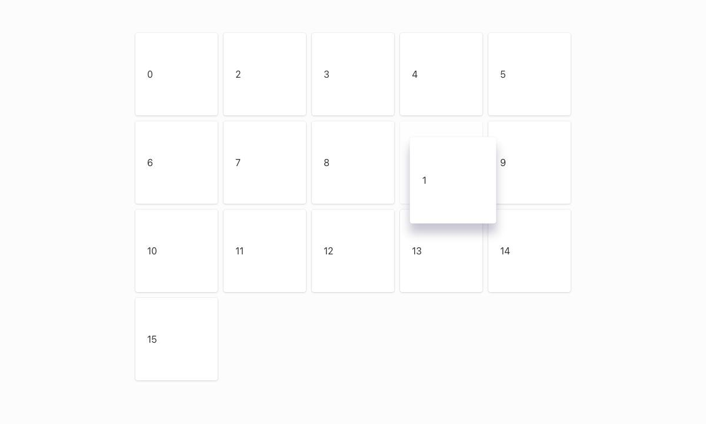 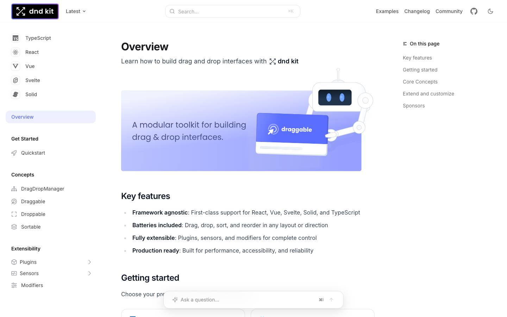 |

---

## 三、现状问题清单（线上 2026-10-02）

### 3.1 首页 1440


- **首屏信息块 11 个**：①顶栏（标志、「智能体市场」胶囊、搜索、登录）②eyebrow + 两行标题 + 两行副标题 ③两个首屏按钮 ④光球 + 9 个环绕图标 ⑤精选区头（标题、副标题、翻页箭头）⑥3 张套装卡 ⑦「帮我推荐」侧栏（标题、副标题、8 个职业、输入框）⑧「全部插件 51」+ 提示语 ⑨分类页签 8 个（带计数）⑩类型分段 4 个 ⑪底部 Dock。参考站点首屏都是 2–3 个。
- **「找插件」的入口有 3 个**：顶栏搜索、「开始挑插件」按钮、「一句话帮我推荐」按钮加侧栏输入框，用户不知道该用哪个。
- **按钮样式 ≥12 种**：白实心大药丸、深色调药丸、白实心小药丸（整套加入）、深色「+ 加入」、蓝实心「✓ 已加入」、描边页签、白实心选中页签、分段控件、圆形翻页箭头、圆形发送、灰色禁用「下一步」、描边「登录」、蓝色文字链「全部 11 个 ›」。**同一屏里白色实心主按钮有 4 个**（开始挑插件 ×1、整套加入 ×3）。
- **筛选有 2 排**：分类 + 类型；有社区插件或插件源时变成 3 排，再加来源。
- 主区被右侧 340px 的「帮我推荐」栏挤成 760px，插件网格只能排 2 列。

### 3.2 首页 390


- 标题、副标题和两个按钮占掉约 290px，套装卡只露出 1 张，「全部插件」在首屏底部，被 Dock 压住了一半分类页签。
- 「帮我推荐」在手机上折叠成按钮，但它和顶部搜索在功能上重复。

### 3.3 目录与卡片

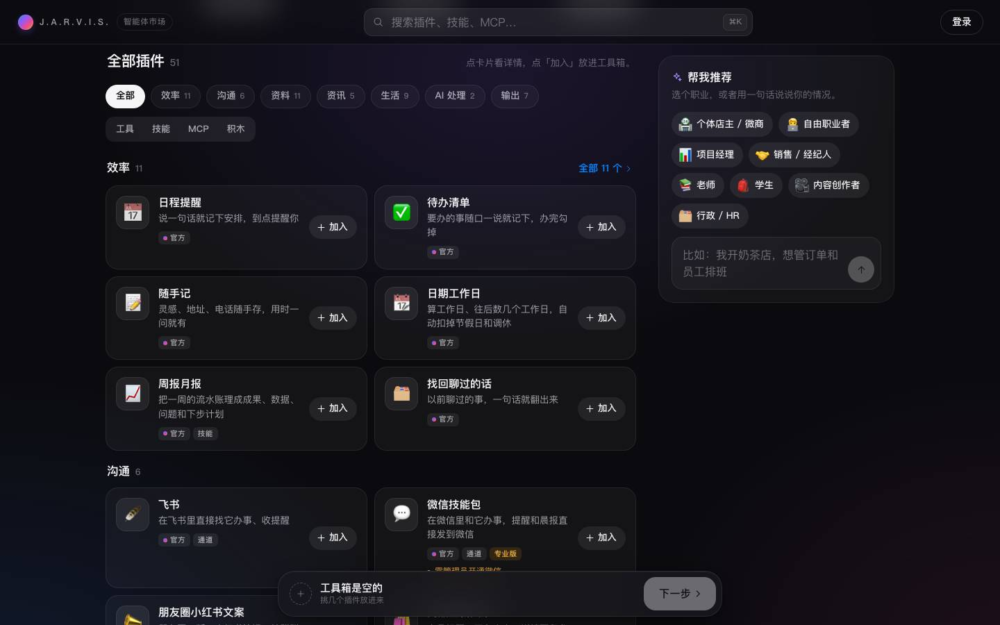 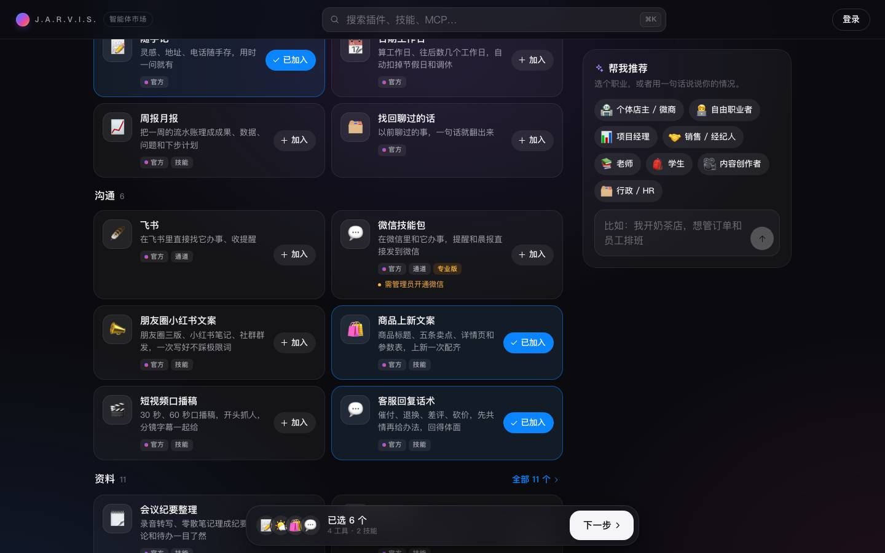 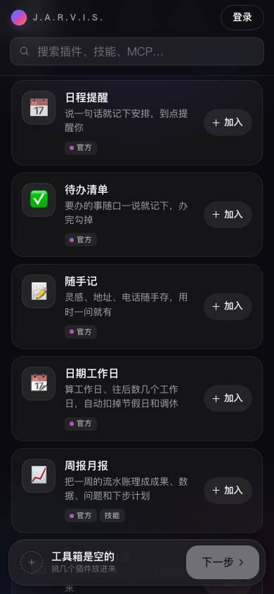

- 卡片最多有 5 层：图标、名称、两行摘要、1–3 个徽标、「需管理员开通微信」说明行，右侧还有带文字的「+ 加入」。卡高 120–145 不等，网格参差。
- **「官方」徽标出现在 51/51 张卡上**（线上目录全是内置插件），不提供任何区分度。「技能 / 通道」类型徽标也是次要信息。
- 已加入的卡整卡铺蓝色边框和底色，再加蓝实心「✓ 已加入」，选中太重。几张一起选中时，页面一片蓝。
- 手机上仍是带边框的大卡（一屏约 5 张），框套框。
- `market.css` 里有 **28 种字号**（含 10.5 / 11.5 / 12.5 / 13.5 / 14.5 / 15.5 / 16.5 等半像素值）、**约 25 种圆角**、**28 种不同的 box-shadow**。层级混乱的根源在这里。

### 3.4 插件详情

  

- 头部 3 个徽标（官方 / MCP / 需要配置）+ 一个粗边框的黄色警示框 + 7 格事实条（来源 / 类型 / 能力 / 分类 / 版本 / 许可证 / 价格，12px 小字，手机上被截断，要横滑）。
- 「它能做什么」每一条是一个带边框的块，只有 1 条时也占一整行框。
- 「试试这样问」3 条示例 = 3 个蓝底长条 + 3 个 ✨ 方块，共 6 个可点元素，视觉上比主按钮还抢眼。
- 主按钮在右下角，需要配置时是灰掉的「+ 加入工具箱」，左边还配两行小字（「需要管理员配置后才能加入」「工具箱 0 个」）。
- 没有内容的「需要什么」仍占一个区块，写「开箱即用，不需要额外设置」。

### 3.5 起名页

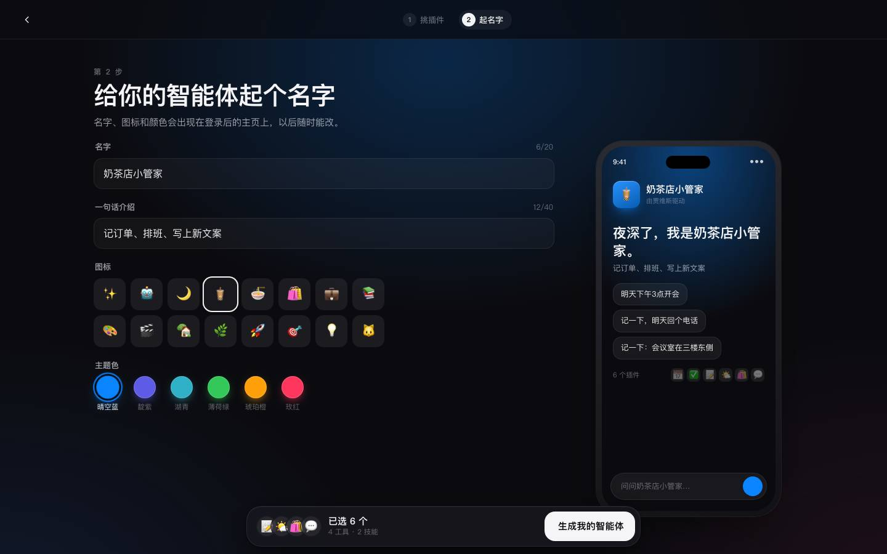 

- 顶栏步骤条「1 挑插件 / 2 起名字」和标题上方的「第 2 步」重复。
- 色板下面常显色名（晴空蓝 / 靛紫 / …），字数计数（6/20、12/40）常显，都是噪音。
- 手机预览下半部约 140px 空白。整体不错，主要是减法。

### 3.6 结果页


- **h1 露出蓝色焦点矩形框**（程序聚焦，`tabIndex=-1`），属于 bug。
- 同一屏有 3 种容器：实底卡（账号）、实底卡（插件）、虚线卡（二维码），风格不统一。
- 口令已经不显示时，左卡大面积留空，只有两行字。
- 「去登录」是实心主按钮，「再做一个」是下划线文字，「在手机上打开」是卡片，三种操作三种样式。

### 3.7 工具箱抽屉

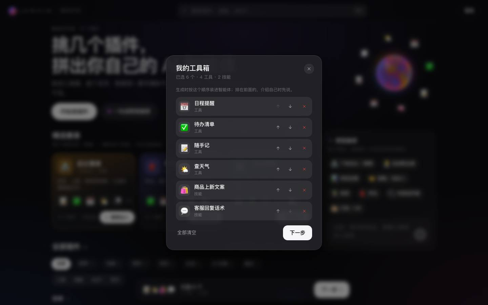

- 每行 3 个图标按钮（↑ ↓ ×），6 行就是 18 个小按钮。保留它们作为键盘 / 读屏的替代路径没问题，但主交互应该是拖动排序（见第四节）。删除用红色 × 太醒目，改成三级色，悬停时才变警示色。

---

## 四、拖拽交互规范（状态机）

接口沿用 `web-src/src/market/dnd/index.jsx`：`useDragSource` 给出 `isDragging`，`useDockDrop` 给出 `dragging / isOver / reason`。建议拖拽代理在元素上同步写状态属性，方便 CSS 统一处理：卡片写 `data-dnd="idle|pressing|dragging"`，Dock 写 `data-dock="idle|ready|over|reject|landing"`。

```
          pointerdown                阈值达到（鼠标 5px / 触屏 350ms 内 ≤8px）
 静止 ─────────────────▶ 按住 ─────────────────────────────▶ 拖起
  ▲                        │ 松开 = 点击（开详情 / 点 +）         │
  │                        │ 触屏移动 >8px = 滚动               │ 指针进入 Dock 区（视口底 120px）
  │                        ▼                                    ▼
  │◀──────────────────── 静止                        越过 Dock（接收 / 拒绝）
  │                                                    │        │ 离开 → 回到「拖起」
  │   250ms 回到原位                                    │ 松手    │
  ├────────────────── 取消 ◀── Esc / Dock 外松手 / pointercancel / 拒绝时松手
  │   240ms 落进空位 + 计数跳动
  └────────────────── 放下 ◀── 接收时松手
```

| 状态 | 进入条件 | 卡片 / 药丸 | Dock | 动效 | 读屏（aria-live=polite） |
| --- | --- | --- | --- | --- | --- |
| 静止 idle | 默认 | 正常；桌面悬停时 `cursor:grab`，表面 +4% | 正常（高 64） | 悬停 160ms | — |
| 按住 pressing | pointerdown，还没到阈值 | 鼠标：无变化。触屏：150ms 后缩到 .98，作为按压反馈 | 不变 | 100ms | — |
| 拖起 dragging | 鼠标位移 ≥5px；触屏长按 350ms 且位移 ≤8px（支持的设备上 `navigator.vibrate(10)`） | 原卡 `opacity:.35` + 1.5px 虚线占位；药丸（图标 40 + 名称，高 56，圆角 16，e2，scale 1.04，rotate 2°）跟手；body `cursor:grabbing`，禁止选中文字 | **接收态**：高 76，40% 强调色虚线边，文案「拖到这里加入」 | 药丸出现 120ms；Dock 变化 200ms；离视口上下边 64px 内自动滚动（最快 12px/帧） | 「已拿起 日程提醒。拖到底部工具箱松手即可加入，按 Esc 取消。」 |
| 越过 Dock（接收）over | 指针进入视口底部 120px，且 `canAdd(id)===''` | 药丸缩到 .9，右上角出现「+」角标 | 14% 强调色底 + 实线边 + scale 1.03；图标行末尾撑开 32px 空位；文案「松手加入 · 将有 N 个」 | 160ms；空位 200ms | 「在工具箱上方，松手加入。」 |
| 越过 Dock（拒绝）reject | 同上，但 `canAdd` 返回原因（需要配置 / 暂不可用 / 已在工具箱） | 药丸角标换成 ⦸ | 不加强调色；⦸ + 原因文字（警示色）；不撑空位 | 160ms | 「不能加入：需要管理员配置后才能加入。」 |
| 放下 landing | 接收态下松手 | 药丸位移并缩到 32px，落进空位后消失；原卡恢复，「+」变「✓」 | 空位填上图标，计数 1→1.12→1；800ms 内回到正常态 | 落位 240ms `--m-ease`；跳动 220ms `cubic-bezier(.34,1.4,.64,1)`；「✓」交叉淡化 160ms | 「已加入 日程提醒，工具箱共 7 个。」 |
| 取消 cancel | Esc、在 Dock 外松手、`pointercancel`、拒绝态下松手 | 药丸 250ms ease 回到原卡位置，然后原卡恢复；原卡不在视口内时，原地 scale 1.1 + 淡出 200ms | 200ms 回到正常态；拒绝时 Dock 上方提示条显示原因 2.6s | 250ms / 200ms | 「已取消，日程提醒放回原处。」 |

**Dock 内的子状态机**（排序 / 移除）：

| 状态 | 条件 | 视觉 | 动效 |
| --- | --- | --- | --- |
| 按住 | 在 Dock 图标上 pointerdown | 鼠标：无变化。触屏：250ms 起拖（Dock 不滚动，可以更短） | — |
| 排序中 | 横向移动 | 拿起的图标放大 1.1 + e2；邻居左右让位 | 让位 200ms ease（dnd-kit sortable 默认值） |
| 拖出 | 指针高于 Dock 顶边 56px | 图标上方显示「松手移除」小标签；图标 `opacity:.5` | 160ms |
| 放下（排序） | 在 Dock 内松手 | 落位，调用 `onReorder(from, to)` | 200ms |
| 放下（移除） | 拖出状态下松手 | 图标缩到 .6 并淡出，调用 `onRemove(id)`；提示「已移除『xx』· 撤销」5s | 160ms |
| 取消 | Esc | 回到原位 | 200ms |

**替代方式**（键盘 / 读屏 / 不想拖的人）：

- 每张卡的「+」都能用 Tab 到达，Enter / Space 加入（走 `flyToDock` 动画加同一句播报）。
- 工具箱抽屉保留 ↑ ↓ × 按钮（现有功能，不删）。
- 可选的增强：卡片获焦时按 Space「拿起」，再按 Enter 加入工具箱、Esc 取消（dnd-kit KeyboardSensor 的思路），播报同上表。
- `prefers-reduced-motion: reduce` 时：药丸不倾斜、不缩放；不做飞入、落位、跳动，状态瞬时切换；接收态、越过态的颜色变化保留（颜色不算动效）；读屏播报一句不少。

---

## 五、来源

- Apple App Store 网页版：https://apps.apple.com/cn/iphone/today · https://apps.apple.com/cn/iphone/apps · https://apps.apple.com/cn/iphone/charts/6007 · https://apps.apple.com/cn/app/notion/id1232780281
- Apple 产品页：https://www.apple.com/iphone/
- Apple HIG 拖放：https://developer.apple.com/design/human-interface-guidelines/drag-and-drop（条文来自 `developer.apple.com/tutorials/data/design/human-interface-guidelines/drag-and-drop.json`）
- Apple HIG 动效：https://developer.apple.com/design/human-interface-guidelines/motion
- 华为应用市场：https://appgallery.huawei.com/
- HarmonyOS Design：https://developer.huawei.com/consumer/cn/design/
- OpenHarmony 栅格布局（断点 / 列数 / 间距）：https://gitcode.com/openharmony/docs/blob/master/zh-cn/application-dev/ui/arkts-layout-development-grid-layout.md
- OpenHarmony 拖拽事件（长按 500ms、800ms 浮起、鼠标 1vp）：https://gitcode.com/openharmony/docs/blob/OpenHarmony-5.1.0-Release/zh-cn/application-dev/ui/arkts-common-events-drag-event.md
- Anthropic：https://www.anthropic.com/
- Claude 连接器与插件目录：https://claude.com/marketplace/connectors-plugins（`claude.ai/directory` 被人机校验拦截，未截到）
- ChatGPT：https://chatgpt.com/gpts · https://chatgpt.com/plugins（`/apps` 会跳到这里）· 插件详情（Google Drive）
- dnd-kit：https://dndkit.com/ · 官方 Storybook「Sortable grid」· 源码默认值 `packages/core/src/components/DragOverlay/hooks/useDropAnimation.ts`（250ms ease）、`packages/sortable/src/hooks/defaults.ts`（200ms ease）
- macOS Dock、iOS 主屏编辑、Trello、Linear：按产品实际行为描述，未截图（系统界面或需登录）
