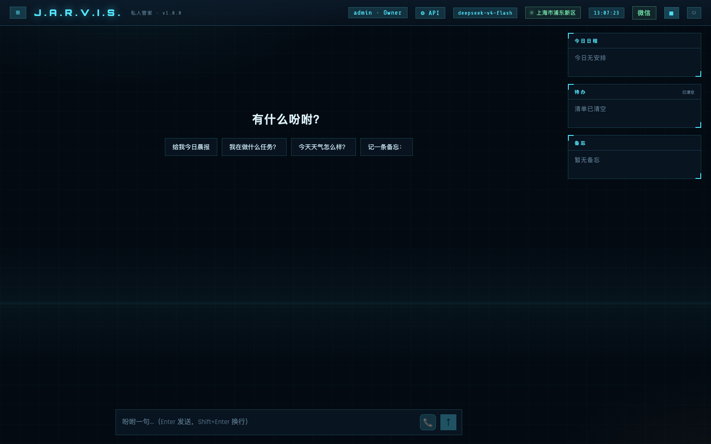
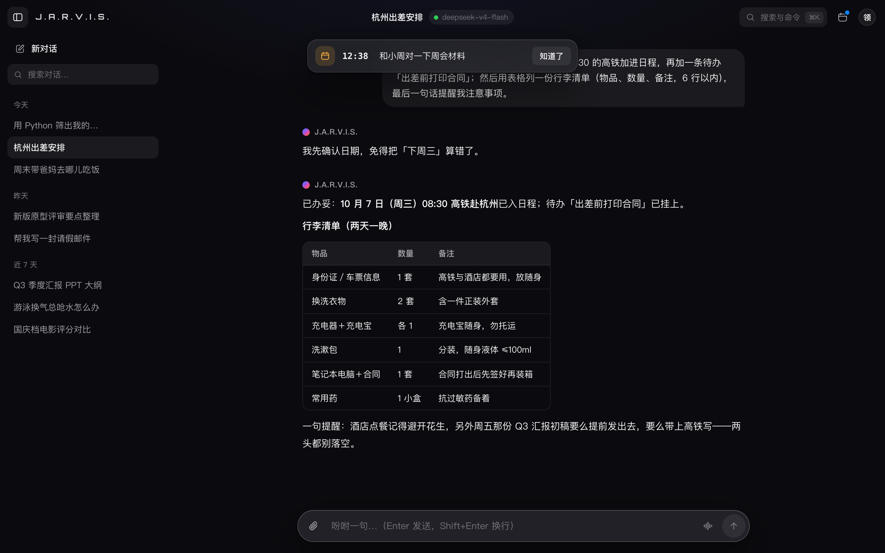
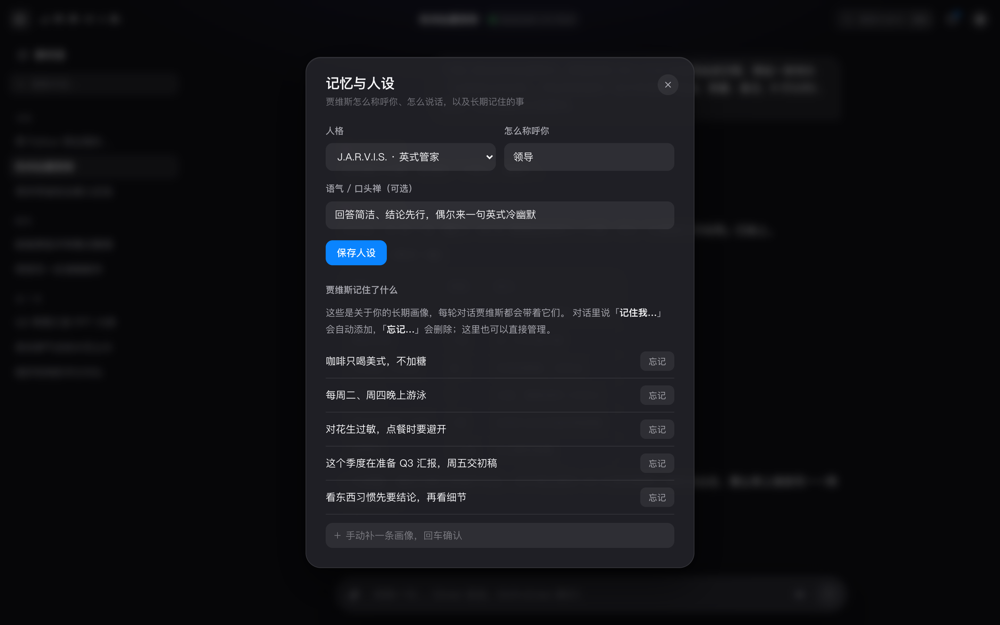
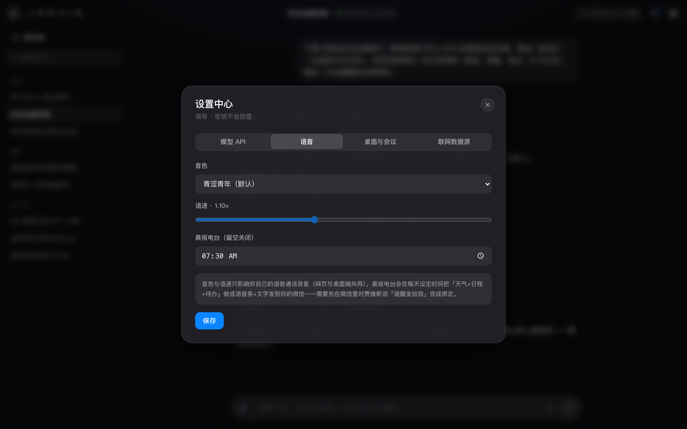
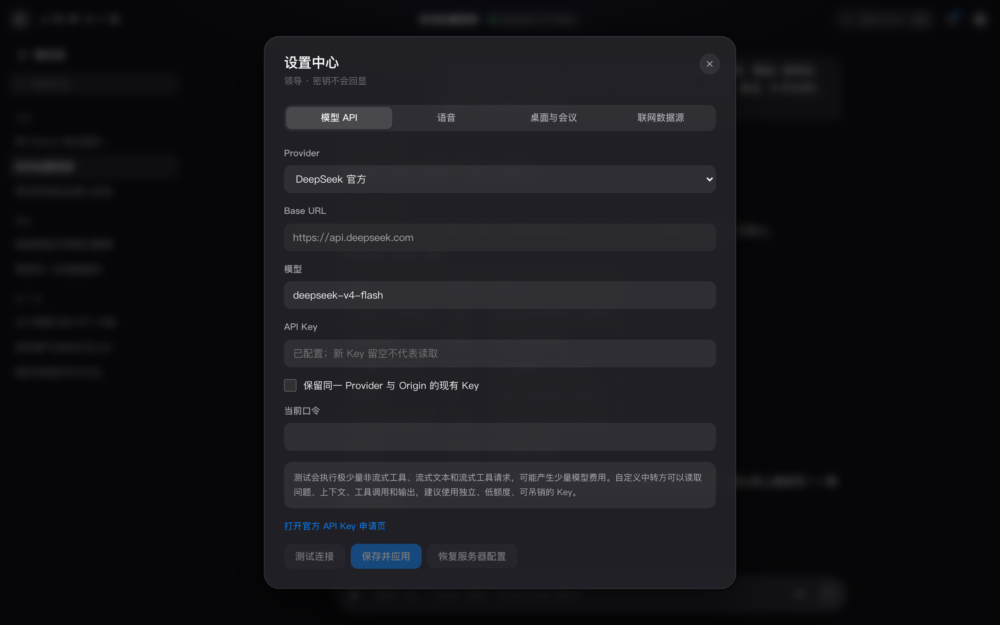
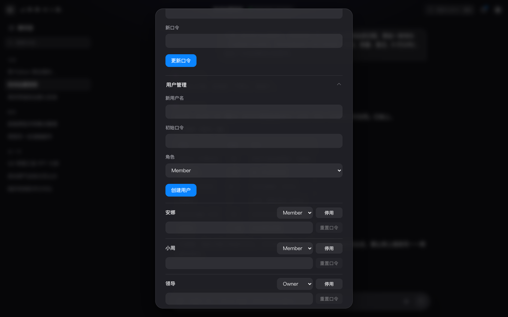
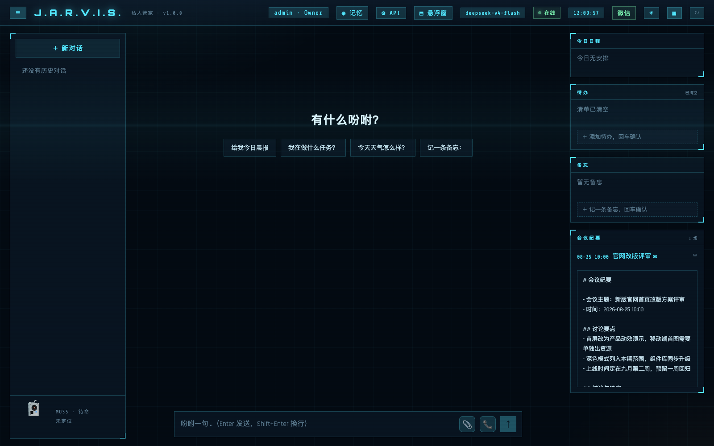
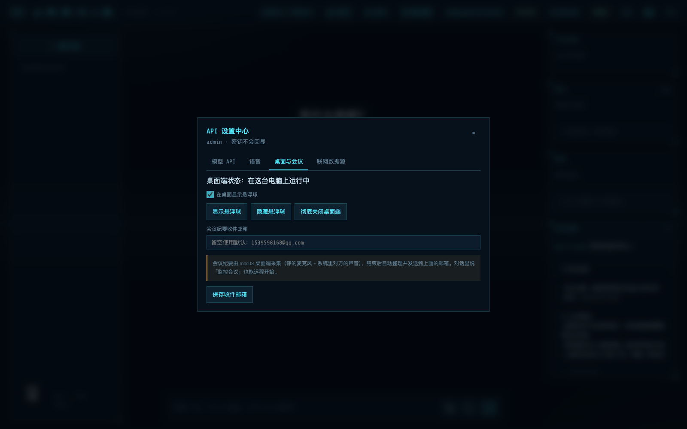

# 功能详解

[← 返回 README](../README.md) · [部署](deployment.md) · [配置](configuration.md) · [微信与飞书](channels.md) · [架构](architecture.md) · [开发与测试](development.md) · [FAQ](faq.md)

贾维斯（JWS-Agent）是一个可私有部署的中文 AI 管家：记得住你说过的话，管得了日程待办，查得到带来源的实时信息；网页、桌面、终端、微信、飞书，随时叫得到。

**目录**：[功能清单](#功能清单) · [为什么是 JWS-Agent](#为什么是-jws-agent) · [多入口对比](#一个-agent多种入口) · [使用指南](#使用指南) · [它可以怎样帮你](#它可以怎样帮你) · [截图画廊](#截图画廊)

## 功能清单

### 对话与任务

- **网页对话**：流式聊天（完整 Markdown 渲染：可点来源链接 / 表格 / 代码高亮），消息可重答、编辑重发、失败重试；配可勾选、可增删的今日日程 / 待办 / 备忘任务台，支持上传 PDF / Word / TXT 文档解析追问。
- **图片 / 短视频识别**：聊天 📎 直接发图片（≤10MB）或短视频（≤7MB），qwen3-vl 转成详细描述注入对话，可连续追问画面细节；截图里的文字、表格会被逐字转录。
- **工具调用透明**：每次工具调用以中文名+图标展示，带耗时与成败，点开可看结果摘要。
- **暗色 / 亮色双主题**：默认赛博 HUD 暗色，一键切换亮色办公风；会话可一键导出为 Markdown。
- **免费搜索链**：SearXNG → DDGS 免费降级，结果带时间与来源；Tavily 可选。

### 记忆与主动性

- **记忆与人设**：长期记忆画像可查可删（「记住我…/忘记…」），称呼、语气可自定义，J.A.R.V.I.S. ↔ MOSS 双人格切换；每天凌晨自动把最近一天的对话蒸馏成长期画像（夜间记忆蒸馏，内容级去重）。
- **主动提醒**：日程到点自动推送——微信（对贾维斯说「提醒发给我」绑定）、桌面系统通知、网页弹条三通道；可选每天定时的「晨报电台」语音条。
- **Heartbeat 主动唤醒**：在 `data/HEARTBEAT.md` 写下关注事项，贾维斯每 30 分钟看一眼清单，判断该开口时主动找你（微信+桌面双通道）；不该说话时保持沉默，`JARVIS_HEARTBEAT_ENABLED=0` 一键关闭。
- **技能热加载**：`skills/` 目录放一个 `SKILL.md` 就长出新技能，改文件下一轮对话生效、无需重启（格式见 [`skills/README.md`](../skills/README.md)）。

### 语音

- **语音通话**：网页端点 📞 直接开口说话，贾维斯用语音回答；音色与语速每用户可选。
- **通话场景模式**：语音通话面板一键切换 9 种情景——管家模式、故事时间、晚安电台、解忧树洞、面试陪练、辩论擂台、英语陪练、口语翻译、玄学茶话；切换即换说话风格并带开场白，选择记为个人偏好。
- **语气情绪感知**：通话中把你刚说的话旁路送情绪识别（qwen3-asr-flash 固定附带的 7 类情绪，零额外配置），面板显示「😢 低落」等徽标，贾维斯下一句自然照应你的情绪。
- **语音唤醒**（默认开启）：直接喊「贾维斯」即亮球接通语音通话——本地 VAD 圈出人声段才送云端识别（静音零请求零上传），命中唤醒词（含同音兜底，`JARVIS_WAKE_WORDS` 可改）立即应答；通话与会议期间自动暂停判定。

### 会议纪要

- **会议纪要**：对贾维斯说「监控会议」（或点桌面 🎙 / 托盘菜单），桌面端同时采集你的麦克风与系统回环声音（飞书等会议里对方的发言），双路实时转写标注「我 / 对方」，开会过程中面板顶部滚动「⚡ 实时要点」（每积累若干发言增量小结一次，对标飞书妙记）；会后自动跑离线**说话人分离**把「对方」细分为 对方1/对方2（paraformer-v2 diarization，分不出就保持原样），整理成含「气氛与情绪」小节的 Markdown 纪要，存档并**自动发送到指定邮箱**；网页任务台可回看、重发邮件、**一键把属于我的待办导入任务台**、**就这场会议继续追问**、以及把「对方N」**改名成真实称呼**（全局替换转写与纪要）。因为走系统回环采集，**不挑会议软件**：飞书、腾讯会议、Zoom、钉钉、微信（Mac 端语音通话）等任何出声的软件都能录——这是市面六大纪要产品（腾讯会议/妙记/听悟/讯飞/Zoom/钉钉）都未产品化的空白。

### 桌面端

- **桌面端**：macOS 常驻悬浮球，⌥Space 一键唤出快捷聊天，右键悬浮球直接接通语音通话；通话中收起面板，球随 听（青）/想（琥珀）/说（绿）三态变色。系统托盘左键切窗、右键弹菜单（含会议纪要、悬浮球显隐、显示当前版本的一键重启）；任意 App 选中文字按 ⌥Q 弹出「翻译 / 解释 / 改写」划词条（授予辅助功能权限可自动取词，未授权走剪贴板降级）。
- **网页控悬浮窗**：网页「⚙ API → 桌面与会议」可一键显示 / 隐藏桌面悬浮球（同机秒级生效，跨机 10 秒内下发），还有二次确认的「彻底关闭桌面端」。

### 渠道与多用户

- **微信桥**：扫码接入个人微信即可对话；发链接即总结，群聊被 @ 才应答；语音消息开发中。详见 [微信与飞书](channels.md#个人微信桥接)。
- **飞书机器人**：企业自建应用走长连接（无需公网回调），单聊或群里 @机器人 即可对话；流式卡片「思考中…」打字机输出，支持图片识别；每人用一次性绑定码把飞书账号绑到自己的贾维斯账号。详见 [微信与飞书](channels.md#飞书机器人)。
- **多用户与租户隔离**：Owner 邀请制开号，各账号对话、记忆、日程完全隔离。
- **每用户 API 设置**：各自选择模型 Provider 与 Key，密钥加密存储、永不回显。详见 [配置参考](configuration.md#多用户-provider--api-设置)。

## 为什么是 JWS-Agent

- **持久记忆**：LangGraph 的 SQLite checkpointer 把对话状态落到本地数据库，进程重启后仍可沿同一线程继续。
- **多入口，同一套能力**：网页端、macOS 桌面悬浮窗、终端 CLI 和个人微信都连接同一个 Agent 与 26 项工具。
- **不仅回答，也能行动**：可增删备忘和日程、维护待办、查询天气与系统状态，并按需调用实时搜索工具。
- **实时信息可追溯**：搜索结果保留查询时间、摘要和 HTTP(S) 来源；电影评分分平台呈现，票务只提供公开信息与深链接。
- **多用户与个人模型配置**：每个账号拥有独立对话、记忆、日程、待办和模型 Provider；Owner 统一管理全局联网数据源。
- **面向私有部署**：模型地址、模型名、数据目录和服务端口均可配置；记忆、备忘、日程、待办和微信 Token 留在你的运行环境中。

## 一个 Agent，多种入口

| 能力 | 网页端 | 桌面悬浮窗 | 终端 CLI | 个人微信 |
| --- | --- | --- | --- | --- |
| 中文自然语言对话与 26 项工具 | ✅ | ✅ | ✅ | ✅（文本消息） |
| 流式展示 | ✅ SSE 逐字输出并展示工具调用 | ✅ SSE 逐字输出并展示工具调用 | — 单次完整返回 | — 消息式回复 |
| 语音通话 | ✅ 📞 实时语音问答，可降级打字通话 | — | — | 🚧 语音消息开发中 |
| 记忆线程 | 每个会话独立 `thread_id` | 固定 `desktop` 线程 | 默认 `main`，可用 `--thread` 指定 | 每个联系人独立 `wx-<联系人>` 线程 |
| 日程、待办、备忘 | 对话操作 + 任务台展示 | 对话操作 + 日程 / 待办任务台展示 | 对话操作 | 对话操作 |
| 实时搜索 | ✅ 免费默认可用 | ✅ 免费默认可用 | ✅ 免费默认可用 | ✅ 免费默认可用 |
| 天气定位 | 浏览器定位优先，公网 IP 兜底 | 使用服务端已有定位；也可直接说城市 | 使用服务端已有定位；也可直接说城市 | 使用服务端已有定位；也可直接说城市 |
| 会话历史管理 | 新建、回放、删除 | 最近历史、清空快捷线程 | 由线程持久化 | 由联系人线程持久化 |
| 个人微信扫码管理 | 顶栏“微信” | 设置 → 个人微信 | — | 自身即消息入口 |
| Provider / API 设置 | 每个账号独立设置模型 | 设置中独立设置模型 | 使用当前 Owner 配置 | 使用唯一 Owner 配置 |

四种入口共享服务端同一套 `SearchService` 后端与降级链。默认 DDGS 无需付费 key；希望优先控制搜索实例时可选自建 SearXNG，但它不是使用实时搜索的必要条件。

飞书机器人是后来接入的又一个入口：单聊、群聊、群话题分别使用 `fs-p-*` / `fs-g-*` / `fs-t-*` 独立线程，落在发信人绑定的贾维斯账号租户里，详见 [微信与飞书 · 飞书机器人](channels.md#飞书机器人)。

## 使用指南

### 语音通话怎么用

点输入框旁的 **📞** 进入通话，浏览器会申请麦克风授权；同意后直接开口说话，说话停顿自动断句，贾维斯边生成边用语音回答并同步文字字幕。拒绝授权或浏览器不支持语音识别时，自动降级为「打字通话」——输入文字，贾维斯照样用语音回答；关闭通话面板后，文字聊天完全不受影响。答复的音色与语速在顶栏「⚙ API → 语音」按用户设置（网页与桌面通话共用），同页可开启每天定时的「晨报电台」。微信语音消息支持仍在开发中。

### 会议纪要怎么用

开会前对贾维斯说「帮我监控会议」（网页 / 桌面 / 语音通话里都行），或直接点桌面端面板的 **🎙**、托盘菜单「会议纪要」。macOS 桌面端会同时采集你的麦克风（标「我」）与系统回环声音（飞书等会议里对方的发言，标「对方」），面板实时滚动双路字幕；说「停止监控会议」或点「⏹ 结束并生成纪要」后，服务端先做离线说话人分离（把「对方」细分为 对方1/对方2；分不出自动保持原样），再整理成含「气氛与情绪」小节的 Markdown 纪要，发送到「⚙ API → 桌面与会议」里配置的邮箱（默认见 `JARVIS_MEETING_MAIL_TO`），网页右侧任务台可回看与重发；点开一场会议还可以「⇩ 导入待办」（只导负责人是我的，去重）、「💬 就这场会议追问」（纪要+转写整包进对话，可连续追问细节）、「✎ 改名」（把对方1 改成张总，转写纪要全局替换）。

三人以上会议同样支持：离线声纹分离按 speaker 自动编号 对方1/对方2/对方3…，纪要还会从上下文推断称呼（如「对方2（张总）」，推不出保持编号绝不瞎猜）。面板上的双条电平柱（青=我 / 金=对方）用来自检声道：对方柱不动说明会议软件没出声或屏幕录制权限没给。首次使用需在 系统设置 → 隐私与安全性 → 屏幕录制 里勾选本应用；服务端 `.env` 需配好 `JARVIS_SMTP_*` 才能发信（见 [配置参考](configuration.md#环境变量)）。

### 语音唤醒怎么用

默认开启（桌面设置可关）。只要喊一声「贾维斯」，悬浮球就会亮出并直接接通语音通话。检测在本机完成（静音零上传、零费用），只有圈出的人声片段会送云端做一次性识别；通话与会议监控期间自动暂停唤醒判定。

### 通话场景与情绪

语音通话面板顶部是场景芯片——点「晚安电台」它会放慢放软、点「辩论擂台」它站你对立面、点「口语翻译」变成中英互译机，共 9 种，切换立即生效并存为你的默认；通话中它还会旁路感知你说话的语气（开心/低落/生气等 7 类），面板显示徽标、回答自然照应你的情绪。

### 发图片 / 视频

聊天输入框 📎 现在也接受图片（jpg/png/webp/bmp，≤10MB）与短视频（mp4/mov，≤7MB）：识别成详细描述后自动进入对话，你可以继续追问「图里第二行写的什么」。

## 它可以怎样帮你

下面是调用方式示例，回答中的实时内容以实际查询结果为准，不预填会过期的价格、比分或评分。

**1. 晨报**

> 你：给我今日晨报，带上天气、今天的安排、待办、编程进度和 Git 情况。
>
> J.A.R.V.I.S.：读取当前定位、三日天气、本地日程、未完成待办与桌面端同步的编程进度和 Git 情况，整理成一份晨间摘要。

**2. 日程与待办**

> 你：明天下午 3 点提醒我做项目复盘，再加一条待办：整理会议材料。
>
> J.A.R.V.I.S.：分别写入日程和待办；之后可继续询问、勾选完成或删除。

**3. 持久记忆**

> 你：记住我周三要交电费。
>
> 你（重启程序后）：我让你记过什么？
>
> J.A.R.V.I.S.：在同一线程中读取 SQLite 检查点并接续上下文。

**4. 娱乐新闻**

> 你：查一下最近一周的娱乐新闻，列出重点、查询时间和来源。
>
> J.A.R.V.I.S.：调用 `web_search`，基于带时间戳和链接的公开搜索资料整理回答。

**5. 分平台电影评分**

> 你：查这部电影在豆瓣、IMDb、Rotten Tomatoes 和 Metacritic 的评分。
>
> J.A.R.V.I.S.：分别给出各平台量表、评价人数和来源，不把不同分制合并成“综合分”。

**6. 电竞比分 / 票务查询**（PandaScore 与 Tavily 均为可选增强）

> 你：查某战队最近一场比赛的比分、赛事和来源。
>
> 你：再找一下某场演出的正规购票入口。
>
> J.A.R.V.I.S.：比分优先使用已配置的 PandaScore 结构化数据，失败或未配置时回退网页搜索；票务只列公开展示价或明确无可靠公开价，并给出平台深链接，不登录、不占座、不下单。

### 上线后可这样测试

- “查最近一周的娱乐新闻，列出来源，并注明资料截至时间。”
- “查这部电影在豆瓣、IMDb、Rotten Tomatoes 和 Metacritic 的评分，分平台列出量表、评价人数、来源和查询时间。”
- “查某俱乐部最近一场比赛的比分、赛事、比赛时间和来源。”
- “查某场演出的正规票务平台入口和公开报价，注明查询时间。”

这些问题用于检查实时搜索、来源与时间信息是否正常返回。公开网页、评分、比分和票价都可能变化，应打开原始来源复核；票务工具只查询和提供链接，不登录、不占座、不下单。

## 截图画廊

<table>
  <tr>
    <td align="center" width="50%"><strong>日程到点主动提醒（微信 / 桌面 / 网页三通道）</strong></td>
    <td align="center" width="50%"><strong>亮色主题一键切换</strong></td>
  </tr>
  <tr>
    <td></td>
    <td></td>
  </tr>
  <tr>
    <td align="center"><strong>记忆与人设：画像可查可删、MOSS 人格切换</strong></td>
    <td align="center"><strong>语音音色 / 语速 / 晨报电台</strong></td>
  </tr>
  <tr>
    <td></td>
    <td></td>
  </tr>
  <tr>
    <td align="center"><strong>每个账号独立的 Provider / API 设置</strong></td>
    <td align="center"><strong>Owner 用户管理与角色控制</strong></td>
  </tr>
  <tr>
    <td></td>
    <td></td>
  </tr>
  <tr>
    <td align="center"><strong>会议纪要：任务台回看、一键重发邮件</strong></td>
    <td align="center"><strong>「桌面与会议」：控悬浮球 + 纪要收件邮箱</strong></td>
  </tr>
  <tr>
    <td></td>
    <td></td>
  </tr>
  <tr>
    <td align="center"><strong>语音通话 9 种场景模式一键切换</strong></td>
    <td align="center"><strong>桌面端会议监控：我 / 对方双路实时字幕</strong></td>
  </tr>
  <tr>
    <td></td>
    <td align="center"></td>
  </tr>
</table>

<table>
  <tr>
    <td align="center"><strong>随时叫得到的桌面悬浮球</strong></td>
    <td align="center"><strong>原地展开的流式聊天窗</strong></td>
    <td align="center"><strong>快捷键、语音音色与晨报设置</strong></td>
  </tr>
  <tr>
    <td align="center"></td>
    <td></td>
    <td></td>
  </tr>
</table>

<table>
  <tr>
    <td align="center" colspan="3"><strong>语音通话三态外显：收起面板后悬浮球随状态变色</strong></td>
  </tr>
  <tr>
    <td align="center"> 听（青色呼吸）</td>
    <td align="center"> 想（琥珀）</td>
    <td align="center"> 说（绿色脉冲）</td>
  </tr>
</table>

### 截图说明

- 网页截图为 2026-08-14 与 2026-08-25 在隔离演示环境实拍：日程、待办、备忘、记忆画像、会议纪要与对话内容均为虚构演示数据，API Key、口令、二维码与真实对话均未进入图片（账户管理图沿用 2026-08-13 生产演示实拍；「桌面与会议」图中的桌面探活状态为本机真实探测结果）。
- 桌面截图为 JWS_SHOT 自检模式实拍（三态图为 2026-08-19 新增）；无真实对话与凭据入图。
