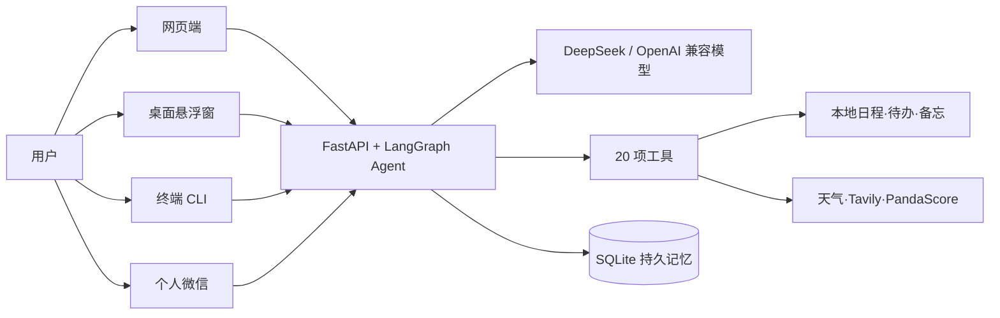

# JWS-Agent Promotional README Implementation Plan

> **For agentic workers:** REQUIRED SUB-SKILL: Use superpowers:subagent-driven-development (recommended) or superpowers:executing-plans to implement this plan task-by-task. Steps use checkbox (`- [ ]`) syntax for tracking.

**Goal:** 把仓库首页升级为带真实脱敏截图、完整能力示例、详细上手说明、联合作者署名和禁止商用声明的宣传型中文 README，并推送到 `origin/main`。

**Architecture:** 文档层只包含 `README.md` 和 `docs/assets/readme/` 下的四张 PNG，不修改产品代码。网页截图由隔离数据目录中的真实 FastAPI/React 页面生成；桌面截图加载当前 `desktop/index.html` 与真实 CSS，在浏览器运行时注入脱敏演示内容，避免访问生产历史或微信登录信息。

**Tech Stack:** Markdown、Mermaid、Playwright CLI、FastAPI/React 当前构建产物、Electron renderer HTML/CSS、macOS `sips`、Git。

## Global Constraints

- 截图必须来自当前代码渲染的真实界面，不使用 AI 生成或重新设计的效果图。
- 所有截图只使用脱敏演示数据；禁止出现真实微信昵称、头像、联系人、二维码、Token、Cookie、历史会话、地理位置和个人日程。
- 不修改网页、桌面悬浮窗、微信桥、Agent、工具、数据库结构或部署配置。
- 尚未配置 `TAVILY_API_KEY` 的联网能力只能写成“配置后可用”，不得宣传为生产已启用。
- README 必须注明“本项目由陈文杰、钟俊琅共同开发”，并声明仅限学习、研究和个人非商业用途，禁止任何形式的商业使用。
- 最终提交必须在 `main`，通过全量测试、Markdown/图片校验、敏感信息检查和 `git diff --check` 后推送 `origin/main`。

---

### Task 1: 建立隔离演示环境并准备截图目录

**Files:**
- Create: `docs/assets/readme/`
- Temporary: `output/playwright/readme/`
- Read: `.env`, `jarvis/server.py`, `jarvis/tools/schedule.py`, `jarvis/tools/todo.py`, `jarvis/tools/memo.py`

**Interfaces:**
- Consumes: 当前 `.venv`、项目 `.env` 中的 DeepSeek 配置、FastAPI `jarvis-web` 入口。
- Produces: 只含虚构数据的临时 `JWS_README_DATA_DIR`，监听 `127.0.0.1:7790` 的演示服务，以及最终图片目录。

- [ ] **Step 1: 验证浏览器自动化前置条件**

Run:

```bash
command -v npx
export JWS_README_PWCLI="/Users/chenwenjie/.codex/skills/playwright/scripts/playwright_cli.sh"
"$JWS_README_PWCLI" --help
```

Expected: `npx` 返回可执行路径，Playwright CLI 显示帮助并退出 0。

- [ ] **Step 2: 创建任务专用目录和隔离数据目录**

Run:

```bash
mkdir -p output/playwright/readme docs/assets/readme
export JWS_README_DATA_DIR="$(mktemp -d /tmp/jws-readme-demo.XXXXXX)"
printf 'demo_data_dir_created=%s\n' "$(test -d "$JWS_README_DATA_DIR" && echo yes || echo no)"
```

Expected: `demo_data_dir_created=yes`。不得把临时目录放入仓库或复用项目真实 `data/`。

- [ ] **Step 3: 用真实工具接口写入虚构演示数据**

Run:

```bash
JARVIS_DATA_DIR="$JWS_README_DATA_DIR" .venv/bin/python - <<'PY'
from datetime import datetime, timedelta
from jarvis.tools.memo import memo_add
from jarvis.tools.schedule import schedule_add
from jarvis.tools.todo import todo_add

today = datetime.now().replace(second=0, microsecond=0)
meeting = today.replace(hour=15, minute=0)
if meeting < today:
    meeting += timedelta(days=1)
schedule_add.invoke({"title": "项目演示复盘", "when": meeting.strftime("%Y-%m-%d %H:%M")})
todo_add.invoke({"content": "整理本周产品更新"})
todo_add.invoke({"content": "检查自动化测试报告"})
memo_add.invoke({"content": "演示环境：所有内容均为虚构数据"})
print("demo_data_seeded=yes")
PY
```

Expected: `demo_data_seeded=yes`，临时目录内出现 `schedule.json`、`todos.json` 和 `memos.json`。

- [ ] **Step 4: 启动隔离网页服务并确认健康状态**

Run in a persistent terminal session:

```bash
JARVIS_DATA_DIR="$JWS_README_DATA_DIR" JARVIS_PORT=7790 .venv/bin/jarvis-web
```

Then run:

```bash
curl -fsS http://127.0.0.1:7790/api/session
```

Expected: 返回包含 `"authed":false` 的 JSON；服务只读取隔离目录。

- [ ] **Step 5: Commit checkpoint is intentionally skipped**

本任务只建立临时运行环境，没有仓库内容值得单独提交；最终图片在 Task 3 统一提交。

---

### Task 2: 拍摄并检查网页端真实截图

**Files:**
- Create: `docs/assets/readme/web-dashboard.png`
- Temporary: `output/playwright/readme/`

**Interfaces:**
- Consumes: Task 1 的 `http://127.0.0.1:7790` 隔离服务和虚构日程/待办/备忘。
- Produces: 1600×1000 左右的网页端全景 PNG，不含真实数据。

- [ ] **Step 1: 打开隔离页面并获取可交互元素引用**

Run:

```bash
export PLAYWRIGHT_CLI_SESSION=readme-web
"$JWS_README_PWCLI" open http://127.0.0.1:7790 --headed
"$JWS_README_PWCLI" resize 1600 1000
"$JWS_README_PWCLI" snapshot
```

Expected: snapshot 显示“用户名”“口令”和“接入系统”。后续只使用该次 snapshot 给出的稳定元素引用。

- [ ] **Step 2: 登录并建立安全演示会话**

```bash
"$JWS_README_PWCLI" run-code "await page.getByLabel('用户名').fill('admin'); await page.getByLabel('口令').fill('admin'); await page.getByRole('button',{name:'接入系统'}).click(); await page.waitForTimeout(1800)"
"$JWS_README_PWCLI" snapshot
"$JWS_README_PWCLI" run-code "const box=page.locator('textarea').last(); await box.fill('请用四点介绍你能为个人用户完成什么，使用简短中文，不要引用任何私人数据。'); await box.press('Enter'); await page.waitForTimeout(25000)"
"$JWS_README_PWCLI" snapshot
```

Expected: 中央聊天区出现该虚构问题和非敏感回答，右栏显示 Task 1 的虚构数据，左栏只出现演示会话。

- [ ] **Step 3: 保存网页全景截图**

Run:

```bash
"$JWS_README_PWCLI" run-code "await page.screenshot({path:'docs/assets/readme/web-dashboard.png', fullPage:false})"
```

Expected: `docs/assets/readme/web-dashboard.png` 存在且能打开。

- [ ] **Step 4: 人工检查网页截图**

使用 `view_image` 打开 `docs/assets/readme/web-dashboard.png`，逐项检查：

- 只出现虚构演示会话。
- 右栏只出现“项目演示复盘”“整理本周产品更新”“检查自动化测试报告”和脱敏备忘。
- 没有真实地理位置、微信信息、二维码、Token、Cookie 或历史线程。
- 主体布局、字体和主要信息清晰可读。

Expected: 四项全部满足；任何一项不满足就废弃该图片并在隔离环境重拍。

- [ ] **Step 5: Commit checkpoint is intentionally skipped**

网页与桌面图片需作为同一套视觉素材一起审阅，统一在 Task 3 结束时提交。

---

### Task 3: 拍摄悬浮球、快捷对话和设置截图

**Files:**
- Create: `docs/assets/readme/desktop-orb.png`
- Create: `docs/assets/readme/desktop-chat.png`
- Create: `docs/assets/readme/desktop-settings.png`
- Read: `desktop/index.html`, `desktop/renderer.js`

**Interfaces:**
- Consumes: 当前桌面 renderer 的原始 HTML/CSS；不连接生产服务器。
- Produces: 三张真实 renderer 截图，运行时仅注入虚构文案，不修改 `desktop/` 源文件。

- [ ] **Step 1: 启动只读桌面静态服务**

Run in a persistent terminal session:

```bash
python3 -m http.server 7791 --bind 127.0.0.1 --directory desktop
```

Expected: `curl -fsS http://127.0.0.1:7791/index.html` 返回当前悬浮窗 HTML。

- [ ] **Step 2: 渲染并拍摄 MOSS 悬浮球**

Run:

```bash
export PLAYWRIGHT_CLI_SESSION=readme-desktop
"$JWS_README_PWCLI" open http://127.0.0.1:7791/index.html
"$JWS_README_PWCLI" resize 420 640
"$JWS_README_PWCLI" run-code "await page.evaluate(() => { document.body.className='ball-moss'; document.documentElement.style.setProperty('--ball','120px') }); await page.locator('#ball').screenshot({path:'docs/assets/readme/desktop-orb.png'})"
```

Expected: 图片只包含当前 MOSS 能量核悬浮球，无页面背景和用户数据。

- [ ] **Step 3: 注入虚构对话并拍摄快捷面板**

Run:

```bash
"$JWS_README_PWCLI" run-code "await page.evaluate(() => { document.body.className='expanded ball-moss'; document.querySelector('#pstate').textContent='在线'; document.querySelector('#plog').innerHTML='<div class=\"m-user\">给我一份今日工作摘要</div><div class=\"tool\">⚙ schedule_list ✓ · todo_list ✓ · coding_status ✓</div><div class=\"m-ai\"><b>今日摘要</b><br>• 15:00 项目演示复盘<br>• 待办：整理产品更新、检查测试报告<br>• 当前项目状态正常，建议先完成高优先级事项。</div>'; }); await page.locator('#panel').screenshot({path:'docs/assets/readme/desktop-chat.png'})"
```

Expected: 420×640 左右的展开面板，显示在线状态、虚构问题、工具调用和脱敏回答。

- [ ] **Step 4: 注入脱敏设置状态并拍摄设置页**

Run:

```bash
"$JWS_README_PWCLI" run-code "await page.evaluate(() => { document.body.className='expanded ball-moss show-settings'; document.querySelector('#s-server').value='https://your-jarvis.example.com'; document.querySelector('#wx-area').innerHTML='<button type=\"button\">连接个人微信</button>'; document.querySelector('#wx-state').textContent='演示模式 · 未展示任何登录信息'; }); await page.locator('#panel').screenshot({path:'docs/assets/readme/desktop-settings.png'})"
```

Expected: 设置页显示开机启动、快捷键、悬浮球、示例服务器和微信入口；不得出现二维码或连接账号。

- [ ] **Step 5: 逐张进行视觉与隐私检查**

用 `view_image` 分别打开三张图片，确认：

- MOSS 悬浮球边缘、光晕和透明背景完整。
- 快捷对话文字清晰，没有真实历史。
- 设置页没有二维码、真实域名、Token 或账号信息。
- 三张图均是当前 renderer 的样式，没有额外重绘组件。

Expected: 全部通过；不合格图片立即重拍。

- [ ] **Step 6: 检查图片尺寸并提交素材**

Run:

```bash
sips -g pixelWidth -g pixelHeight docs/assets/readme/*.png
git add docs/assets/readme/*.png
git commit -m "docs: add sanitized product screenshots"
```

Expected: 四张 PNG 均有非零尺寸，提交只包含 `docs/assets/readme/` 图片。

---

### Task 4: 重写宣传型 README

**Files:**
- Modify: `README.md`
- Read: `pyproject.toml`, `.env.example`, `jarvis/tools/__init__.py`, `desktop/package.json`

**Interfaces:**
- Consumes: Task 2/3 的四张相对路径图片和仓库当前功能事实。
- Produces: GitHub 可直接渲染的完整中文宣传主页。

- [ ] **Step 1: 重构首屏和产品预览**

用 `apply_patch` 重写 `README.md` 首部，必须包含：

- 居中项目名 `J.A.R.V.I.S. / JWS-Agent`。
- 宣传语“一个真正记得住、随时叫得到、能够采取行动的私人 AI 管家”。
- Python、LangGraph、FastAPI、Electron、macOS、Non-Commercial 徽章。
- 网页地址 `https://jws.gkgeek-set.cn`，注明为私有部署演示入口。
- `docs/assets/readme/web-dashboard.png` 主图。
- 三张桌面图使用 HTML table 并排展示，移动端允许自然换行。
- 首屏附近的醒目非商用提示。

- [ ] **Step 2: 写功能价值、矩阵与真实场景示例**

README 必须新增：

- “为什么是 JWS-Agent”：持久记忆、多入口、20 项工具、实时信息可追溯、私有部署。
- 网页端/桌面悬浮窗/终端/个人微信能力矩阵。
- 六个短对话示例：晨报、日程待办、持久记忆、娱乐新闻、分平台电影评分、电竞比分/票务查询。
- 联网示例旁明确写“需要配置 `TAVILY_API_KEY`”；不填写具体实时价格、比分和评分。

- [ ] **Step 3: 添加架构图和完整技术说明**

使用 Mermaid `flowchart LR` 展示：



随后说明工具分层、SSE 流式响应、线程隔离、SQLite checkpointer 和搜索来源边界。

- [ ] **Step 4: 保留并扩充上手、部署、验收与 FAQ**

必须包含：

- Python 3.10+、Node.js/npm 和 macOS 桌面端要求。
- 虚拟环境、`pip install -e ".[dev]"`、`.env`、网页/CLI/桌面启动命令。
- `DEEPSEEK_API_KEY`、`TAVILY_API_KEY`、`PANDASCORE_TOKEN` 等变量表。
- 四条验收命令和 109 项当前测试基线。
- 微信专用小号、二维码/Token 不入库、禁止群发营销等风险说明。
- FAQ：搜索为什么提示未配置、Electron 缺二进制、天气未定位、微信失效重扫、生产部署建议。

- [ ] **Step 5: 添加作者与禁止商用条款**

README 结尾必须原样包含：

```text
本项目由陈文杰、钟俊琅共同开发。

本项目仅供学习、研究与个人非商业用途。未经两位开发者书面授权，禁止任何形式的商业使用、付费分发、商业部署、商业集成或以本项目为基础提供收费服务。
```

同时说明第三方依赖仍适用各自许可证；本声明不授予第三方组件之外的商业使用权。

- [ ] **Step 6: 提交 README**

Run:

```bash
git add README.md
git commit -m "docs: publish promotional project guide"
```

Expected: 提交只包含 README 文案改版。

---

### Task 5: 验证、清理临时环境并推送 main

**Files:**
- Verify: `README.md`
- Verify: `docs/assets/readme/*.png`
- Verify: repository diff and Git history

**Interfaces:**
- Consumes: Tasks 1–4 的 README 与四张图片。
- Produces: 干净、可追溯且已推送的 `origin/main` 文档版本。

- [ ] **Step 1: 验证 Markdown 图片路径和代码围栏**

Run:

```bash
.venv/bin/python - <<'PY'
import re
from pathlib import Path

readme = Path("README.md").read_text(encoding="utf-8")
images = re.findall(r'!\[[^]]*\]\(([^)]+)\)', readme)
missing = [path for path in images if not path.startswith("http") and not Path(path).exists()]
print("image_count=", len(images))
print("missing_images=", missing)
print("code_fences_even=", readme.count("```") % 2 == 0)
raise SystemExit(1 if missing or readme.count("```") % 2 else 0)
PY
```

Expected: `image_count=4`、`missing_images=[]`、`code_fences_even=True`。

- [ ] **Step 2: 扫描敏感信息与错误声明**

Run:

```bash
rg -n 'TAVILY_API_KEY=.*[A-Za-z0-9]{20}|DEEPSEEK_API_KEY=.*[A-Za-z0-9]{20}|PANDASCORE_TOKEN=.*[A-Za-z0-9]{20}|jws_session=|wx-[A-Za-z0-9]{16,}' README.md docs/assets/readme
rg -n '陈文杰|钟俊琅|禁止任何形式的商业使用|配置.*TAVILY_API_KEY' README.md
```

Expected: 第一条命令无匹配；第二条命令匹配作者、非商用声明和搜索配置提示。

- [ ] **Step 3: 运行全量回归与差异检查**

Run:

```bash
.venv/bin/python -m pytest -q
git diff --check
git status --short
```

Expected: 至少 `109 passed`、0 failed、0 skipped；`git diff --check` 无输出；工作树只有预期文档提交后的干净状态。

- [ ] **Step 4: 停止临时服务并关闭浏览器会话**

Run:

```bash
"$JWS_README_PWCLI" --session readme-web close
"$JWS_README_PWCLI" --session readme-desktop close
```

向 Task 1 和 Task 3 的持久终端会话发送 `Ctrl-C`。确认端口已释放：

```bash
curl --max-time 2 http://127.0.0.1:7790/api/session
curl --max-time 2 http://127.0.0.1:7791/index.html
```

Expected: 两个 curl 均连接失败；不删除项目数据或生产数据。

- [ ] **Step 5: 推送并核对远端 main**

Run:

```bash
git push origin main
git fetch origin main
printf 'local_main=' && git rev-parse --short main
printf 'origin_main=' && git rev-parse --short origin/main
git status --short
```

Expected: `local_main` 与 `origin_main` 相同，工作树无输出。
